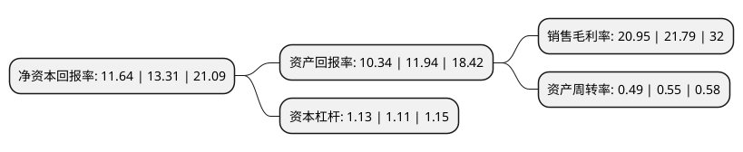

> 本页面由自动化程序生成于 2022年5月20日 01:36
> 内容可能存在错误，如有bug请提交issue至：https://github.com/Eroleice/doc-pi/issues
{.is-warning}

# 上市公司基本情况

## 基本资料

奥锐特药业股份有限公司（以下简称“奥锐特”）成立于1998年03月05日，台州市。于2020年09月21日在上交所主板上市。

奥锐特注册资本40,100万元，主要产品为呼吸系统类，心血管类，抗感染类和神经系统类药物，包括氟美松，丙酸氟替卡松，依普利酮，替诺福韦，普瑞巴林等原料药和中间体，主要从事特色原料药和医药中间体的研发，生产和销售以下是详细信息：

- 公司名称: 奥锐特药业股份有限公司
- 股票代码: 605116.SH
- 所在地: 浙江 - 台州市
- 成立日期: 1998年03月05日
- 注册资本: 40,100万元
- 法定代表人: 彭志恩
- 主营业务: 主要产品为呼吸系统类，心血管类，抗感染类和神经系统类药物，包括氟美松，丙酸氟替卡松，依普利酮，替诺福韦，普瑞巴林等原料药和中间体，主要从事特色原料药和医药中间体的研发，生产和销售
- 公司官网: www.aurisco.com
- 公司介绍: 公司是国内较早成功研发并生产出丙酸氟替卡松、依普利酮、普瑞巴林等原料药和中间体的企业。除上述产品外，公司还完成了醋酸阿比特龙、倍他米松、布地奈德、脱氢孕酮、布瓦西坦、西罗莫司、TAF等在内的数个系列原料药和中间体的产品研发与工艺开发。同时，公司积极进行新产品的研发工作，目前正在进行恩杂鲁胺、维兰特罗、多替拉韦钠、奥贝胆酸、利拉鲁肽、舍马鲁肽等产品的研究开发工作。通过长期服务于国外知名制药企业，公司加深了对规范医药市场的理解，发行人已经通过了包括NMPA、FDA、WHO、BGV等监管机构的认证，目前已经有1个产品通过WHO的审计，4个产品取得欧盟CEP认证，3个产品取得了欧盟GMP证书，5个产品取得了出口欧盟的证明，11个产品已经提交了美国DMF文件，建立了独具竞争力的自主品牌，成为国内出口特色原料药较多的企业之一。

## 股东及高管情况

上市公司第一大股东为浙江桐本投资有限公司，持股153,583,200股，占比38.3%，为上市公司实际控制人。

截至2022年03月31日，上市公司的前十大股东中，共有5名自然人股东，5名机构股东，其中5%以上大股东共有2名。上市公司前十大股东明细如下：

> 截至2022年03月31日，上市公司前十大股东信息如下：

| 股东名称 | 持股数量（股） | 持股比例 |
| --- | --- | --- |
| 浙江桐本投资有限公司 | 153,583,200 | 38.3% |
| 褚义舟 | 112,294,800 | 28% |
| 刘美华 | 16,513,200 | 4.12% |
| 邱培静 | 11,178,000 | 2.79% |
| 天台铂融投资合伙企业(有限合伙) | 9,907,200 | 2.47% |
| 裘伟红 | 9,907,100 | 2.47% |
| 北京泓石资本管理股份有限公司-青岛泓石股权投资管理中心(有限合伙) | 8,258,400 | 2.06% |
| 李建文 | 6,984,000 | 1.74% |
| 天台铂恩投资管理合伙企业(有限合伙) | 6,606,000 | 1.65% |
| 宁波中金国联信德股权投资合伙企业(有限合伙) | 3,874,900 | 0.97% |

## 利润表分析

上市公司2021年总收入为8.03亿元，净利润为1.68亿元，实现盈利。

## 杜邦分析

> 数据列示周期：2021年 | 2020年 | 2019年
{.is-info}

上市公司的净资产收益率在近一年有所下降，下降幅度为-12.55%，其变化情况分解如下：
- 上市公司的销售毛利率在近一年下降了-3.85%，可能是生产效率的下降、商品原材料价格上涨或商品价格的下跌所致。
- 上市公司的资产周转率在近一年下降了-10.91%，可能是源自于更慢的销售回款或库存管理效果下降。
- 上市公司的财务杠杆比率在近一年上升了1.8%，可能是增加负债扩大生产规模。

