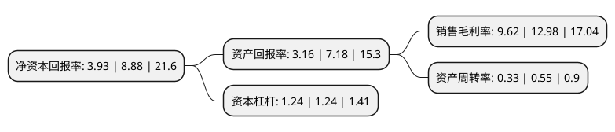

> 本页面由自动化程序生成于 2022年5月20日 01:36
> 内容可能存在错误，如有bug请提交issue至：https://github.com/Eroleice/doc-pi/issues
{.is-warning}

# 上市公司基本情况

## 基本资料

浙江东亚药业股份有限公司（以下简称“东亚药业”）成立于1998年02月06日，台州市。于2020年11月25日在上交所主板上市。

东亚药业注册资本11,360万元，主要从事化学原料药，医药中间体的研发，生产和销售，主要产品包括:头孢克洛中间体，头孢克洛原料药，拉氧头孢钠中间体，头孢美唑钠中间体，头孢唑肟钠中间体，马来酸曲美布汀原料药，左氧氟沙星原料药，氧氟沙星原料药，酮康唑原料药等。以下是详细信息：

- 公司名称: 浙江东亚药业股份有限公司
- 股票代码: 605177.SH
- 所在地: 浙江 - 台州市
- 成立日期: 1998年02月06日
- 注册资本: 11,360万元
- 法定代表人: 池正明
- 主营业务: 主要从事化学原料药，医药中间体的研发，生产和销售，主要产品包括:头孢克洛中间体，头孢克洛原料药，拉氧头孢钠中间体，头孢美唑钠中间体，头孢唑肟钠中间体，马来酸曲美布汀原料药，左氧氟沙星原料药，氧氟沙星原料药，酮康唑原料药等
- 公司官网: www.eapharm.net
- 公司介绍: 公司是一家专业从事医药中间体、原料药、制剂生产的集团型企业,主要从事化学原料药、医药中间体的研发、生产和销售，主导产品涵盖抗细菌类药物(β-内酰胺类和喹诺酮类)、抗胆碱和合成解痉药物(马来酸曲美布汀)、皮肤用抗真菌药物等多个用药领域，拥有省级技术中心、省级研发中心，多项合成工艺获得国家发明专利。凭借产品的优势地位，公司与多家国内外知名医药企业建立了稳定的战略合作关系。目前东亚药业和子公司东邦药业均为国家高新技术企业,是浙江省专利示范企业,公司多次承担省级重大科技专项、国家火炬计划项目、省重大国际科技专项、省重点高新技术产品开发项目等。公司“β-内酰胺类药物创新团队”于2014年入选台州市重点企业技术创新团队，多次获得浙江省和台州市科技进步奖等。

## 股东及高管情况

上市公司第一大股东为池正明，持股47,116,769股，占比41.48%，为上市公司实际控制人。

截至2022年03月31日，上市公司的前十大股东中，共有5名自然人股东，5名机构股东，其中5%以上大股东共有2名。上市公司前十大股东明细如下：

> 截至2022年03月31日，上市公司前十大股东信息如下：

| 股东名称 | 持股数量（股） | 持股比例 |
| --- | --- | --- |
| 池正明 | 47,116,769 | 41.48% |
| 池骋 | 7,786,875 | 6.85% |
| 深圳新华创资产管理有限公司-深圳市睿创一号投资合伙企业(有限合伙) | 2,520,000 | 2.22% |
| 台州市瑞康投资合伙企业(有限合伙) | 2,500,000 | 2.2% |
| 大连电瓷集团股份有限公司 | 2,281,216 | 2.01% |
| 陈东辉 | 1,250,000 | 1.1% |
| 杭州滨创股权投资有限公司 | 1,233,785 | 1.09% |
| 陈中 | 1,136,848 | 1% |
| 夏道敏 | 1,102,938 | 0.97% |
| 嘉兴真灼嘉衡投资合伙企业(有限合伙) | 937,200 | 0.83% |

## 利润表分析

上市公司2021年总收入为7.12亿元，净利润为0.68亿元，实现盈利。

## 杜邦分析

> 数据列示周期：2021年 | 2020年 | 2019年
{.is-info}

上市公司的净资产收益率在近一年有所下降，下降幅度为-55.74%，其变化情况分解如下：
- 上市公司的销售毛利率在近一年下降了-25.89%，可能是生产效率的下降、商品原材料价格上涨或商品价格的下跌所致。
- 上市公司的资产周转率在近一年下降了-40%，可能是源自于更慢的销售回款或库存管理效果下降。
- 上市公司的财务杠杆比率在近一年下降了0%，可能是减少负债降低财务费用。

