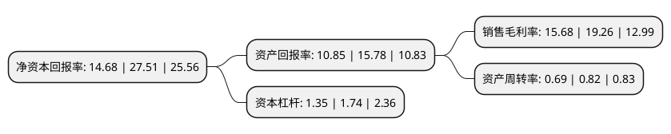

> 本页面由自动化程序生成于 2022年5月20日 01:37
> 内容可能存在错误，如有bug请提交issue至：https://github.com/Eroleice/doc-pi/issues
{.is-warning}

# 上市公司基本情况

## 基本资料

国邦医药集团股份有限公司（以下简称“国邦医药”）成立于1996年03月29日，绍兴市。于2021年08月02日在上交所主板上市。

国邦医药注册资本55,882.35万元，主要从事医药及动物保健品领域相关产品的研发，生产和销售以下是详细信息：

- 公司名称: 国邦医药集团股份有限公司
- 股票代码: 605507.SH
- 所在地: 浙江 - 绍兴市
- 成立日期: 1996年03月29日
- 注册资本: 55,882.35万元
- 法定代表人: 邱家军
- 主营业务: 主要从事医药及动物保健品领域相关产品的研发，生产和销售
- 公司官网: www.gbgcn.com
- 公司介绍: 公司是一家全球性、多品种、具备产业链优势和工业平台完整要素的医药制造公司，是全球化学药品制造产业链的重要参与者，2016年至2018年连续3年入选全国医药工业百强名单。公司主要从事医药及动物保健品领域相关产品的研发、生产和销售，其中医药板块涵盖原料药、关键医药中间体及制剂，动物保健品板块涵盖动保原料药、动保添加剂及制剂。在医药及动物保健品两大业务板块中，公司均形成产业链优势，以原料药业务为核心，向上掌握关键医药中间体的制造，并以此进一步稳定原料药供应的品质和数量，向下通过制剂工艺及医药流通，将产业链延伸至终端药品消费领域,公司的业务发展秉承着科技服务生命、经济利益和社会效益统一的原则，遵循着医药产业发展的脉络，在选品选址上体现了稳健经营的理念，突出了生产可复制性和产业链可拓展性的核心竞争力。在长期稳健的发展中，公司形成了“一个体系、两个平台”的综合优势，即形成了有效的管理和创新体系，先进完整的规模化生产制造平台、广泛有效的全球化市场渠道平台。

## 股东及高管情况

上市公司第一大股东为新昌庆裕投资发展有限公司，持股73,296,367股，占比13.12%，**疑似为**上市公司实际控制人。

截至2022年03月31日，上市公司的前十大股东中，共有2名自然人股东，7名机构股东，1个产品账户，其中5%以上大股东共有4名。上市公司前十大股东明细如下：

> 未能通过持股比例判定出上市公司实际控制人（持股30%以上）
> 可能存在通过间接持股、联合持股、协议控制等方式拥有实际控制权的主体，具体请参考上市公司定期公告！
{.is-warning}

> 截至2022年03月31日，上市公司前十大股东信息如下：

| 股东名称 | 持股数量（股） | 持股比例 |
| --- | --- | --- |
| 新昌庆裕投资发展有限公司 | 73,296,367 | 13.12% |
| 邱家军 | 54,852,971 | 9.82% |
| 潍坊仕琦汇股权投资合伙企业(有限合伙) | 50,021,196 | 8.95% |
| 宁波梅山保税港区浙民投投资管理有限公司-平潭浙民投恒久投资合伙企业(有限合伙) | 33,999,999 | 6.08% |
| 浙江丝路产业投资基金合伙企业(有限合伙) | 25,000,000 | 4.47% |
| 潍坊洪德辉股权投资合伙企业(有限合伙) | 14,668,653 | 2.62% |
| 诸暨市毓晨股权投资合伙企业(有限合伙) | 10,000,000 | 1.79% |
| 竺亚庆 | 7,452,666 | 1.33% |
| 绍兴锦泽企业管理有限公司 | 6,875,001 | 1.23% |
| 绍兴市上虞区国有资本投资运营有限公司 | 6,875,001 | 1.23% |

## 利润表分析

上市公司2021年总收入为45.05亿元，净利润为7.06亿元，实现盈利。

## 杜邦分析

> 数据列示周期：2021年 | 2020年 | 2019年
{.is-info}

上市公司的净资产收益率在近一年有所下降，下降幅度为-46.64%，其变化情况分解如下：
- 上市公司的销售毛利率在近一年下降了-18.59%，可能是生产效率的下降、商品原材料价格上涨或商品价格的下跌所致。
- 上市公司的资产周转率在近一年下降了-15.85%，可能是源自于更慢的销售回款或库存管理效果下降。
- 上市公司的财务杠杆比率在近一年下降了-22.41%，可能是减少负债降低财务费用。

