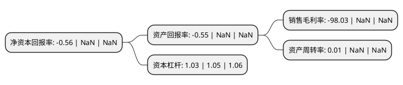

> 本页面由自动化程序生成于 2022年5月20日 01:37
> 内容可能存在错误，如有bug请提交issue至：https://github.com/Eroleice/doc-pi/issues
{.is-warning}

# 上市公司基本情况

## 基本资料

上海谊众药业股份有限公司（以下简称“上海谊众-U”）成立于2009年09月10日，上海市。于2021年09月09日在上交所科创板上市。

上海谊众-U注册资本10,580万元，主要研发产品是紫杉醇胶束。致力于抗肿瘤药物改良型新药的研发及产业化。以下是详细信息：

- 公司名称: 上海谊众药业股份有限公司
- 股票代码: 688091.SH
- 所在地: 上海 - 上海市
- 成立日期: 2009年09月10日
- 注册资本: 10,580万元
- 法定代表人: 周劲松
- 主营业务: 主要研发产品是紫杉醇胶束致力于抗肿瘤药物改良型新药的研发及产业化
- 公司官网: www.yizhongpharma.com
- 公司介绍: 公司拥有高分子材料、药物制剂、生物学等背景的高科技人才，掌握纳米药物载体和药用高分子辅料合成的核心关键技术，在纳米给药系统领域具有独特的创新性。自成立以来，公司坚持自主创新，针对已上市的疗效确切、适应症广、临床需求大的抗肿瘤药物，独创性地研发了国家2.2类改良型新药紫杉醇胶束。2016年12月，发行人的紫杉醇胶束Ⅲ期临床研究课题获得国家“重大新药创制”科技重大专项“十三五”第一批课题立项；2019年1月，发行人完成紫杉醇胶束针对非小细胞肺癌的Ⅲ期临床试验，是国内第一家完成注射用紫杉醇胶束Ⅲ期临床试验的企业。

## 股东及高管情况

上市公司第一大股东为周劲松，持股20,633,000股，占比19.5%，**疑似为**上市公司实际控制人。

截至2022年03月31日，上市公司的前十大股东中，共有5名自然人股东，5名机构股东，其中5%以上大股东共有2名。上市公司前十大股东明细如下：

> 未能通过持股比例判定出上市公司实际控制人（持股30%以上）
> 可能存在通过间接持股、联合持股、协议控制等方式拥有实际控制权的主体，具体请参考上市公司定期公告！
{.is-warning}

> 截至2022年03月31日，上市公司前十大股东信息如下：

| 股东名称 | 持股数量（股） | 持股比例 |
| --- | --- | --- |
| 周劲松 | 20,633,000 | 19.5% |
| 上海凯宝药业股份有限公司 | 13,750,000 | 13% |
| 上海杉元企业管理合伙企业(有限合伙) | 5,000,000 | 4.73% |
| 上海贤昱投资中心(有限合伙) | 4,300,000 | 4.06% |
| 曾美桦 | 3,958,000 | 3.74% |
| 李峰 | 3,600,000 | 3.4% |
| 李端 | 3,581,000 | 3.38% |
| 李循 | 3,500,000 | 3.31% |
| 上海宜羡健康管理咨询中心(有限合伙) | 3,458,000 | 3.27% |
| 上海谊兴企业管理合伙企业(有限合伙) | 2,500,000 | 2.36% |

## 利润表分析

上市公司2021年总收入为0.04亿元，净利润为-0.04亿元，**未实现盈利**。

## 杜邦分析

> 数据列示周期：2021年 | 2020年 | 2019年
{.is-info}

上市公司的净资产收益率在近一年有所下降，下降幅度为NaN%，其变化情况分解如下：
- 上市公司的销售毛利率在近一年下降了NaN%，可能是生产效率的下降、商品原材料价格上涨或商品价格的下跌所致。
- 上市公司的资产周转率在近一年下降了NaN%，可能是源自于更慢的销售回款或库存管理效果下降。
- 上市公司的财务杠杆比率在近一年下降了-1.9%，可能是减少负债降低财务费用。

