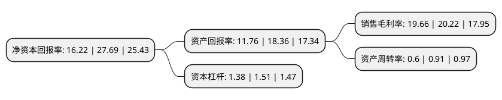

> 本页面由自动化程序生成于 2022年5月20日 01:38
> 内容可能存在错误，如有bug请提交issue至：https://github.com/Eroleice/doc-pi/issues
{.is-warning}

# 上市公司基本情况

## 基本资料

上海皓元医药股份有限公司（以下简称“皓元医药”）成立于2006年09月30日，上海市。于2021年06月08日在上交所科创板上市。

皓元医药注册资本7,434.201万元，专注于小分子药物研发服务与产业化应用的平台型高新技术企业，主要业务包括小分子药物发现领域的分子砌块和工具化合物的研发，以及小分子药物原料药，中间体的工艺开发和生产技术改进，为全球医药企业和科研机构提供从药物发现到原料药和医药中间体的规模化生产的相关产品和技术服务。以下是详细信息：

- 公司名称: 上海皓元医药股份有限公司
- 股票代码: 688131.SH
- 所在地: 上海 - 上海市
- 成立日期: 2006年09月30日
- 注册资本: 7,434.201万元
- 法定代表人: 郑保富
- 主营业务: 专注于小分子药物研发服务与产业化应用的平台型高新技术企业，主要业务包括小分子药物发现领域的分子砌块和工具化合物的研发，以及小分子药物原料药，中间体的工艺开发和生产技术改进，为全球医药企业和科研机构提供从药物发现到原料药和医药中间体的规模化生产的相关产品和技术服务
- 公司官网: www.chemexpress.com.cn
- 公司介绍: 公司是一家专注于小分子药物研发服务与产业化应用的平台型高新技术企业，主要业务包括小分子药物发现领域的分子砌块和工具化合物的研发，以及小分子药物原料药、中间体的工艺开发和生产技术改进，为全球医药企业和科研机构提供从药物发现到原料药和医药中间体的规模化生产的相关产品和技术服务,公司凭借在药物化学和有机合成领域的技术优势，和多年深耕小分子药物研发行业的经验，形成了集研发、生产及销售为一体的分子砌块和工具化合物供应平台；平台为客户提供数万种结构新颖、功能多样的分子砌块和工具化合物，其中自主合成的分子砌块和工具化合物超过10,000种，同时致力于提供高难度、高附加值分子砌块和工具化合物定制合成等技术服务；平台的产品和服务及时快速满足客户需求，助力了国内外超过2,000家科研机构和医药企业的科学研究和创新药物发现。

## 股东及高管情况

上市公司第一大股东为上海安戌信息科技有限公司，持股24,480,000股，占比32.93%，为上市公司实际控制人。

截至2022年03月31日，上市公司的前十大股东中，共有7名机构股东，3个产品账户，其中5%以上大股东共有3名。上市公司前十大股东明细如下：

> 截至2022年03月31日，上市公司前十大股东信息如下：

| 股东名称 | 持股数量（股） | 持股比例 |
| --- | --- | --- |
| 上海安戌信息科技有限公司 | 24,480,000 | 32.93% |
| 君信(上海)股权投资基金管理有限公司-苏民投君信(上海)产业升级与科技创新股权投资合伙企业(有限合伙) | 5,481,900 | 7.37% |
| 上海真金高技术服务业创业投资中心(有限合伙) | 5,181,227 | 6.97% |
| 上海臣骁企业管理咨询中心(有限合伙) | 3,050,000 | 4.1% |
| 上海景嘉创业接力创业投资中心(有限合伙) | 3,001,202 | 4.04% |
| 上海国弘医疗健康投资中心(有限合伙) | 2,201,129 | 2.96% |
| 上海臣迈企业管理中心(有限合伙) | 2,000,000 | 2.69% |
| 国泰君安证券资管-招商银行-国泰君安君享科创板皓元医药1号战略配售集合资产管理计划 | 1,710,531 | 2.3% |
| 新余川流投资管理有限公司-分宜川流长枫新材料投资合伙企业(有限合伙) | 1,652,399 | 2.22% |
| 黄山高新毅达新安江专精特新创业投资基金(有限合伙) | 1,621,834 | 2.18% |

## 利润表分析

上市公司2021年总收入为9.69亿元，净利润为1.9亿元，实现盈利。

## 杜邦分析

> 数据列示周期：2021年 | 2020年 | 2019年
{.is-info}

上市公司的净资产收益率在近一年有所下降，下降幅度为-41.42%，其变化情况分解如下：
- 上市公司的销售毛利率在近一年下降了-2.77%，可能是生产效率的下降、商品原材料价格上涨或商品价格的下跌所致。
- 上市公司的资产周转率在近一年下降了-34.07%，可能是源自于更慢的销售回款或库存管理效果下降。
- 上市公司的财务杠杆比率在近一年下降了-8.61%，可能是减少负债降低财务费用。

