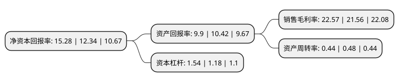

> 本页面由自动化程序生成于 2022年5月20日 01:38
> 内容可能存在错误，如有bug请提交issue至：https://github.com/Eroleice/doc-pi/issues
{.is-warning}

# 上市公司基本情况

## 基本资料

博瑞生物医药(苏州)股份有限公司（以下简称“博瑞医药”）成立于2001年10月26日，苏州市。于2019年11月08日在上交所科创板上市。

博瑞医药注册资本41,000万元，从事高技术壁垒的医药中间体，原料药和制剂产品的研发和生产业务，凭借自身在微生物发酵，高难度药物合成工艺，药物合成原创路线设计，药物新晶型及药物靶向递送等方面积累的技术优势，建立了发酵半合成技术平台，多手性药物技术平台，靶向高分子偶联技术平台和非生物大分子技术平台等核心药物研发技术平台，形成了高技术附加值的医药中间体和原料药销售，药品技术转让以及利用自身技术和产品优势与其它具有品牌或销售渠道优势的医药企业合作开发并获得销售分成等多元化的盈利模式以下是详细信息：

- 公司名称: 博瑞生物医药(苏州)股份有限公司
- 股票代码: 688166.SH
- 所在地: 江苏 - 苏州市
- 成立日期: 2001年10月26日
- 注册资本: 41,000万元
- 法定代表人: 袁建栋
- 主营业务: 从事高技术壁垒的医药中间体，原料药和制剂产品的研发和生产业务，凭借自身在微生物发酵，高难度药物合成工艺，药物合成原创路线设计，药物新晶型及药物靶向递送等方面积累的技术优势，建立了发酵半合成技术平台，多手性药物技术平台，靶向高分子偶联技术平台和非生物大分子技术平台等核心药物研发技术平台，形成了高技术附加值的医药中间体和原料药销售，药品技术转让以及利用自身技术和产品优势与其它具有品牌或销售渠道优势的医药企业合作开发并获得销售分成等多元化的盈利模式
- 公司官网: www.bright-gene.com
- 公司介绍: 公司是一家研发驱动、参与国际竞争的化学制药全产业链产品和技术平台型企业，致力于成为一家全球领先的创新型高端化学制药企业,一直从事高技术壁垒的医药中间体、原料药和制剂产品的研发和生产业务，凭借自身在微生物发酵、高难度药物合成工艺、药物合成原创路线设计、药物新晶型及药物靶向递送等方面积累的技术优势，建立了发酵半合成技术平台、多手性药物技术平台、靶向高分子偶联技术平台和非生物大分子技术平台等核心药物研发技术平台，形成了高技术附加值的医药中间体和原料药销售、药品技术转让以及利用自身技术和产品优势与其它具有品牌或销售渠道优势的医药企业合作开发并获得销售分成等多元化的盈利模式，并进一步向制剂产品领域拓展，逐步建立起原料药与制剂一体，仿制药与创新药结合，国际市场与国内市场并重的业务体系,公司产品和服务的最终客户主要为全球知名仿制药厂家。

## 股东及高管情况

上市公司第一大股东为袁建栋，持股113,535,123股，占比27.69%，**疑似为**上市公司实际控制人。

截至2022年03月31日，上市公司的前十大股东中，共有2名自然人股东，7名机构股东，1个产品账户，其中5%以上大股东共有3名。上市公司前十大股东明细如下：

> 未能通过持股比例判定出上市公司实际控制人（持股30%以上）
> 可能存在通过间接持股、联合持股、协议控制等方式拥有实际控制权的主体，具体请参考上市公司定期公告！
{.is-warning}

> 截至2022年03月31日，上市公司前十大股东信息如下：

| 股东名称 | 持股数量（股） | 持股比例 |
| --- | --- | --- |
| 袁建栋 | 113,535,123 | 27.69% |
| 钟伟芳 | 39,192,969 | 9.56% |
| 苏州博瑞鑫稳管理咨询合伙企业(有限合伙) | 35,251,144 | 8.6% |
| 北京红杉坤德投资管理中心(有限合伙)-宁波梅山保税港区红杉智盛股权投资合伙企业(有限合伙) | 18,879,801 | 4.6% |
| 先进制造产业投资基金(有限合伙) | 18,612,863 | 4.54% |
| 南京华泰大健康一号股权投资合伙企业(有限合伙) | 12,144,614 | 2.96% |
| 苏州高钺创业投资管理有限公司-苏州高铨创业投资企业(有限合伙) | 7,491,771 | 1.83% |
| 苏州德睿亨风创业投资有限公司 | 7,120,731 | 1.74% |
| 宁波梅山保税港区茗嘉一期投资合伙企业(有限合伙) | 6,032,000 | 1.47% |
| 广发乾和投资有限公司 | 5,962,594 | 1.45% |

## 利润表分析

上市公司2021年总收入为10.52亿元，净利润为2.37亿元，实现盈利。

## 杜邦分析

> 数据列示周期：2021年 | 2020年 | 2019年
{.is-info}

上市公司的净资产收益率在近一年有所上升，上升幅度为23.82%，其变化情况分解如下：
- 上市公司的销售毛利率在近一年上升了4.68%，可能是生产效率的提升、商品原材料价格下跌或商品价格的上涨所致。
- 上市公司的资产周转率在近一年下降了-8.33%，可能是源自于更慢的销售回款或库存管理效果下降。
- 上市公司的财务杠杆比率在近一年上升了30.51%，可能是增加负债扩大生产规模。

