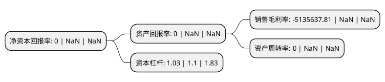

> 本页面由自动化程序生成于 2022年5月20日 01:38
> 内容可能存在错误，如有bug请提交issue至：https://github.com/Eroleice/doc-pi/issues
{.is-warning}

# 上市公司基本情况

## 基本资料

江苏亚虹医药科技股份有限公司（以下简称“亚虹医药-U”）成立于2010年03月16日，泰州市。于2022年01月07日在上交所科创板上市。

亚虹医药-U注册资本57,000万元，聚焦于泌尿生殖系统肿瘤及其他重大疾病领域，致力于为患者提供诊疗一体化解决方案。以下是详细信息：

- 公司名称: 江苏亚虹医药科技股份有限公司
- 股票代码: 688176.SH
- 所在地: 江苏 - 泰州市
- 成立日期: 2010年03月16日
- 注册资本: 57,000万元
- 法定代表人: PAN KE
- 主营业务: 聚焦于泌尿生殖系统肿瘤及其他重大疾病领域，致力于为患者提供诊疗一体化解决方案
- 公司官网: www.asieris.cn
- 公司介绍: 公司是即将进入商业化阶段、专注于泌尿生殖系统(Urogenital System)肿瘤及其它重大疾病领域的全球化创新药公司。秉承“改善人类健康，让生命更有尊严”的企业使命，发行人立志成为在专注治疗领域集研发、生产和商业化为一体的国际领先制药企业，为中国和全球患者提供最佳的诊疗一体化解决方案。公司坚持以创新技术和产品为核心驱动力，通过内部完善的研发体系、三大核心技术平台和全球药物开发经验专长，深入探索药物作用机理，高效率筛选评价候选药物，致力于在专注治疗领域推出全球首创(First-in-Class)药物及存在巨大未被满足治疗需求的创新药物。同时，公司通过自主研发和战略合作，围绕泌尿生殖系统疾病进行产品管线的深度布局。发行人高度关注专注领域的技术前沿和治疗发展趋势，洞察并挖掘未被满足的临床需求，前瞻性地进行产品规划和生命周期管理，打造从疾病诊断到治疗的优势产品组合，从而造福更多的中国和全球患者。

## 股东及高管情况

上市公司第一大股东为PAN KE，持股129,465,348股，占比22.71%，**疑似为**上市公司实际控制人。

截至2022年03月31日，上市公司的前十大股东中，共有6名机构股东，1个产品账户，3个海外主体，其中5%以上大股东共有2名。上市公司前十大股东明细如下：

> 未能通过持股比例判定出上市公司实际控制人（持股30%以上）
> 可能存在通过间接持股、联合持股、协议控制等方式拥有实际控制权的主体，具体请参考上市公司定期公告！
{.is-warning}

> 截至2022年03月31日，上市公司前十大股东信息如下：

| 股东名称 | 持股数量（股） | 持股比例 |
| --- | --- | --- |
| PAN KE | 129,465,348 | 22.71% |
| Pan-Scientific Holdings Co., Ltd. | 31,858,481 | 5.59% |
| 北京龙磐健康医疗投资中心(有限合伙) | 24,735,039 | 4.34% |
| 南京瑞可企业管理咨询合伙企业(有限合伙) | 15,391,333 | 2.7% |
| QM139 Limited | 13,506,045 | 2.37% |
| 泰州东虹企业管理中心(有限合伙) | 12,812,891 | 2.25% |
| 中小企业发展基金(深圳有限合伙) | 12,102,586 | 2.12% |
| 泰州亚虹企业管理中心(有限合伙) | 11,563,138 | 2.03% |
| 西藏虹瓴创业投资中心(有限合伙) | 9,894,015 | 1.74% |
| 杭州凯泰民德投资合伙企业(有限合伙) | 9,894,015 | 1.74% |

## 利润表分析

上市公司2021年总收入为0亿元，净利润为-2.35亿元，**未实现盈利**。

## 杜邦分析

> 数据列示周期：2021年 | 2020年 | 2019年
{.is-info}

上市公司的净资产收益率在近一年有所下降，下降幅度为NaN%，其变化情况分解如下：
- 上市公司的销售毛利率在近一年下降了NaN%，可能是生产效率的下降、商品原材料价格上涨或商品价格的下跌所致。
- 上市公司的资产周转率在近一年下降了NaN%，可能是源自于更慢的销售回款或库存管理效果下降。
- 上市公司的财务杠杆比率在近一年下降了-6.36%，可能是减少负债降低财务费用。

