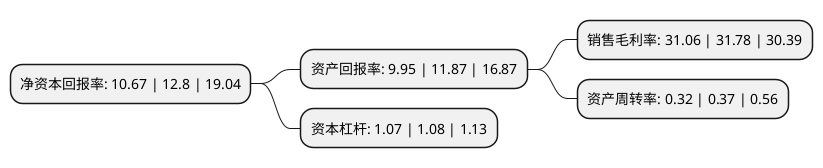

> 本页面由自动化程序生成于 2022年5月20日 01:38
> 内容可能存在错误，如有bug请提交issue至：https://github.com/Eroleice/doc-pi/issues
{.is-warning}

# 上市公司基本情况

## 基本资料

上海阿拉丁生化科技股份有限公司（以下简称“阿拉丁”）成立于2009年03月16日，上海市。于2020年10月26日在上交所科创板上市。

阿拉丁注册资本10,093.34万元，化学试剂，生物试剂，生物工程产品领域内的技术开发，技术咨询，技术服务，技术转让，仪器仪表，玻璃制品的销售，化学试剂(含药物中间体，添加剂，生物试剂，电子化学品)的研发，生产，分装和批发，零售(除危险化学品，监控化学品，烟花爆竹，民用爆炸物品，易制毒化学品)，用于传染病防治的消毒产品生产，销售，批发危险化学品(许可范围详见许可证附页)，从事货物进出口及技术进出口业务，医疗器械经营。(除依法须经批准的项目外，凭营业执照依法自主开展经营活动)以下是详细信息：

- 公司名称: 上海阿拉丁生化科技股份有限公司
- 股票代码: 688179.SH
- 所在地: 上海 - 上海市
- 成立日期: 2009年03月16日
- 注册资本: 10,093.34万元
- 法定代表人: 徐久振
- 主营业务: 化学试剂，生物试剂，生物工程产品领域内的技术开发，技术咨询，技术服务，技术转让，仪器仪表，玻璃制品的销售，化学试剂(含药物中间体，添加剂，生物试剂，电子化学品)的研发，生产，分装和批发，零售(除危险化学品，监控化学品，烟花爆竹，民用爆炸物品，易制毒化学品)，用于传染病防治的消毒产品生产，销售，批发危险化学品(许可范围详见许可证附页)，从事货物进出口及技术进出口业务，医疗器械经营(除依法须经批准的项目外，凭营业执照依法自主开展经营活动)
- 公司官网: www.aladdin-e.com
- 公司介绍: 公司是集研发、生产及销售为一体的科研试剂制造商，业务涵盖高端化学、生命科学、分析色谱及材料科学四大领域，同时配套少量实验耗材。公司自主打造“阿拉丁”品牌科研试剂和“芯硅谷”品牌实验耗材，主要依托自身电子商务平台(www.aladdin-e.com)实现线上销售。公司科研试剂产品广泛应用于高等院校、科研院所以及生物医药、新材料、新能源、节能环保、航空航天等高新技术产业和战略性新兴产业相关企业的研发机构。通过多年的行业深耕和技术积累，公司科研试剂常备库存产品超过3.3万种，是国内品种最齐全的供应商之一。公司拥有超过6.8万种2D及3D分子结构图、超过3.1万种核磁图谱、超过1.1万种红外图谱，在自主电商平台上公开了部分上述资料供访客免费下载，方便了下游用户的科学研究。公司拥有超过14.5万名注册用户，积累了优质、坚实、广泛的客户群体，直接客户有以中国科学院、中国医学科学院、中国农业科学院等为代表的科研院所；有以普门科技、药明康德、药石科技、深天马A、亿纬锂能等为代表的各战略新兴行业内创新型企业群体(覆盖220余家A股上市公司)；有以北京大学、清华大学、复旦大学为代表的众多高等院校(覆盖全部985工程大学、90%以上211工程大学)。

## 股东及高管情况

上市公司第一大股东为徐久振，持股28,000,000股，占比27.74%，**疑似为**上市公司实际控制人。

截至2022年03月31日，上市公司的前十大股东中，共有3名自然人股东，3名机构股东，4个产品账户，其中5%以上大股东共有2名。上市公司前十大股东明细如下：

> 未能通过持股比例判定出上市公司实际控制人（持股30%以上）
> 可能存在通过间接持股、联合持股、协议控制等方式拥有实际控制权的主体，具体请参考上市公司定期公告！
{.is-warning}

> 截至2022年03月31日，上市公司前十大股东信息如下：

| 股东名称 | 持股数量（股） | 持股比例 |
| --- | --- | --- |
| 徐久振 | 28,000,000 | 27.74% |
| 招立萍 | 15,000,000 | 14.86% |
| 上海晶真文化艺术发展中心(有限合伙) | 3,918,000 | 3.88% |
| 上海理成殷睿投资管理中心(有限合伙) | 3,622,000 | 3.59% |
| 中信证券-中信银行-中信证券卓越成长两年持有期混合型集合资产管理计划 | 2,757,297 | 2.73% |
| 中国工商银行股份有限公司-中欧医疗健康混合型证券投资基金 | 2,544,860 | 2.52% |
| 济南豪迈动力股权投资基金合伙企业(有限合伙) | 2,190,000 | 2.17% |
| 上海道基福临投资合伙企业(有限合伙) | 2,000,000 | 1.98% |
| 兴证全球资本-上海银行-兴全睿众基石3号特定多客户专项资产管理计划 | 1,830,000 | 1.81% |
| 乔斌 | 1,500,000 | 1.49% |

## 利润表分析

上市公司2021年总收入为2.87亿元，净利润为0.89亿元，实现盈利。

## 杜邦分析

> 数据列示周期：2021年 | 2020年 | 2019年
{.is-info}

上市公司的净资产收益率在近一年有所下降，下降幅度为-16.64%，其变化情况分解如下：
- 上市公司的销售毛利率在近一年下降了-2.27%，可能是生产效率的下降、商品原材料价格上涨或商品价格的下跌所致。
- 上市公司的资产周转率在近一年下降了-13.51%，可能是源自于更慢的销售回款或库存管理效果下降。
- 上市公司的财务杠杆比率在近一年下降了-0.93%，可能是减少负债降低财务费用。

