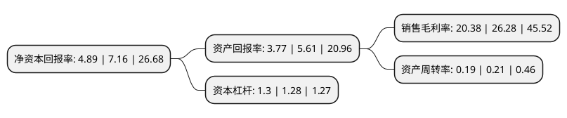

> 本页面由自动化程序生成于 2022年5月20日 01:38
> 内容可能存在错误，如有bug请提交issue至：https://github.com/Eroleice/doc-pi/issues
{.is-warning}

# 上市公司基本情况

## 基本资料

成都先导药物开发股份有限公司（以下简称“成都先导”）成立于2012年02月22日，成都市。于2020年04月16日在上交所科创板上市。

成都先导注册资本40,068万元，主营业务为利用其核心技术——DEL技术提供药物早期发现阶段的研发服务以及新药研发项目转让。具体业务包括:DEL筛选服务，DEL库定制服务，化学合成服务，新药研发项目转让等。以下是详细信息：

- 公司名称: 成都先导药物开发股份有限公司
- 股票代码: 688222.SH
- 所在地: 四川 - 成都市
- 成立日期: 2012年02月22日
- 注册资本: 40,068万元
- 法定代表人: 李进
- 主营业务: 主营业务为利用其核心技术——DEL技术提供药物早期发现阶段的研发服务以及新药研发项目转让具体业务包括:DEL筛选服务，DEL库定制服务，化学合成服务，新药研发项目转让等
- 公司官网: www.hitgen.com
- 公司介绍: 公司是一家高科技创新药物研发企业，由英国皇家化学学会会士JIN LI(李进)博士归国后携国内外多位生物、化学等领域专家共同创建，公司设立至今一直围绕着DNA编码化合物库(DNA Encoded compound Library，简称DEL)技术潜心研究与创造，专注于原创新药的早期链段研发——苗头化合物和先导化合物的发现。目前，已建立合作关系的客户主要包括：全球跨国制药企业(辉瑞、强生、默沙东、赛诺菲、武田制药、勃林格殷格翰、利奥制药、LG化学等)，国际知名生物技术公司(基因泰克、Aduro、Forma等)，国内大型医药企业(扬子江药业、天士力集团、先声药业等)，支持新药研发的基金会(盖茨基金会)以及其他领域公司(巴斯夫)。

## 股东及高管情况

上市公司第一大股东为JIN LI(李进)，持股81,876,948股，占比20.43%，**疑似为**上市公司实际控制人。

截至2022年03月31日，上市公司的前十大股东中，共有1名自然人股东，7名机构股东，1个产品账户，1个海外主体，其中5%以上大股东共有5名。上市公司前十大股东明细如下：

> 未能通过持股比例判定出上市公司实际控制人（持股30%以上）
> 可能存在通过间接持股、联合持股、协议控制等方式拥有实际控制权的主体，具体请参考上市公司定期公告！
{.is-warning}

> 截至2022年03月31日，上市公司前十大股东信息如下：

| 股东名称 | 持股数量（股） | 持股比例 |
| --- | --- | --- |
| JIN LI(李进) | 81,876,948 | 20.43% |
| 拉萨经济技术开发区华博医疗器械有限公司 | 54,785,953 | 13.67% |
| 成都聚智科创生物科技合伙企业(有限合伙) | 38,651,163 | 9.65% |
| 安吉东方佳钰企业管理合伙企业(有限合伙) | 33,665,721 | 8.4% |
| 深圳市钧天投资企业(有限合伙) | 22,132,314 | 5.52% |
| 张驰 | 14,540,984 | 3.63% |
| JUMBO KINDNESS LIMITED(巨慈有限公司) | 13,915,543 | 3.47% |
| 杭州鼎晖新趋势股权投资合伙企业(有限合伙) | 12,243,377 | 3.06% |
| 重庆渤溢新天股权投资基金合伙企业(有限合伙) | 12,107,637 | 3.02% |
| 钧天创业投资有限公司 | 11,931,448 | 2.98% |

## 利润表分析

上市公司2021年总收入为3.11亿元，净利润为0.63亿元，实现盈利。

## 杜邦分析

> 数据列示周期：2021年 | 2020年 | 2019年
{.is-info}

上市公司的净资产收益率在近一年有所下降，下降幅度为-31.7%，其变化情况分解如下：
- 上市公司的销售毛利率在近一年下降了-22.45%，可能是生产效率的下降、商品原材料价格上涨或商品价格的下跌所致。
- 上市公司的资产周转率在近一年下降了-9.52%，可能是源自于更慢的销售回款或库存管理效果下降。
- 上市公司的财务杠杆比率在近一年上升了1.56%，可能是增加负债扩大生产规模。

