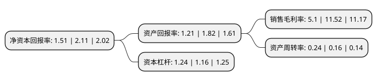

> 本页面由自动化程序生成于 2022年5月20日 01:39
> 内容可能存在错误，如有bug请提交issue至：https://github.com/Eroleice/doc-pi/issues
{.is-warning}

# 上市公司基本情况

## 基本资料

深圳微芯生物科技股份有限公司（以下简称“微芯生物”）成立于2001年03月21日，深圳市。于2019年08月12日在上交所科创板上市。

微芯生物注册资本41,072.05万元，主营业务:为患者提供可承受的，临床亟需的原创新分子实体药物，具备完整的从药物作用靶点发现与确证，先导分子的发现与评价到新药临床开发，产业化，学术推广及销售的能力。以下是详细信息：

- 公司名称: 深圳微芯生物科技股份有限公司
- 股票代码: 688321.SH
- 所在地: 广东 - 深圳市
- 成立日期: 2001年03月21日
- 注册资本: 41,072.05万元
- 法定代表人: XIANPING LU
- 主营业务: 主营业务:为患者提供可承受的，临床亟需的原创新分子实体药物，具备完整的从药物作用靶点发现与确证，先导分子的发现与评价到新药临床开发，产业化，学术推广及销售的能力
- 公司官网: www.chipscreen.com
- 公司介绍: 公司是一家旨在为患者提供可承受的、临床亟需的原创新分子实体药物的国家级高新技术企业。公司主要产品均为自主研发的新分子实体且作用机制新颖的原创新药。包括已上市的国家1类原创新药西达本胺，已完成Ⅲ期临床试验的国家1类原创新药西格列他钠，以及其它正处于临床实验或临床前研究的新分子实体候选药物。公司开发的西达本胺是全球第一个获批的亚型选择性组蛋白去乙酰化酶抑制剂，目前在外周T细胞淋巴瘤治疗领域属于中国唯一的二线治疗药物，在国内没有竞争对手。公司的业务模式为新药开发并申请上市，获批后通过学术推广及销售来获得盈利。公司是国家级高新技术企业，具有实力雄厚的研发团队，在研发策略、技术应用上积累了较强的竞争优势。

## 股东及高管情况

上市公司第一大股东为博奥生物集团有限公司，持股42,919,572股，占比10.45%，**疑似为**上市公司实际控制人。

截至2022年03月31日，上市公司的前十大股东中，共有7名机构股东，1个产品账户，2个海外主体，其中5%以上大股东共有3名。上市公司前十大股东明细如下：

> 未能通过持股比例判定出上市公司实际控制人（持股30%以上）
> 可能存在通过间接持股、联合持股、协议控制等方式拥有实际控制权的主体，具体请参考上市公司定期公告！
{.is-warning}

> 截至2022年03月31日，上市公司前十大股东信息如下：

| 股东名称 | 持股数量（股） | 持股比例 |
| --- | --- | --- |
| 博奥生物集团有限公司 | 42,919,572 | 10.45% |
| 深圳市海粤门生物科技开发有限公司 | 22,936,008 | 5.58% |
| LU XIANPING | 22,239,625 | 5.41% |
| 深圳海德睿博投资有限公司 | 19,817,445 | 4.83% |
| Vertex Technology Fund (III) Ltd | 17,745,902 | 4.32% |
| 深圳市海德康成投资合伙企业(有限合伙) | 15,285,290 | 3.72% |
| 深圳市海德睿远企业管理合伙企业(有限合伙) | 12,533,849 | 3.05% |
| 深圳市海德睿达企业管理合伙企业(有限合伙) | 12,533,849 | 3.05% |
| 深圳市海德鑫成企业管理合伙企业(有限合伙) | 9,416,540 | 2.29% |
| 广东红土创业投资管理有限公司-深圳市人才创新创业一号股权投资基金(有限合伙) | 9,009,724 | 2.19% |

## 利润表分析

上市公司2021年总收入为4.3亿元，净利润为0.21亿元，实现盈利。

## 杜邦分析

> 数据列示周期：2021年 | 2020年 | 2019年
{.is-info}

上市公司的净资产收益率在近一年有所下降，下降幅度为-28.44%，其变化情况分解如下：
- 上市公司的销售毛利率在近一年下降了-55.73%，可能是生产效率的下降、商品原材料价格上涨或商品价格的下跌所致。
- 上市公司的资产周转率在近一年上升了50%，可能是源自于更快的销售回款或库存管理效果提升。
- 上市公司的财务杠杆比率在近一年上升了6.9%，可能是增加负债扩大生产规模。

