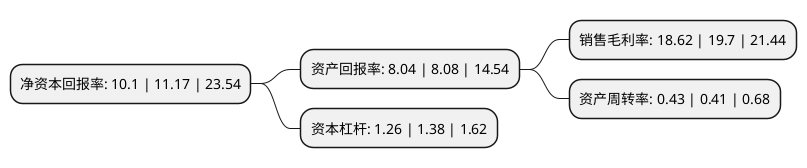

> 本页面由自动化程序生成于 2022年5月20日 01:39
> 内容可能存在错误，如有bug请提交issue至：https://github.com/Eroleice/doc-pi/issues
{.is-warning}

# 上市公司基本情况

## 基本资料

上海复旦张江生物医药股份有限公司（以下简称“复旦张江”）成立于1996年11月11日，上海市。于2020年06月19日在上交所科创板上市。

复旦张江注册资本104,300万元，主要从事生物医药的创新研究开发，生产制造和市场营销。以下是详细信息：

- 公司名称: 上海复旦张江生物医药股份有限公司
- 股票代码: 688505.SH
- 所在地: 上海 - 上海市
- 成立日期: 1996年11月11日
- 注册资本: 104,300万元
- 法定代表人: 王海波
- 主营业务: 主要从事生物医药的创新研究开发，生产制造和市场营销
- 公司官网: www.fd-zj.com
- 公司介绍: 公司是一家研发驱动型企业,主要从事生物医药的创新研究、开发、生产和销售，公司的光动力技术处于世界领先水平，并拥有先进的纳米技术、基因工程技术和口服固体制剂技术等，现有药品主要覆盖皮肤性病治疗和抗肿瘤治疗领域。公司以探索临床治疗的缺失和不足，并提供更有效的治疗方案和药物为核心定位，务求成为生物医药业界的创新者和领先者。凭借在生物医药领域的实力，公司多次担纲国家级研发项目，其中包括：国家高技术研究发展计划(八六三计划)、国家“九五”攻关项目、“国家‘重大新药创制’科技重大专项”等,并连续被上海市科学技术委员会认定为“上海市高新技术企业”。

## 股东及高管情况

上市公司第一大股东为香港中央结算(代理人)有限公司，持股238,234,900股，占比22.84%，**疑似为**上市公司实际控制人。

截至2022年03月31日，上市公司的前十大股东中，共有4名自然人股东，2名机构股东，3个海外主体，1名其他股东，其中5%以上大股东共有4名。上市公司前十大股东明细如下：

> 未能通过持股比例判定出上市公司实际控制人（持股30%以上）
> 可能存在通过间接持股、联合持股、协议控制等方式拥有实际控制权的主体，具体请参考上市公司定期公告！
{.is-warning}

> 截至2022年03月31日，上市公司前十大股东信息如下：

| 股东名称 | 持股数量（股） | 持股比例 |
| --- | --- | --- |
| 香港中央结算(代理人)有限公司 | 238,234,900 | 22.84% |
| 上海医药集团股份有限公司 | 210,142,560 | 20.15% |
| 新企二期创业投资企业 | 156,892,912 | 15.04% |
| 杨宗孟 | 80,000,000 | 7.67% |
| Investco Hong Kong Limited | 30,563,000 | 2.93% |
| Invesco Hong Kong Limited | 30,563,000 | 2.93% |
| 苏勇 | 18,317,860 | 1.76% |
| 上海复旦资产经营有限公司 | 15,449,264 | 1.48% |
| 赵大君 | 15,260,710 | 1.46% |
| 李军 | 8,688,200 | 0.83% |

## 利润表分析

上市公司2021年总收入为11.4亿元，净利润为2.12亿元，实现盈利。

## 杜邦分析

> 数据列示周期：2021年 | 2020年 | 2019年
{.is-info}

上市公司的净资产收益率在近一年有所下降，下降幅度为-9.58%，其变化情况分解如下：
- 上市公司的销售毛利率在近一年下降了-5.48%，可能是生产效率的下降、商品原材料价格上涨或商品价格的下跌所致。
- 上市公司的资产周转率在近一年上升了4.88%，可能是源自于更快的销售回款或库存管理效果提升。
- 上市公司的财务杠杆比率在近一年下降了-8.7%，可能是减少负债降低财务费用。

