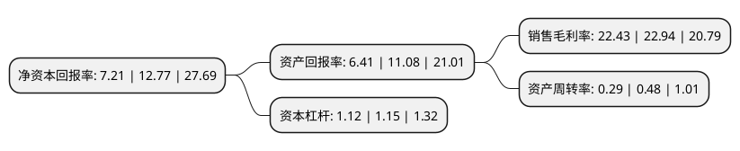

> 本页面由自动化程序生成于 2022年5月20日 01:39
> 内容可能存在错误，如有bug请提交issue至：https://github.com/Eroleice/doc-pi/issues
{.is-warning}

# 上市公司基本情况

## 基本资料

江苏吉贝尔药业股份有限公司（以下简称“吉贝尔”）成立于2001年11月13日，镇江市。于2020年05月18日在上交所科创板上市。

吉贝尔注册资本18,694.16万元，专业从事化学药品制剂，中成药制剂，原料药的研发，生产和销售，以下是详细信息：

- 公司名称: 江苏吉贝尔药业股份有限公司
- 股票代码: 688566.SH
- 所在地: 江苏 - 镇江市
- 成立日期: 2001年11月13日
- 注册资本: 18,694.16万元
- 法定代表人: 耿仲毅
- 主营业务: 专业从事化学药品制剂，中成药制剂，原料药的研发，生产和销售，
- 公司官网: www.jbepharm.com
- 公司介绍: 公司是专业从事化学药品制剂、中成药制剂、原料药的研发、生产、销售的医药高新技术企业。经过多年发展，公司不断丰富产品种类，研制出了尼群洛尔片、醋氯芬酸肠溶片、加替沙星滴眼液等6款新药，目前已具备片剂、硬胶囊剂、滴眼剂、凝胶剂、乳膏剂(激素类)等多个剂型产品和原料药的研发、生产能力以及中药前处理及提取能力，形成以利可君片、玉屏风胶囊、醋氯芬酸肠溶片、尼群洛尔片、盐酸洛美沙星滴眼液、加替沙星滴眼液等高新技术产品为主的多元产品系列，产品功能覆盖提升白细胞、增强免疫力、治疗关节疾病、抗高血压、抗眼部感染、治疗支气管炎、保护肝功能等多个治疗领域，并正致力于研发治疗抑郁症、肿瘤、胃病等其他疾病的药物，以满足市场和临床用药的需求。公司是国家火炬计划重点高新技术企业、国家高新技术企业，设有江苏省企业院士工作站、江苏省博士后创新实践基地，并建有江苏省抗肺癌和乳腺癌工程研究中心、江苏省微丸制剂药物工程技术研究中心、江苏省企业技术中心，具备了强大的科技创新能力和坚实的科研基础，并由此获得了江苏省重点企业研发机构、江苏省科技型中小企业和江苏省民营科技企业认定。

## 股东及高管情况

上市公司第一大股东为镇江中天投资咨询有限责任公司，持股54,400,000股，占比29.1%，**疑似为**上市公司实际控制人。

截至2022年03月31日，上市公司的前十大股东中，共有5名自然人股东，4名机构股东，1个产品账户，其中5%以上大股东共有5名。上市公司前十大股东明细如下：

> 未能通过持股比例判定出上市公司实际控制人（持股30%以上）
> 可能存在通过间接持股、联合持股、协议控制等方式拥有实际控制权的主体，具体请参考上市公司定期公告！
{.is-warning}

> 截至2022年03月31日，上市公司前十大股东信息如下：

| 股东名称 | 持股数量（股） | 持股比例 |
| --- | --- | --- |
| 镇江中天投资咨询有限责任公司 | 54,400,000 | 29.1% |
| 南通汇瑞投资有限公司 | 27,200,000 | 14.55% |
| 耿仲毅 | 24,606,200 | 13.16% |
| 胡涛 | 17,680,000 | 9.46% |
| 南通汇吉科技发展有限公司 | 16,320,000 | 8.73% |
| 国金证券-中信银行-国金证券吉贝尔高管参与科创板战略配售1号集合资产管理计划 | 4,673,540 | 2.5% |
| 国金创新投资有限公司 | 1,869,416 | 1% |
| 郭军 | 1,141,540 | 0.61% |
| 许伟 | 503,173 | 0.27% |
| 彭迎春 | 255,619 | 0.14% |

## 利润表分析

上市公司2021年总收入为5.09亿元，净利润为1.14亿元，实现盈利。

## 杜邦分析

> 数据列示周期：2021年 | 2020年 | 2019年
{.is-info}

上市公司的净资产收益率在近一年有所下降，下降幅度为-43.54%，其变化情况分解如下：
- 上市公司的销售毛利率在近一年下降了-2.22%，可能是生产效率的下降、商品原材料价格上涨或商品价格的下跌所致。
- 上市公司的资产周转率在近一年下降了-39.58%，可能是源自于更慢的销售回款或库存管理效果下降。
- 上市公司的财务杠杆比率在近一年下降了-2.61%，可能是减少负债降低财务费用。

