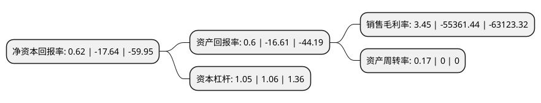

> 本页面由自动化程序生成于 2022年5月20日 01:40
> 内容可能存在错误，如有bug请提交issue至：https://github.com/Eroleice/doc-pi/issues
{.is-warning}

# 上市公司基本情况

## 基本资料

上海艾力斯医药科技股份有限公司（以下简称“艾力斯-U”）成立于2004年03月22日，上海市。于2020年12月02日在上交所科创板上市。

艾力斯-U注册资本45,000万元，致力于研发和生产具有自主知识产权，安全，有效，惠及大众的创新药物。以下是详细信息：

- 公司名称: 上海艾力斯医药科技股份有限公司
- 股票代码: 688578.SH
- 所在地: 上海 - 上海市
- 成立日期: 2004年03月22日
- 注册资本: 45,000万元
- 法定代表人: 杜锦豪
- 主营业务: 致力于研发和生产具有自主知识产权，安全，有效，惠及大众的创新药物
- 公司官网: www.allist.com.cn
- 公司介绍: 公司是一家专注于肿瘤治疗领域的创新药企业，目前已在非小细胞肺癌小分子靶向药领域构建了丰富的研发管线。作为一家创新驱动型药企，公司以提高全人类的生命质量和健康水平为己任，以全球医药市场未被满足的临床需求为导向，以开发出首创药物(First-in-class)和同类最佳药物(Best-in-class)为目标，致力于研发和生产具有自主知识产权、安全、有效、惠及大众的创新药物。自成立以来，公司坚持自主创新，针对已经科学验证的靶点，建立了完整的新药研发体系，涵盖先导药物的发现及优化、候选药物的评价及确立、药物临床前及临床研究、药品注册申报、产业化及商业化等各个环节,关于阿利沙坦酯《抗高血压化学1.1类创新药物——艾力沙坦的III期临床研究》课题获得国家“重大新药创制”科技重大专项，其临床研究入选国家高技术研究发展计划(863计划)。

## 股东及高管情况

上市公司第一大股东为上海乔可企业发展有限公司，持股144,776,786股，占比32.17%，为上市公司实际控制人。

截至2022年03月31日，上市公司的前十大股东中，共有1名自然人股东，6名机构股东，1个产品账户，2个海外主体，其中5%以上大股东共有4名。上市公司前十大股东明细如下：

> 截至2022年03月31日，上市公司前十大股东信息如下：

| 股东名称 | 持股数量（股） | 持股比例 |
| --- | --- | --- |
| 上海乔可企业发展有限公司 | 144,776,786 | 32.17% |
| 上海艾祥企业发展中心(有限合伙) | 36,401,021 | 8.09% |
| 海南拾玉私募基金管理有限公司-嘉兴唐玉投资合伙企业(有限合伙) | 34,500,002 | 7.67% |
| JEFFREY YANG GUO | 25,623,597 | 5.69% |
| 南通肆坊合供应链管理合伙企业(有限合伙) | 15,524,998 | 3.45% |
| JENNIFER GUO | 14,823,596 | 3.29% |
| 杜锦豪 | 10,800,001 | 2.4% |
| 上海艾耘企业发展中心(有限合伙) | 10,800,001 | 2.4% |
| 上海檀英投资合伙企业(有限合伙) | 8,624,998 | 1.92% |
| 上海正心谷投资管理有限公司-上海泽瑶投资合伙企业(有限合伙) | 7,838,311 | 1.74% |

## 利润表分析

上市公司2021年总收入为5.3亿元，净利润为0.18亿元，实现盈利。

## 杜邦分析

> 数据列示周期：2021年 | 2020年 | 2019年
{.is-info}

上市公司的净资产收益率在近一年有所下降，下降幅度为-103.51%，其变化情况分解如下：
- 上市公司的销售毛利率在近一年下降了-100.01%，可能是生产效率的下降、商品原材料价格上涨或商品价格的下跌所致。
- 上市公司的资产周转率在近一年上升了Infinity%，可能是源自于更快的销售回款或库存管理效果提升。
- 上市公司的财务杠杆比率在近一年下降了-0.94%，可能是减少负债降低财务费用。

