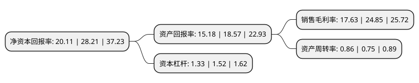

> 本页面由自动化程序生成于 2022年5月20日 01:40
> 内容可能存在错误，如有bug请提交issue至：https://github.com/Eroleice/doc-pi/issues
{.is-warning}

# 上市公司基本情况

## 基本资料

安徽华恒生物科技股份有限公司（以下简称“华恒生物”）成立于2005年04月13日，合肥市。于2021年04月22日在上交所科创板上市。

华恒生物注册资本10,840万元，主要产品包括丙氨酸系列产品，D-泛酸钙和α-熊果苷，其中丙氨酸系列产品包括L-丙氨酸，DL-丙氨酸和β-丙氨酸。，主要从事氨基酸及其衍生物产品研发，生产，销售。以下是详细信息：

- 公司名称: 安徽华恒生物科技股份有限公司
- 股票代码: 688639.SH
- 所在地: 安徽 - 合肥市
- 成立日期: 2005年04月13日
- 注册资本: 10,840万元
- 法定代表人: 郭恒华
- 主营业务: 主要产品包括丙氨酸系列产品，D-泛酸钙和α-熊果苷，其中丙氨酸系列产品包括L-丙氨酸，DL-丙氨酸和β-丙氨酸，主要从事氨基酸及其衍生物产品研发，生产，销售
- 公司官网: www.huahengbio.com
- 公司介绍: 公司坚持“以可再生生物资源替代不可再生石化资源，以绿色清洁的生物制造工艺替代高能耗高污染的石化工艺‖的发展路径，以合成生物学、代谢工程、发酵工程等学科为基础，建立了“工业菌种—发酵与提取—产品应用”的技术研发链，在工业菌种创制、发酵过程智能控制、高效后提取、产品应用开发环节形成了完备的技术领先优势，开发和应用了以微生物细胞工厂为核心的发酵法生产工艺和以酶催化为核心的酶法生产工艺，替代了传统化学合成工艺的重污染生产方式，实现了利用生物技术生产精细化合物的技术变革，并持续推进生物制造技术工艺的升级和迭代。其中，微生物发酵法工艺利用可再生的葡萄糖直接发酵生产，生产成本更低，生产过程更为安全、绿色、环保，代表了更为先进的生物制造方法。公司的核心技术和产品还获得了多项国家及省部级奖项，例如―中国轻工业联合会技术发明一等奖‖、―工信部制造业单项冠军产品”“中国专利优秀奖”“安徽省高新技术产品”“安徽省重点新产品”、“安徽省专利金奖”、“国家重点新产品”等发酵法技术或产品荣誉，以及“上海市科技进步一等奖”、“安徽省高新技术产品”等酶法技术或产品荣誉。

## 股东及高管情况

上市公司第一大股东为郭恒华，持股21,511,194股，占比19.84%，**疑似为**上市公司实际控制人。

截至2022年03月31日，上市公司的前十大股东中，共有4名自然人股东，5名机构股东，1个产品账户，其中5%以上大股东共有4名。上市公司前十大股东明细如下：

> 未能通过持股比例判定出上市公司实际控制人（持股30%以上）
> 可能存在通过间接持股、联合持股、协议控制等方式拥有实际控制权的主体，具体请参考上市公司定期公告！
{.is-warning}

> 截至2022年03月31日，上市公司前十大股东信息如下：

| 股东名称 | 持股数量（股） | 持股比例 |
| --- | --- | --- |
| 郭恒华 | 21,511,194 | 19.84% |
| 合肥市三和股权投资合伙企业(有限合伙) | 10,834,951 | 10% |
| 江苏高投创新价值创业投资合伙企业(有限合伙) | 7,521,861 | 6.94% |
| 嘉兴市兴和股权投资合伙企业(有限合伙) | 6,011,595 | 5.55% |
| 马鞍山幸福基石投资管理有限公司-马鞍山基石智能制造产业基金合伙企业(有限合伙) | 5,177,994 | 4.78% |
| 张学礼 | 3,686,369 | 3.4% |
| 安徽恒润华业投资有限公司 | 3,457,038 | 3.19% |
| 北京芳晟创业投资中心(有限合伙) | 2,507,089 | 2.31% |
| 郭恒平 | 2,401,566 | 2.22% |
| 程昶宇 | 2,233,713 | 2.06% |

## 利润表分析

上市公司2021年总收入为9.54亿元，净利润为1.68亿元，实现盈利。

## 杜邦分析

> 数据列示周期：2021年 | 2020年 | 2019年
{.is-info}

上市公司的净资产收益率在近一年有所下降，下降幅度为-28.71%，其变化情况分解如下：
- 上市公司的销售毛利率在近一年下降了-29.05%，可能是生产效率的下降、商品原材料价格上涨或商品价格的下跌所致。
- 上市公司的资产周转率在近一年上升了14.67%，可能是源自于更快的销售回款或库存管理效果提升。
- 上市公司的财务杠杆比率在近一年下降了-12.5%，可能是减少负债降低财务费用。

