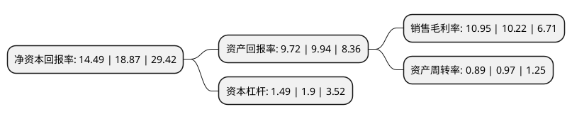

> 本页面由自动化程序生成于 2022年5月20日 01:40
> 内容可能存在错误，如有bug请提交issue至：https://github.com/Eroleice/doc-pi/issues
{.is-warning}

# 上市公司基本情况

## 基本资料

悦康药业集团股份有限公司（以下简称“悦康药业”）成立于2001年08月14日，北京市。于2020年12月24日在上交所科创板上市。

悦康药业注册资本45,000万元，主营业务涵盖药品研发，制造，流通销售全产业链条，具备注射液，冻干粉针剂，片剂，胶囊剂等多种剂型以及部分原料药的生产能力，产品覆盖心脑血管，消化系统，抗感染，内分泌以及抗肿瘤等12个用药领域。以下是详细信息：

- 公司名称: 悦康药业集团股份有限公司
- 股票代码: 688658.SH
- 所在地: 北京 - 北京市
- 成立日期: 2001年08月14日
- 注册资本: 45,000万元
- 法定代表人: 于伟仕
- 主营业务: 主营业务涵盖药品研发，制造，流通销售全产业链条，具备注射液，冻干粉针剂，片剂，胶囊剂等多种剂型以及部分原料药的生产能力，产品覆盖心脑血管，消化系统，抗感染，内分泌以及抗肿瘤等12个用药领域
- 公司官网: www.youcareyk.com
- 公司介绍: 公司是以高端化学药为主导的大型医药企业集团、以研发创新为驱动的国家级高新技术企业，主营业务涵盖药品研发、制造、流通销售全产业链条，具备注射液、冻干粉针剂、片剂、胶囊剂等多种剂型以及部分原料药的生产能力，产品覆盖心脑血管、消化系统、抗感染、内分泌以及抗肿瘤等12个用药领域,公司定位于高端化学药的研发与生产，产品具有较强的行业竞争能力，公司市场地位突出，2009-2018年连续十年入选工信部医药工业百强，2013-2018年连续六年入选工信部中国医药研发产品线最佳工业企业，并在南方医药经济研究所2018年度中国医药工业百强化药企业TOP100中位居第33位,公司始终秉承创新驱动发展的理念，不断全面提升企业实力，通过不断优化生产技术、生产工艺创新，持续提升药品制剂的质量和疗效水平，并将研发成果运用至现有产品中。公司“奥美拉唑系列产品产业化与国际化的关键技术开发项目”、“化学药物晶型关键技术体系的建立与应用”先后获得国家科学技术进步二等奖。

## 股东及高管情况

上市公司第一大股东为阜阳京悦永顺信息咨询有限公司，持股180,240,120股，占比40.05%，为上市公司实际控制人。

截至2022年04月22日，上市公司的前十大股东中，共有10名机构股东，其中5%以上大股东共有3名。上市公司前十大股东明细如下：

> 截至2022年04月22日，上市公司前十大股东信息如下：

| 股东名称 | 持股数量（股） | 持股比例 |
| --- | --- | --- |
| 阜阳京悦永顺信息咨询有限公司 | 180,240,120 | 40.05% |
| 宁波惟精昫竔股权投资合伙企业(有限合伙) | 28,910,000 | 6.4244% |
| 宁波惟精昫竔股权投资合伙企业(有限合伙) | 28,910,000 | 6.42% |
| 菏泽三荣股权投资合伙企业(有限合伙) | 14,400,000 | 3.2% |
| 霍尔果斯德峰股权投资管理合伙企业(有限合伙) | 12,780,000 | 2.84% |
| 霍尔果斯锦然股权投资管理合伙企业(有限合伙) | 12,780,000 | 2.84% |
| 中信证券投资有限公司 | 8,719,080 | 1.94% |
| 北京海纳有容投资管理有限公司-宁波鹏力股权投资合伙企业(有限合伙) | 8,399,880 | 1.87% |
| 苏州厚扬景桥创业投资有限公司-宁波梅山保税港区厚扬天弘股权投资中心(有限合伙) | 7,799,760 | 1.73% |
| 霍尔果斯德仁股权投资管理合伙企业(有限合伙) | 7,200,000 | 1.6% |

## 利润表分析

上市公司2021年总收入为49.65亿元，净利润为5.43亿元，实现盈利。

## 杜邦分析

> 数据列示周期：2021年 | 2020年 | 2019年
{.is-info}

上市公司的净资产收益率在近一年有所下降，下降幅度为-23.21%，其变化情况分解如下：
- 上市公司的销售毛利率在近一年上升了7.14%，可能是生产效率的提升、商品原材料价格下跌或商品价格的上涨所致。
- 上市公司的资产周转率在近一年下降了-8.25%，可能是源自于更慢的销售回款或库存管理效果下降。
- 上市公司的财务杠杆比率在近一年下降了-21.58%，可能是减少负债降低财务费用。

