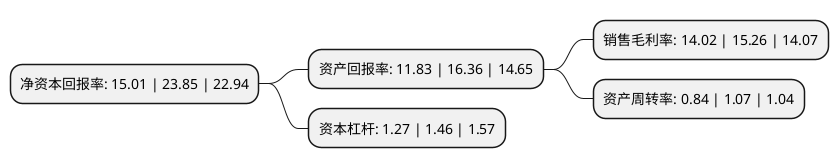

> 本页面由自动化程序生成于 2022年5月20日 01:40
> 内容可能存在错误，如有bug请提交issue至：https://github.com/Eroleice/doc-pi/issues
{.is-warning}

# 上市公司基本情况

## 基本资料

湖南华纳大药厂股份有限公司（以下简称“华纳药厂”）成立于2001年04月30日，长沙市。于2021年07月13日在上交所科创板上市。

华纳药厂注册资本9,380万元，主营业务为药品制剂和原料药的研发，生产和销售。以下是详细信息：

- 公司名称: 湖南华纳大药厂股份有限公司
- 股票代码: 688799.SH
- 所在地: 湖南 - 长沙市
- 成立日期: 2001年04月30日
- 注册资本: 9,380万元
- 法定代表人: 黄本东
- 主营业务: 主营业务为药品制剂和原料药的研发，生产和销售
- 公司官网: www.warrant.com.cn
- 公司介绍: 公司自创立以来，秉承“科技服务健康”的企业宗旨，遵循“潜心制药，诚信待人”的企业经营理念，坚持创新引领的企业发展战略、走专业化发展道路，实现了人才、产品、平台的持续积累。主营业务为药品制剂和原料药的研发、生产和销售,公司主要产品分布于消化、呼吸、抗感染等领域，消化类药物包括胶体果胶铋干混悬剂、胶体果胶铋胶囊、多库酯钠片、蒙脱石散、聚乙二醇4000散等；抗感染类药物包括磷霉素氨丁三醇散、法罗培南钠颗粒、克霉唑阴道片等；呼吸类药物如吸入用乙酰半胱氨酸溶液等,公司围绕消化、呼吸、抗感染、儿童用药等重点治疗领域进行未来产品线布局。公司在研产品储备丰富，形成了较强的产品迭代能力,公司视产品质量为企业的生命，并始终坚持“质量第一”的质量管理方针，建立、健全“全面质量管理体系”。公司通过实施药品GMP管理，建立了完善的质量检验和质量保证体系，各生产线均通过新版GMP认证。

## 股东及高管情况

上市公司第一大股东为湖南华纳医药投资合伙企业(有限合伙)，持股37,312,000股，占比39.78%，为上市公司实际控制人。

截至2022年03月31日，上市公司的前十大股东中，共有5名自然人股东，4名机构股东，1个产品账户，其中5%以上大股东共有2名。上市公司前十大股东明细如下：

> 截至2022年03月31日，上市公司前十大股东信息如下：

| 股东名称 | 持股数量（股） | 持股比例 |
| --- | --- | --- |
| 湖南华纳医药投资合伙企业(有限合伙) | 37,312,000 | 39.78% |
| 徐燕 | 13,200,000 | 14.07% |
| 泰州中电弘泰投资中心(有限合伙) | 4,500,000 | 4.8% |
| 金焰 | 3,036,000 | 3.24% |
| 姜策 | 2,600,000 | 2.77% |
| 徐小强 | 2,400,000 | 2.56% |
| 华泰证券资管-招商银行-华泰华纳药厂家园1号科创板员工持股集合资产管理计划 | 2,350,000 | 2.51% |
| 湖南鼎信恒祥股权投资企业(有限合伙) | 1,750,000 | 1.87% |
| 九江鹊山天权投资中心(有限合伙) | 1,750,000 | 1.87% |
| 余旭亮 | 1,500,000 | 1.6% |

## 利润表分析

上市公司2021年总收入为11.46亿元，净利润为1.6亿元，实现盈利。

## 杜邦分析

> 数据列示周期：2021年 | 2020年 | 2019年
{.is-info}

上市公司的净资产收益率在近一年有所下降，下降幅度为-37.06%，其变化情况分解如下：
- 上市公司的销售毛利率在近一年下降了-8.13%，可能是生产效率的下降、商品原材料价格上涨或商品价格的下跌所致。
- 上市公司的资产周转率在近一年下降了-21.5%，可能是源自于更慢的销售回款或库存管理效果下降。
- 上市公司的财务杠杆比率在近一年下降了-13.01%，可能是减少负债降低财务费用。

