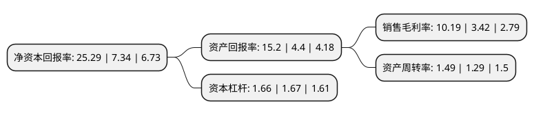

> 本页面由自动化程序生成于 2022年5月20日 01:02
> 内容可能存在错误，如有bug请提交issue至：https://github.com/Eroleice/doc-pi/issues
{.is-warning}

# 上市公司基本情况

## 基本资料

四川新金路集团股份有限公司（以下简称“新金路”）成立于1992年04月18日，德阳市。于1993年05月07日在深交所主板上市。

新金路注册资本60,918.225万元，主要业务:生产销售PVC树脂，烧碱系列化工原料及其加工产品，白酒生产和销售，房地产业，天然气加工销售等。以下是详细信息：

- 公司名称: 四川新金路集团股份有限公司
- 股票代码: 000510.SZ
- 所在地: 四川 - 德阳市
- 成立日期: 1992年04月18日
- 注册资本: 60,918.225万元
- 法定代表人: 刘江东
- 主营业务: 生产销售PVC树脂，烧碱系列化工原料及其加工产品，白酒生产和销售，房地产业，天然气加工销售等
- 公司官网: www.xjinlu.cn
- 公司介绍: 公司为氯碱化工企业，生产规模居于同行业中等水平，管理能力、技术水平、能源消耗水平、品牌价值等处于行业中等以上水平，公司已成为国内氯碱行业的骨干企业。公司主要从事PVC树脂与烧碱的生产与销售。PVC树脂作为基础化工原料，广泛运用于建筑、包装、电力电缆等行业，烧碱产品广泛应用于轻工、纺织、农业、建材、电子等方面与国民经济发展息息相关。“金路”牌聚氯乙烯树脂被确定为大连商品交易所PVC期货指定交割品牌，“金路”牌PVC树脂连年被评为“全国用户满意产品”，公司产品质量在行业及下游客户中拥有良好的口碑，主导产品PVC树脂拥有较为明显的品牌优势。

## 股东及高管情况

上市公司第一大股东为刘江东，持股53,752,951股，占比8.82%，**疑似为**上市公司实际控制人。

截至2022年03月31日，上市公司的前十大股东中，共有3名自然人股东，4名机构股东，2个产品账户，1个海外主体，其中5%以上大股东共有2名。上市公司前十大股东明细如下：

> 未能通过持股比例判定出上市公司实际控制人（持股30%以上）
> 可能存在通过间接持股、联合持股、协议控制等方式拥有实际控制权的主体，具体请参考上市公司定期公告！
{.is-warning}

> 上市公司第一大股东持股不超过10%，请检查是否存在公司控制权风险！
{.is-danger}

> 截至2022年03月31日，上市公司前十大股东信息如下：

| 股东名称 | 持股数量（股） | 持股比例 |
| --- | --- | --- |
| 刘江东 | 53,752,951 | 8.82% |
| 四川金海马实业有限公司 | 36,898,365 | 6.06% |
| 德阳市国有资产经营有限公司 | 21,556,124 | 3.54% |
| 四川新金路集团股份有限公司-2021年员工持股计划 | 17,989,100 | 2.95% |
| 汉龙实业发展有限公司 | 12,560,365 | 2.06% |
| 陈显学 | 10,572,370 | 1.74% |
| 深圳市大刚投资管理有限公司-大刚麒圣启航3期私募证券投资基金 | 5,601,633 | 0.92% |
| 韦露馨 | 3,426,900 | 0.56% |
| 深圳市特发集团有限公司 | 3,246,009 | 0.53% |
| MORGAN STANLEY & CO. INTERNATIONAL PLC. | 3,011,733 | 0.49% |

## 利润表分析

上市公司2021年总收入为29.78亿元，净利润为3.03亿元，实现盈利。

## 杜邦分析

> 数据列示周期：2021年 | 2020年 | 2019年
{.is-info}

上市公司的净资产收益率在近一年有所上升，上升幅度为244.55%，其变化情况分解如下：
- 上市公司的销售毛利率在近一年上升了197.95%，可能是生产效率的提升、商品原材料价格下跌或商品价格的上涨所致。
- 上市公司的资产周转率在近一年上升了15.5%，可能是源自于更快的销售回款或库存管理效果提升。
- 上市公司的财务杠杆比率在近一年下降了-0.6%，可能是减少负债降低财务费用。

