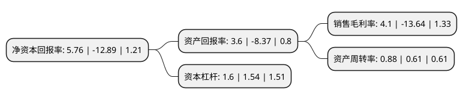

> 本页面由自动化程序生成于 2022年5月20日 01:02
> 内容可能存在错误，如有bug请提交issue至：https://github.com/Eroleice/doc-pi/issues
{.is-warning}

# 上市公司基本情况

## 基本资料

金浦钛业股份有限公司（以下简称“金浦钛业”）成立于1989年11月15日，吉林市。于1993年12月15日在深交所主板上市。

金浦钛业注册资本98,683.31万元，主营业务:钛白粉的生产和销售以下是详细信息：

- 公司名称: 金浦钛业股份有限公司
- 股票代码: 000545.SZ
- 所在地: 吉林 - 吉林市
- 成立日期: 1989年11月15日
- 注册资本: 98,683.31万元
- 法定代表人: 郭彦君
- 主营业务: 主营业务:钛白粉的生产和销售
- 公司官网: www.nthcl.com
- 公司介绍: 公司是国内较大的硫酸法钛白粉生产企业之一，2012年8月通过“高新技术企业”认定，已通过ISO9001：2000质量管理体系认证。公司产品广泛应用于涂料、造纸、化纤、油墨、塑料管型材、薄膜、橡胶、皮革、化妆品等领域，畅销国内市场，并出口到东南亚、非洲、美洲等国家或地区，享誉国内外，受到国内外用户的一致好评。公司产品连续多年荣获“江苏省名牌产品”称号，其“南南”牌钛白粉商标被授予“南京市著名商标”称号。NA100锐钛型钛白粉、NR950高性能金红石型钛白粉及副产品NH9330型氧化铁黑通过江苏省新产品新技术鉴定，其废酸回收技术也已通过南京市新产品新技术鉴定。

## 股东及高管情况

上市公司第一大股东为金浦投资控股集团有限公司，持股338,101,448股，占比34.26%，为上市公司实际控制人。

截至2022年03月31日，上市公司的前十大股东中，共有7名自然人股东，2名机构股东，1个产品账户，其中5%以上大股东共有1名。上市公司前十大股东明细如下：

> 截至2022年03月31日，上市公司前十大股东信息如下：

| 股东名称 | 持股数量（股） | 持股比例 |
| --- | --- | --- |
| 金浦投资控股集团有限公司 | 338,101,448 | 34.26% |
| 广州无线电集团有限公司 | 13,736,930 | 1.39% |
| 景建波 | 7,767,000 | 0.79% |
| 张秀 | 4,488,100 | 0.45% |
| 张加强 | 4,000,000 | 0.41% |
| 深圳前海鹰眼资本投资管理有限公司-福照1号鹰眼私募证券投资基金 | 3,891,300 | 0.39% |
| 赵章财 | 3,474,900 | 0.35% |
| 柳冰 | 3,425,500 | 0.35% |
| 吴新生 | 3,026,000 | 0.31% |
| 张永胜 | 3,000,000 | 0.3% |

## 利润表分析

上市公司2021年总收入为26.2亿元，净利润为1.07亿元，实现盈利。

## 杜邦分析

> 数据列示周期：2021年 | 2020年 | 2019年
{.is-info}

上市公司的净资产收益率在近一年有所下降，下降幅度为-144.69%，其变化情况分解如下：
- 上市公司的销售毛利率在近一年下降了-130.06%，可能是生产效率的下降、商品原材料价格上涨或商品价格的下跌所致。
- 上市公司的资产周转率在近一年上升了44.26%，可能是源自于更快的销售回款或库存管理效果提升。
- 上市公司的财务杠杆比率在近一年上升了3.9%，可能是增加负债扩大生产规模。

