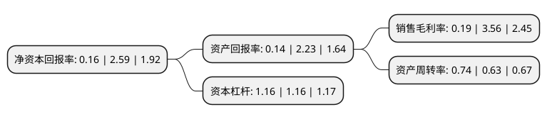

> 本页面由自动化程序生成于 2022年5月20日 01:02
> 内容可能存在错误，如有bug请提交issue至：https://github.com/Eroleice/doc-pi/issues
{.is-warning}

# 上市公司基本情况

## 基本资料

宁夏英力特化工股份有限公司（以下简称“英力特”）成立于1996年11月12日，石嘴山市。于1996年11月20日在深交所主板上市。

英力特注册资本30,308.76万元，主要业务:化工原料及化学制品生产及销售。主要产品:PVC，电石，双氰胺。以下是详细信息：

- 公司名称: 宁夏英力特化工股份有限公司
- 股票代码: 000635.SZ
- 所在地: 宁夏 - 石嘴山市
- 成立日期: 1996年11月12日
- 注册资本: 30,308.76万元
- 法定代表人: 张华
- 主营业务: 化工原料及化学制品生产及销售主要产品:PVC，电石，双氰胺
- 公司官网: null
- 公司介绍: 公司于1996年在深圳交易所挂牌上市，主要业务为电石及其系列延伸产品的生产和销售；聚氯乙烯、烧碱及其系列延伸产品的生产和销售；特种树脂生产及销售；电力、热力的生产及销售。公司主要产品有PVC、E-PVC、烧碱、电石等产品。其中PVC主要应用于各种型材、板材、管材、硬片、电线电缆等行业；E-PVC主要应用于人造革、地板革、壁纸等行业；烧碱在国民经济中应用非常广泛，主要应用于冶金、轻工、化工、纺织、印染、医药、电力等行业；电石主要用来生产乙炔气体，制取多种化工产品的原料。

## 股东及高管情况

上市公司第一大股东为国能英力特能源化工集团股份有限公司，持股155,322,687股，占比51.25%，为上市公司实际控制人。

截至2022年03月31日，上市公司的前十大股东中，共有8名自然人股东，1名机构股东，1个产品账户，其中5%以上大股东共有1名。上市公司前十大股东明细如下：

> 截至2022年03月31日，上市公司前十大股东信息如下：

| 股东名称 | 持股数量（股） | 持股比例 |
| --- | --- | --- |
| 国能英力特能源化工集团股份有限公司 | 155,322,687 | 51.25% |
| 朴永松 | 2,833,300 | 0.93% |
| 谢红秀 | 1,704,300 | 0.56% |
| 蔡学慧 | 1,363,300 | 0.45% |
| 上海大藏资产管理有限公司-大藏友芾三号私募证券投资基金 | 1,109,300 | 0.37% |
| 冯军伏 | 983,800 | 0.32% |
| 彭帅 | 950,635 | 0.31% |
| 晏树勇 | 614,000 | 0.2% |
| 张冰 | 613,400 | 0.2% |
| 罗瑞娉 | 514,700 | 0.17% |

## 杜邦分析

> 数据列示周期：2021年 | 2020年 | 2019年
{.is-info}

上市公司的净资产收益率在近一年有所下降，下降幅度为-93.82%，其变化情况分解如下：
- 上市公司的销售毛利率在近一年下降了-94.66%，可能是生产效率的下降、商品原材料价格上涨或商品价格的下跌所致。
- 上市公司的资产周转率在近一年上升了17.46%，可能是源自于更快的销售回款或库存管理效果提升。
- 上市公司的财务杠杆比率在近一年下降了0%，可能是减少负债降低财务费用。

