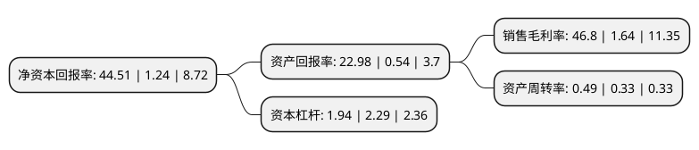

> 本页面由自动化程序生成于 2022年5月20日 01:03
> 内容可能存在错误，如有bug请提交issue至：https://github.com/Eroleice/doc-pi/issues
{.is-warning}

# 上市公司基本情况

## 基本资料

内蒙古远兴能源股份有限公司（以下简称“远兴能源”）成立于1997年01月23日，鄂尔多斯市。于1997年01月31日在深交所主板上市。

远兴能源注册资本367,341.256万元，主要业务:天然碱和无机盐系列产品的生产和经营。主要产品:纯碱，小苏打。以下是详细信息：

- 公司名称: 内蒙古远兴能源股份有限公司
- 股票代码: 000683.SZ
- 所在地: 内蒙古 - 鄂尔多斯市
- 成立日期: 1997年01月23日
- 注册资本: 367,341.256万元
- 法定代表人: 宋为兔
- 主营业务: 天然碱和无机盐系列产品的生产和经营主要产品:纯碱，小苏打
- 公司官网: www.yuanxing.com
- 公司介绍: 公司是一家以天然气化工、煤化工、天然碱化工为主导，新能源化工、精细化工及物流业为发展方向的现代化能源化工企业。在乌审旗乌审召生态工业园区建成生产规模135万吨/年的中国最大的天然气制甲醇基地；在有“中国天然碱之都”美誉的河南桐柏县形成了生产能力200万吨以上的中国天然碱循环经济示范基地；在乌审旗蒙大工业园区建设的年产100万吨/煤制化肥项目已建成投产，在兴安盟建设的年产60万吨/年尿素项目正在试车。煤资源基地建设已初具规模，伊金霍洛旗湾图沟已形成450万吨/年的煤炭产能，乌兰察布市兴和庙梁煤炭循环经济产业园区数字化配煤项目已建成投运，同时与中煤集团合作的一个千万吨级的煤矿已投入试生产。公司所属企业的“远兴”牌和“马兰”牌商标是中国驰名商标，“远兴”牌纯碱是中国名牌产品。

## 股东及高管情况

上市公司第一大股东为内蒙古博源控股集团有限公司，持股1,122,491,995股，占比30.56%，为上市公司实际控制人。

截至2022年03月31日，上市公司的前十大股东中，共有4名机构股东，5个产品账户，1个海外主体，其中5%以上大股东共有1名。上市公司前十大股东明细如下：

> 截至2022年03月31日，上市公司前十大股东信息如下：

| 股东名称 | 持股数量（股） | 持股比例 |
| --- | --- | --- |
| 内蒙古博源控股集团有限公司 | 1,122,491,995 | 30.56% |
| 中国信达资产管理股份有限公司 | 166,530,749 | 4.53% |
| 香港中央结算有限公司(陆股通) | 63,791,906 | 1.74% |
| 中国工商银行股份有限公司-中欧价值智选回报混合型证券投资基金 | 60,026,313 | 1.63% |
| 中国农业银行股份有限公司-大成新锐产业混合型证券投资基金 | 44,894,722 | 1.22% |
| 中信证券股份有限公司 | 42,142,295 | 1.15% |
| 招商银行股份有限公司-兴全合润混合型证券投资基金 | 38,213,286 | 1.04% |
| 中国工商银行-广发策略优选混合型证券投资基金 | 32,387,785 | 0.88% |
| 北京中稷弘立资产管理有限公司 | 32,300,995 | 0.88% |
| 中国建设银行股份有限公司-浙商丰利增强债券型证券投资基金 | 30,000,000 | 0.82% |

## 利润表分析

上市公司2021年总收入为121.48亿元，净利润为56.86亿元，实现盈利。

## 杜邦分析

> 数据列示周期：2021年 | 2020年 | 2019年
{.is-info}

上市公司的净资产收益率在近一年有所上升，上升幅度为3489.52%，其变化情况分解如下：
- 上市公司的销售毛利率在近一年上升了2753.66%，可能是生产效率的提升、商品原材料价格下跌或商品价格的上涨所致。
- 上市公司的资产周转率在近一年上升了48.48%，可能是源自于更快的销售回款或库存管理效果提升。
- 上市公司的财务杠杆比率在近一年下降了-15.28%，可能是减少负债降低财务费用。

