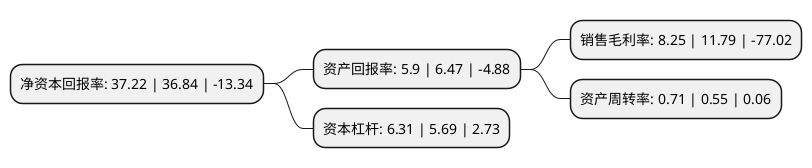

> 本页面由自动化程序生成于 2022年5月20日 01:03
> 内容可能存在错误，如有bug请提交issue至：https://github.com/Eroleice/doc-pi/issues
{.is-warning}

# 上市公司基本情况

## 基本资料

甘肃亚太实业发展股份有限公司（以下简称“亚太实业”）成立于1988年02月12日，兰州市。于1997年02月28日在深交所主板上市。

亚太实业注册资本32,327万元，公司的主营业务由房地产开发与销售变更为精细化工产品中的医药中间体，农药中间体的研发，生产和销售。以下是详细信息：

- 公司名称: 甘肃亚太实业发展股份有限公司
- 股票代码: 000691.SZ
- 所在地: 甘肃 - 兰州市
- 成立日期: 1988年02月12日
- 注册资本: 32,327万元
- 法定代表人: 马兵
- 主营业务: 公司的主营业务由房地产开发与销售变更为精细化工产品中的医药中间体，农药中间体的研发，生产和销售
- 公司官网: www.lzytgroup.com\www.ytsy000691.com
- 公司介绍: 公司创建于1996年8月，是甘肃地产界首家控股上市企业，是集住宅、工业、商业地产开发，建筑工程、工业制造、矿业开采、生物制药、能源开发、资本运营、金融服务、经贸商贸、餐饮娱乐等为一体的多元化大型股份制企业。公司主营业务主要由房地产开发构成。已成功开发“亚太·名苑”、“亚太·嘉园”、“亚太·国际公馆”等20多个经典小区，累计开发面积400多万平方米，多次获得“中国名盘100强”、“中国房产名企50强”等殊荣。公司深耕兰州市永登县区域市场，注重加强管理，在当地具有一定的品牌效应和市场认知度。

## 股东及高管情况

上市公司第一大股东为兰州太华投资控股有限公司，持股54,783,700股，占比16.95%，**疑似为**上市公司实际控制人。

截至2022年03月31日，上市公司的前十大股东中，共有7名自然人股东，2名机构股东，1个产品账户，其中5%以上大股东共有2名。上市公司前十大股东明细如下：

> 未能通过持股比例判定出上市公司实际控制人（持股30%以上）
> 可能存在通过间接持股、联合持股、协议控制等方式拥有实际控制权的主体，具体请参考上市公司定期公告！
{.is-warning}

> 截至2022年03月31日，上市公司前十大股东信息如下：

| 股东名称 | 持股数量（股） | 持股比例 |
| --- | --- | --- |
| 兰州太华投资控股有限公司 | 54,783,700 | 16.95% |
| 兰州亚太工矿集团有限公司 | 32,177,295 | 9.95% |
| 芜湖长元股权投资基金(有限合伙) | 7,015,489 | 2.17% |
| 谢锦和 | 4,972,800 | 1.54% |
| 陈荣 | 4,872,200 | 1.51% |
| 王坚宏 | 3,990,500 | 1.23% |
| 张佳 | 3,949,210 | 1.22% |
| 王涛 | 3,649,200 | 1.13% |
| 张汉亮 | 3,320,600 | 1.03% |
| 谢人杰 | 2,766,600 | 0.86% |

## 利润表分析

上市公司2021年总收入为5.21亿元，净利润为0.43亿元，实现盈利。

## 杜邦分析

> 数据列示周期：2021年 | 2020年 | 2019年
{.is-info}

上市公司的净资产收益率在近一年有所上升，上升幅度为1.03%，其变化情况分解如下：
- 上市公司的销售毛利率在近一年下降了-30.03%，可能是生产效率的下降、商品原材料价格上涨或商品价格的下跌所致。
- 上市公司的资产周转率在近一年上升了29.09%，可能是源自于更快的销售回款或库存管理效果提升。
- 上市公司的财务杠杆比率在近一年上升了10.9%，可能是增加负债扩大生产规模。

