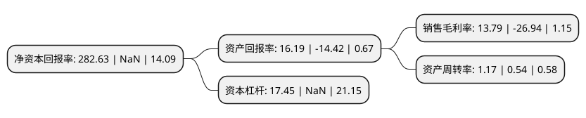

> 本页面由自动化程序生成于 2022年5月20日 01:03
> 内容可能存在错误，如有bug请提交issue至：https://github.com/Eroleice/doc-pi/issues
{.is-warning}

# 上市公司基本情况

## 基本资料

湖北双环科技股份有限公司（以下简称“双环科技”）成立于1993年12月27日，孝感市。于1997年04月15日在深交所主板上市。

双环科技注册资本46,414.577万元，主要产品:联碱产品。以下是详细信息：

- 公司名称: 湖北双环科技股份有限公司
- 股票代码: 000707.SZ
- 所在地: 湖北 - 孝感市
- 成立日期: 1993年12月27日
- 注册资本: 46,414.577万元
- 法定代表人: 汪万新
- 主营业务: 主要产品:联碱产品
- 公司官网: www.hbshkj.cn
- 公司介绍: 公司主要生产销售纯碱、氯化铵及盐化工系列产品、氯甲烷系列产品、氯化聚乙烯系列产品；承担与盐化工行业相关的科研、设计及新产品开发、设备制造项目；从事软件开发及医疗设备、光电子设备微电机的生产与销售及房地产开发。公司是采用联碱法生产纯碱和氯化铵的化工企业，具有年产纯碱和氯化铵各180万吨的生产能力，是我国最大的纯碱生产企业之一，也是世界上最大的联碱生产企业。公司主导产品氯化铵被授予“全国用户满意产品”称号，公司主导产品红双环牌纯碱和“红双圈”牌氯化铵双双被评为“中国名牌”产品。公司多次被授予“全国用户满意企业”、“全国质量效益型先进企业特别奖”、“全国质量管理先进企业”、“全国推行全面质量管理先进企业”等荣誉称号。

## 股东及高管情况

上市公司第一大股东为湖北双环化工集团有限公司，持股116,563,210股，占比25.11%，**疑似为**上市公司实际控制人。

截至2022年03月31日，上市公司的前十大股东中，共有8名自然人股东，1名机构股东，1个产品账户，其中5%以上大股东共有1名。上市公司前十大股东明细如下：

> 未能通过持股比例判定出上市公司实际控制人（持股30%以上）
> 可能存在通过间接持股、联合持股、协议控制等方式拥有实际控制权的主体，具体请参考上市公司定期公告！
{.is-warning}

> 截至2022年03月31日，上市公司前十大股东信息如下：

| 股东名称 | 持股数量（股） | 持股比例 |
| --- | --- | --- |
| 湖北双环化工集团有限公司 | 116,563,210 | 25.11% |
| 葛素芹 | 7,200,872 | 1.55% |
| 梅崯玺 | 4,882,801 | 1.05% |
| 魏巍 | 4,873,300 | 1.05% |
| 吴峰 | 4,770,200 | 1.03% |
| 花中富 | 3,931,800 | 0.85% |
| 陈于文 | 3,876,007 | 0.84% |
| 朱培毅 | 3,603,000 | 0.78% |
| 中国工商银行-广发策略优选混合型证券投资基金 | 3,143,600 | 0.68% |
| 王雯丽 | 2,619,000 | 0.56% |

## 利润表分析

上市公司2021年总收入为30.63亿元，净利润为4.22亿元，实现盈利。

## 杜邦分析

> 数据列示周期：2021年 | 2020年 | 2019年
{.is-info}

上市公司的净资产收益率在近一年有所下降，下降幅度为NaN%，其变化情况分解如下：
- 上市公司的销售毛利率在近一年下降了-151.19%，可能是生产效率的下降、商品原材料价格上涨或商品价格的下跌所致。
- 上市公司的资产周转率在近一年上升了116.67%，可能是源自于更快的销售回款或库存管理效果提升。
- 上市公司的财务杠杆比率在近一年下降了NaN%，可能是减少负债降低财务费用。

