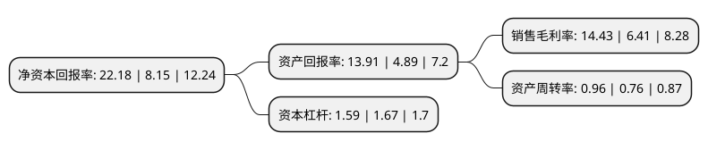

> 本页面由自动化程序生成于 2022年5月20日 01:03
> 内容可能存在错误，如有bug请提交issue至：https://github.com/Eroleice/doc-pi/issues
{.is-warning}

# 上市公司基本情况

## 基本资料

航锦科技股份有限公司（以下简称“航锦科技”）成立于1997年09月16日，葫芦岛市。于1997年10月17日在深交所主板上市。

航锦科技注册资本67,915.6万元，主要产品:烧碱，氯化苯，液氯，聚氯乙烯，三氯乙烯，环氧丙烷，聚醚。以下是详细信息：

- 公司名称: 航锦科技股份有限公司
- 股票代码: 000818.SZ
- 所在地: 辽宁 - 葫芦岛市
- 成立日期: 1997年09月16日
- 注册资本: 67,915.6万元
- 法定代表人: 蔡卫东
- 主营业务: 主要产品:烧碱，氯化苯，液氯，聚氯乙烯，三氯乙烯，环氧丙烷，聚醚
- 公司官网: www.hangjintechnology.com
- 公司介绍: 公司是一家大型化工生产基地，主要产品包括：烧碱、液氯、氯化苯、环氧丙烷、聚醚及聚氯乙烯等，并已形成了以烧碱、环氧丙烷、聚醚三大引进装置为主的大工业化生产格局。主要销售对象包括化纤、医药、聚氨酯、建筑等下游产品生产企业，产品用途较为广泛。2017年下半年，公司成功收购了长沙韶光半导体有限公司及威科电子模块(深圳)有限公司两家军工企业。长沙韶光是我国军用集成电路系列产品的供应商，产品广泛应用于航空、航天、兵器、船舶、电子等领域，客户体系涵盖了我国各大军工集团及下属单位、民营军工企业等国内重点武器装备生产企业。威科电子主要产品为厚膜集成电路，并且在标准厚膜混合集成电路领域有着近三十年的生产和销售经验，产品在军工、航天等高端领域拥有广阔的市场空间。公司将实现化工业务+军工业务两个业务板块共同发展的产业布局，实现化工军工业务双轮驱动、两翼齐飞的新格局。

## 股东及高管情况

上市公司第一大股东为武汉新能实业发展有限公司，持股113,363,924股，占比16.69%，**疑似为**上市公司实际控制人。

截至2022年03月31日，上市公司的前十大股东中，共有4名自然人股东，4名机构股东，1个产品账户，1个海外主体，其中5%以上大股东共有2名。上市公司前十大股东明细如下：

> 未能通过持股比例判定出上市公司实际控制人（持股30%以上）
> 可能存在通过间接持股、联合持股、协议控制等方式拥有实际控制权的主体，具体请参考上市公司定期公告！
{.is-warning}

> 截至2022年03月31日，上市公司前十大股东信息如下：

| 股东名称 | 持股数量（股） | 持股比例 |
| --- | --- | --- |
| 武汉新能实业发展有限公司 | 113,363,924 | 16.69% |
| 新余昊月信息技术有限公司 | 71,138,276 | 10.47% |
| 香港中央结算有限公司(陆股通) | 32,847,735 | 4.84% |
| 彭朝晖 | 13,398,600 | 1.97% |
| 中国银行股份有限公司-华夏行业景气混合型证券投资基金 | 11,718,048 | 1.73% |
| 王世忱 | 10,544,168 | 1.55% |
| 杭州万珹投资合伙企业(有限合伙) | 8,174,668 | 1.2% |
| 张利群 | 8,070,040 | 1.19% |
| 张新容 | 6,843,350 | 1.01% |
| 华夏人寿保险股份有限公司-自有资金 | 6,000,000 | 0.88% |

## 杜邦分析

> 数据列示周期：2021年 | 2020年 | 2019年
{.is-info}

上市公司的净资产收益率在近一年有所上升，上升幅度为172.15%，其变化情况分解如下：
- 上市公司的销售毛利率在近一年上升了125.12%，可能是生产效率的提升、商品原材料价格下跌或商品价格的上涨所致。
- 上市公司的资产周转率在近一年上升了26.32%，可能是源自于更快的销售回款或库存管理效果提升。
- 上市公司的财务杠杆比率在近一年下降了-4.79%，可能是减少负债降低财务费用。

