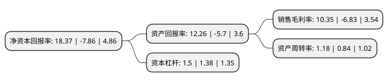

> 本页面由自动化程序生成于 2022年5月20日 01:03
> 内容可能存在错误，如有bug请提交issue至：https://github.com/Eroleice/doc-pi/issues
{.is-warning}

# 上市公司基本情况

## 基本资料

山东海化股份有限公司（以下简称“山东海化”）成立于1998年06月04日，潍坊市。于1998年07月03日在深交所主板上市。

山东海化注册资本89,509.193万元，主要产品为纯碱，烧碱等产品的生产和销售以下是详细信息：

- 公司名称: 山东海化股份有限公司
- 股票代码: 000822.SZ
- 所在地: 山东 - 潍坊市
- 成立日期: 1998年06月04日
- 注册资本: 89,509.193万元
- 法定代表人: 王永志
- 主营业务: 主要产品为纯碱，烧碱等产品的生产和销售
- 公司官网: www.chinahaihua.com
- 公司介绍: 公司是以发展海洋化工新兴产业为主导的现代化特大型企业，主要致力于纯碱、溴素、氯化钙、原盐等产品的生产和销售，其中纯碱为公司主导产品，广泛应用于化工、玻璃、冶金、造纸、印染、合成洗涤剂、石油化工、食品、医药卫生等行业，是重要的基础化工原料。目前，公司纯碱业务位于行业前列。“鸢都”牌纯碱荣获“中国名牌”、“中国驰名商标”称号。

## 股东及高管情况

上市公司第一大股东为山东海化集团有限公司，持股361,048,878股，占比40.34%，为上市公司实际控制人。

截至2022年03月31日，上市公司的前十大股东中，共有1名自然人股东，2名机构股东，6个产品账户，1个海外主体，其中5%以上大股东共有1名。上市公司前十大股东明细如下：

> 截至2022年03月31日，上市公司前十大股东信息如下：

| 股东名称 | 持股数量（股） | 持股比例 |
| --- | --- | --- |
| 山东海化集团有限公司 | 361,048,878 | 40.34% |
| 中国建设银行股份有限公司-浙商丰利增强债券型证券投资基金 | 20,000,000 | 2.23% |
| UBS   AG | 9,083,030 | 1.01% |
| 保宁资本有限公司-保宁新兴市场基金(美国) | 7,801,700 | 0.87% |
| 华泰证券股份有限公司 | 7,760,079 | 0.87% |
| 陈淑琤 | 5,504,900 | 0.62% |
| 中国农业银行股份有限公司-浙商聚潮产业成长混合型证券投资基金 | 5,000,000 | 0.56% |
| 中国建设银行股份有限公司-西部利得策略优选混合型证券投资基金 | 4,952,400 | 0.55% |
| 中国农业银行股份有限公司-申万菱信新能源汽车主题灵活配置混合型证券投资基金 | 4,573,194 | 0.51% |
| 兴业银行股份有限公司-南方金融主题灵活配置混合型证券投资基金 | 3,976,400 | 0.44% |

## 利润表分析

上市公司2021年总收入为58.5亿元，净利润为6.05亿元，实现盈利。

## 杜邦分析

> 数据列示周期：2021年 | 2020年 | 2019年
{.is-info}

上市公司的净资产收益率在近一年有所下降，下降幅度为-333.72%，其变化情况分解如下：
- 上市公司的销售毛利率在近一年下降了-251.54%，可能是生产效率的下降、商品原材料价格上涨或商品价格的下跌所致。
- 上市公司的资产周转率在近一年上升了40.48%，可能是源自于更快的销售回款或库存管理效果提升。
- 上市公司的财务杠杆比率在近一年上升了8.7%，可能是增加负债扩大生产规模。

