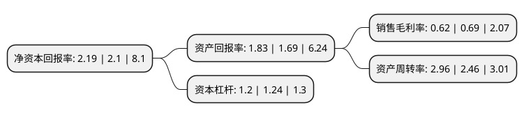

> 本页面由自动化程序生成于 2022年5月20日 01:04
> 内容可能存在错误，如有bug请提交issue至：https://github.com/Eroleice/doc-pi/issues
{.is-warning}

# 上市公司基本情况

## 基本资料

大庆华科股份有限公司（以下简称“大庆华科”）成立于1998年12月07日，大庆市。于2000年07月26日在深交所主板上市。

大庆华科注册资本12,963.95万元，主要业务:精细化工产品，石油化工产品的生产及销售。主要产品:聚丙烯，加氢戊烯。以下是详细信息：

- 公司名称: 大庆华科股份有限公司
- 股票代码: 000985.SZ
- 所在地: 黑龙江 - 大庆市
- 成立日期: 1998年12月07日
- 注册资本: 12,963.95万元
- 法定代表人: 施铁权
- 主营业务: 精细化工产品，石油化工产品的生产及销售主要产品:聚丙烯，加氢戊烯
- 公司官网: www.huake.com
- 公司介绍: 公司位于大庆高新技术产业开发区，于2008年按照新标准被首批认定为国家级高新技术企业。公司现有化工分公司、树脂分公司、聚丙烯分公司、科技开发分公司、药业分公司、销售分公司六个分公司、检维修中心、质量检验中心两个中心、一个研究所。主要从事石化新材料、精细化工和医药产品的开发、生产和销售。公司始终坚持“资源配置最优化、管理实现精细化、效益追求最佳化”的经营理念，不断完善质量、安全、健康、环保管理体系，努力建设资源节约型和环境友好型企业。公司曾荣获全国五一劳动奖、黑龙江省最具成长性企业、国家火炬计划重点高新技术企业、国家创新型企业等多项荣誉。公司裂解C5分离工艺技术、C9浅色石油树脂工艺技术、芳烃加氢工艺技术、氢化石油树脂工艺技术、乙腈精制工艺技术获得国家发明专利授权。

## 股东及高管情况

上市公司第一大股东为中国石油大庆石油化工有限公司，持股71,339,700股，占比55.03%，为上市公司实际控制人。

截至2022年03月31日，上市公司的前十大股东中，共有8名自然人股东，2名机构股东，其中5%以上大股东共有2名。上市公司前十大股东明细如下：

> 截至2022年03月31日，上市公司前十大股东信息如下：

| 股东名称 | 持股数量（股） | 持股比例 |
| --- | --- | --- |
| 中国石油大庆石油化工有限公司 | 71,339,700 | 55.03% |
| 大庆高新国有资产运营有限公司 | 10,980,900 | 8.47% |
| 周顺东 | 772,700 | 0.6% |
| 潘霞 | 640,000 | 0.49% |
| 陈乡 | 580,000 | 0.45% |
| 林梦清 | 501,849 | 0.39% |
| 焦玥 | 482,300 | 0.37% |
| 黄秋月 | 465,000 | 0.36% |
| 向美珍 | 463,354 | 0.36% |
| 孙定保 | 451,483 | 0.35% |

## 利润表分析

上市公司2021年总收入为20.73亿元，净利润为0.12亿元，实现盈利。

## 杜邦分析

> 数据列示周期：2021年 | 2020年 | 2019年
{.is-info}

上市公司的净资产收益率在近一年有所上升，上升幅度为4.29%，其变化情况分解如下：
- 上市公司的销售毛利率在近一年下降了-10.14%，可能是生产效率的下降、商品原材料价格上涨或商品价格的下跌所致。
- 上市公司的资产周转率在近一年上升了20.33%，可能是源自于更快的销售回款或库存管理效果提升。
- 上市公司的财务杠杆比率在近一年下降了-3.23%，可能是减少负债降低财务费用。

