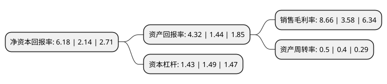

> 本页面由自动化程序生成于 2022年5月20日 01:04
> 内容可能存在错误，如有bug请提交issue至：https://github.com/Eroleice/doc-pi/issues
{.is-warning}

# 上市公司基本情况

## 基本资料

诚志股份有限公司（以下简称“诚志股份”）成立于1998年10月09日，南昌市。于2000年07月06日在深交所主板上市。

诚志股份注册资本125,301.192万元，主要产品:生命医药，信息产品，精细化工。以下是详细信息：

- 公司名称: 诚志股份有限公司
- 股票代码: 000990.SZ
- 所在地: 江西 - 南昌市
- 成立日期: 1998年10月09日
- 注册资本: 125,301.192万元
- 法定代表人: 龙大伟
- 主营业务: 主要产品:生命医药，信息产品，精细化工
- 公司官网: www.chengzhi.com.cn
- 公司介绍: 公司是清华大学控股的高科技上市公司、清华控股战略引领型企业、江西省重点企业，也是清华大学在生命科学、生物技术、医疗健康、液晶化工等领域成果转化的产业基地。公司以生命科技、液晶材料、医药化工、医疗服务为主营业务并向此凝聚核心能力，经过不断发展与积累，在北京、江西、广东、河北、辽宁及境外拥有二十多家分子公司，形成了以环渤海地区、江西地区、广东地区及辽东地区为主阵地并辐射全国的产业布局。在未来的发展中，诚志股份将继续秉承“心诚志专、厚德载物”的核心理念，以“诚信规范、高效创新”为经营主旨，实施“以人为本，荟萃精英”的人才战略，致力于将公司打造成集生命科技与医药、显示材料与化工、医疗技术产品和服务、相关贸易为补充于一体的专业化、规模化、国际化的高科技企业。

## 股东及高管情况

上市公司第一大股东为诚志科融控股有限公司，持股374,650,564股，占比29.9%，**疑似为**上市公司实际控制人。

截至2022年03月31日，上市公司的前十大股东中，共有2名自然人股东，7名机构股东，1个产品账户，其中5%以上大股东共有4名。上市公司前十大股东明细如下：

> 未能通过持股比例判定出上市公司实际控制人（持股30%以上）
> 可能存在通过间接持股、联合持股、协议控制等方式拥有实际控制权的主体，具体请参考上市公司定期公告！
{.is-warning}

> 截至2022年03月31日，上市公司前十大股东信息如下：

| 股东名称 | 持股数量（股） | 持股比例 |
| --- | --- | --- |
| 诚志科融控股有限公司 | 374,650,564 | 29.9% |
| 清华控股有限公司 | 191,677,639 | 15.3% |
| 北京金信卓华投资中心(有限合伙) | 82,240,026 | 6.56% |
| 中吉金投资产管理有限公司-中吉金投-资产共赢22号私募投资基金 | 69,825,977 | 5.57% |
| 肖燕丽 | 31,594,692 | 2.52% |
| 共青城智随善同投资合伙企业(有限合伙) | 24,312,264 | 1.94% |
| 芜湖华融渝创投资中心(有限合伙) | 14,300,365 | 1.14% |
| 吕大龙 | 14,097,905 | 1.13% |
| 珠海融文股权投资合伙企业(有限合伙) | 11,469,800 | 0.92% |
| 鹰潭市经贸国有资产运营有限公司 | 8,565,706 | 0.68% |

## 利润表分析

上市公司2021年总收入为121.83亿元，净利润为10.55亿元，实现盈利。

## 杜邦分析

> 数据列示周期：2021年 | 2020年 | 2019年
{.is-info}

上市公司的净资产收益率在近一年有所上升，上升幅度为188.79%，其变化情况分解如下：
- 上市公司的销售毛利率在近一年上升了141.9%，可能是生产效率的提升、商品原材料价格下跌或商品价格的上涨所致。
- 上市公司的资产周转率在近一年上升了25%，可能是源自于更快的销售回款或库存管理效果提升。
- 上市公司的财务杠杆比率在近一年下降了-4.03%，可能是减少负债降低财务费用。

