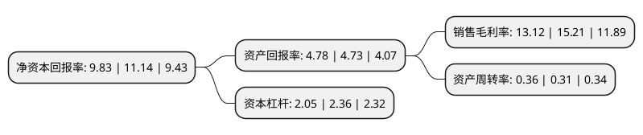

> 本页面由自动化程序生成于 2022年5月20日 01:05
> 内容可能存在错误，如有bug请提交issue至：https://github.com/Eroleice/doc-pi/issues
{.is-warning}

# 上市公司基本情况

## 基本资料

鸿达兴业股份有限公司（以下简称“鸿达兴业”）成立于1995年12月06日，扬州市。于2004年06月25日在深交所中小板上市。

鸿达兴业注册资本312,048.546万元，主要产品:PVC板材，PVC片材以下是详细信息：

- 公司名称: 鸿达兴业股份有限公司
- 股票代码: 002002.SZ
- 所在地: 江苏 - 扬州市
- 成立日期: 1995年12月06日
- 注册资本: 312,048.546万元
- 法定代表人: 周奕丰
- 主营业务: 主要产品:PVC板材，PVC片材
- 公司官网: www.002002.cn
- 公司介绍: 公司是中国知名的大型资源能源综合产业上市公司，国家火炬计划重点高新技术企业、国内大型高科技新型材料生产基地，拥有二十多条高科技自动化生产线。主营产品及服务包括土壤调理剂、环保脱硫剂等环保产品，提供土壤治理、脱硫脱硝等环境修复工程服务；PVC、PVC塑料建筑模板、PVC医药包装材料、PVC生态屋等PVC新材料；稀土热稳定剂、稀土催化剂等稀土新材料；提供塑料等大宗工业原材料现货B2B电子交易、综合物流服务、供应链管理及技术支持等服务。公司致力于“创新”，坚持用“创新驱动发展”的思路指导生产运营，通过持续的“技术创新、产品创新、服务创新和管理创新”，积极探索和开发适应市场需求的新产品。鸿达兴业将坚持以“实干创造未来”的企业精神，充分发挥上下游产业链的协同效应，坚持不懈的努力，实现公司效益最大化，以回报股东和社会。

## 股东及高管情况

上市公司第一大股东为鸿达兴业集团有限公司，持股353,239,250股，占比11.31%，**疑似为**上市公司实际控制人。

截至2022年03月31日，上市公司的前十大股东中，共有2名自然人股东，4名机构股东，3个产品账户，1个海外主体，其中5%以上大股东共有2名。上市公司前十大股东明细如下：

> 未能通过持股比例判定出上市公司实际控制人（持股30%以上）
> 可能存在通过间接持股、联合持股、协议控制等方式拥有实际控制权的主体，具体请参考上市公司定期公告！
{.is-warning}

> 截至2022年03月31日，上市公司前十大股东信息如下：

| 股东名称 | 持股数量（股） | 持股比例 |
| --- | --- | --- |
| 鸿达兴业集团有限公司 | 353,239,250 | 11.31% |
| 广州市成禧经济发展有限公司 | 175,505,415 | 5.62% |
| 乌海市皇冠实业有限公司 | 118,150,803 | 3.78% |
| 长城国融投资管理有限公司 | 26,990,553 | 0.86% |
| 香港中央结算有限公司(陆股通) | 22,710,422 | 0.73% |
| 李绪坤 | 12,813,600 | 0.41% |
| 中国农业银行股份有限公司-中证500交易型开放式指数证券投资基金 | 12,487,278 | 0.4% |
| 安徽中安资本管理有限公司-中安鼎汇定增私募投资基金 | 10,796,221 | 0.35% |
| 庄依榕 | 10,453,000 | 0.33% |
| 中信银行股份有限公司-建信中证500指数增强型证券投资基金 | 6,918,300 | 0.22% |

## 利润表分析

上市公司2021年总收入为65.22亿元，净利润为8.55亿元，实现盈利。

## 杜邦分析

> 数据列示周期：2021年 | 2020年 | 2019年
{.is-info}

上市公司的净资产收益率在近一年有所下降，下降幅度为-11.76%，其变化情况分解如下：
- 上市公司的销售毛利率在近一年下降了-13.74%，可能是生产效率的下降、商品原材料价格上涨或商品价格的下跌所致。
- 上市公司的资产周转率在近一年上升了16.13%，可能是源自于更快的销售回款或库存管理效果提升。
- 上市公司的财务杠杆比率在近一年下降了-13.14%，可能是减少负债降低财务费用。

