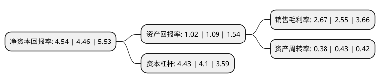

> 本页面由自动化程序生成于 2022年5月20日 01:05
> 内容可能存在错误，如有bug请提交issue至：https://github.com/Eroleice/doc-pi/issues
{.is-warning}

# 上市公司基本情况

## 基本资料

保利联合化工控股集团股份有限公司（以下简称“保利联合”）成立于2002年07月18日，贵阳市。于2004年09月08日在深交所中小板上市。

保利联合注册资本48,762.531万元，主要产品:雷管，索类，炸药等民用爆破器材产品。主营业务:各类炸药及管索的生产，销售;建筑安装工程施工;拆除爆破工程作业;土石方工程施工;公路工程施工等。以下是详细信息：

- 公司名称: 保利联合化工控股集团股份有限公司
- 股票代码: 002037.SZ
- 所在地: 贵州 - 贵阳市
- 成立日期: 2002年07月18日
- 注册资本: 48,762.531万元
- 法定代表人: 安胜杰
- 主营业务: 主要产品:雷管，索类，炸药等民用爆破器材产品主营业务:各类炸药及管索的生产，销售;建筑安装工程施工;拆除爆破工程作业;土石方工程施工;公路工程施工等
- 公司官网: www.gzjiulian.com
- 公司介绍: 公司是全国高新技术企业，致力于各类民爆产品的研发、生产及销售，并为客户提供特定的爆破工程解决方案和技术服务。公司是目前国内民爆器材产品品种最为齐全的企业之一；在爆破工程施工及技术服务方面，公司拥有爆破与拆除、市政工程、爆破作业单位许可证(营业性)一级资质，矿山总承包、公路总承包、房建二级资质，定向爆破国内领先，年爆破施工能力达35亿元，爆破施工及技术服务处于国内领先水平，享有较高声誉。2018年公司通过重大资产重组收购盘江民爆100%股权,开源爆破94.75%股权,银光民爆100%股权,公司的生产规模进一步扩大，在爆破服务领域的竞争力得到加强，一体化运作水平进一步提高。

## 股东及高管情况

上市公司第一大股东为保利久联控股集团有限责任公司，持股145,105,699股，占比29.76%，**疑似为**上市公司实际控制人。

截至2022年03月31日，上市公司的前十大股东中，共有1名自然人股东，8名机构股东，1个产品账户，其中5%以上大股东共有4名。上市公司前十大股东明细如下：

> 未能通过持股比例判定出上市公司实际控制人（持股30%以上）
> 可能存在通过间接持股、联合持股、协议控制等方式拥有实际控制权的主体，具体请参考上市公司定期公告！
{.is-warning}

> 截至2022年03月31日，上市公司前十大股东信息如下：

| 股东名称 | 持股数量（股） | 持股比例 |
| --- | --- | --- |
| 保利久联控股集团有限责任公司 | 145,105,699 | 29.76% |
| 保利久联控股集团有限责任公司 | 143,478,060 | 29.65% |
| 贵州盘江化工(集团)有限公司 | 72,850,840 | 14.94% |
| 贵州盘江化工(集团)有限公司 | 71,829,494 | 14.84% |
| 山东银光化工集团有限公司 | 20,097,977 | 4.12% |
| 贵州乌江能源投资有限公司 | 14,769,159 | 3.03% |
| 国元证券股份有限公司约定购回专用账户 | 11,500,000 | 2.36% |
| 瓮福(集团)有限责任公司 | 5,246,410 | 1.08% |
| 广东恒健资本管理有限公司 | 1,683,800 | 0.35% |
| 陈斌 | 1,474,308 | 0.3% |

## 利润表分析

上市公司2021年总收入为60.28亿元，净利润为1.6亿元，实现盈利。

## 杜邦分析

> 数据列示周期：2021年 | 2020年 | 2019年
{.is-info}

上市公司的净资产收益率在近一年有所上升，上升幅度为1.79%，其变化情况分解如下：
- 上市公司的销售毛利率在近一年上升了4.71%，可能是生产效率的提升、商品原材料价格下跌或商品价格的上涨所致。
- 上市公司的资产周转率在近一年下降了-11.63%，可能是源自于更慢的销售回款或库存管理效果下降。
- 上市公司的财务杠杆比率在近一年上升了8.05%，可能是增加负债扩大生产规模。

