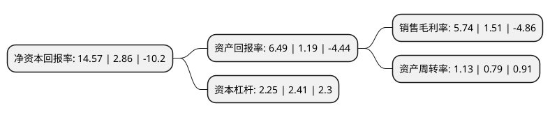

> 本页面由自动化程序生成于 2022年5月20日 01:05
> 内容可能存在错误，如有bug请提交issue至：https://github.com/Eroleice/doc-pi/issues
{.is-warning}

# 上市公司基本情况

## 基本资料

江西黑猫炭黑股份有限公司（以下简称“黑猫股份”）成立于2001年07月12日，景德镇市。于2006年09月15日在深交所中小板上市。

黑猫股份注册资本74,811.96万元，主要产品:炭黑，尾气以下是详细信息：

- 公司名称: 江西黑猫炭黑股份有限公司
- 股票代码: 002068.SZ
- 所在地: 江西 - 景德镇市
- 成立日期: 2001年07月12日
- 注册资本: 74,811.96万元
- 法定代表人: 王耀
- 主营业务: 主要产品:炭黑，尾气
- 公司官网: www.jx-blackcat.com
- 公司介绍: 公司是江西景德镇开门子集团旗下的主要控股子公司，主要生产各类炭黑产品及其尾气，炭黑产品畅销全国橡胶轮胎企业，并远销国外。公司掌握的自主知识产权已达数十项。公司荣膺国家级高新技术企业，橡胶工业协会“科技进步先进企业”，中国炭黑工业发展20年历程“新星企业”，中国炭黑工业60周年“科技创新先进企业”等20多项荣誉称号。公司先后通过了ISO9001标准质量管理体系认证，ISO14001标准环境管理体系认证，GB/T18001标准职业健康安全管理体系认证，检测中心通过国家实验室认证。公司开发生产了几十种炭黑、白炭黑系列产品，广泛应用于各类橡胶制品。公司7大生产基地分布全国，数十条先进的炭黑生产线创造了近百万吨的产能，产销量连续多年位居国内同行业之首，世界炭黑行业前列。公司产品畅销全国，其中40%远销海外。

## 股东及高管情况

上市公司第一大股东为景德镇黑猫集团有限责任公司，持股254,743,820股，占比34.05%，为上市公司实际控制人。

截至2022年03月31日，上市公司的前十大股东中，共有2名机构股东，8个产品账户，其中5%以上大股东共有2名。上市公司前十大股东明细如下：

> 截至2022年03月31日，上市公司前十大股东信息如下：

| 股东名称 | 持股数量（股） | 持股比例 |
| --- | --- | --- |
| 景德镇黑猫集团有限责任公司 | 254,743,820 | 34.05% |
| 景德镇井冈山北汽创新发展投资中心(有限合伙) | 96,068,417 | 12.84% |
| 中国农业银行股份有限公司-国泰智能汽车股票型证券投资基金 | 33,372,145 | 4.46% |
| 中国银行股份有限公司-国泰智能装备股票型证券投资基金 | 18,756,134 | 2.51% |
| 太平资管-招商银行-太平资产量化17号资管产品 | 11,160,400 | 1.49% |
| 中国农业银行股份有限公司-万家内需增长一年持有期混合型证券投资基金 | 9,737,700 | 1.3% |
| 兴业银行股份有限公司-万家成长优选灵活配置混合型证券投资基金 | 9,093,600 | 1.22% |
| 中国建设银行股份有限公司-万家科创主题3年封闭运作灵活配置混合型证券投资基金 | 6,669,902 | 0.89% |
| 中国工商银行股份有限公司-汇添富科技创新灵活配置混合型证券投资基金 | 6,514,600 | 0.87% |
| 招商银行股份有限公司-万家战略发展产业混合型证券投资基金 | 5,712,400 | 0.76% |

## 利润表分析

上市公司2021年总收入为79.3亿元，净利润为4.55亿元，实现盈利。

## 杜邦分析

> 数据列示周期：2021年 | 2020年 | 2019年
{.is-info}

上市公司的净资产收益率在近一年有所上升，上升幅度为409.44%，其变化情况分解如下：
- 上市公司的销售毛利率在近一年上升了280.13%，可能是生产效率的提升、商品原材料价格下跌或商品价格的上涨所致。
- 上市公司的资产周转率在近一年上升了43.04%，可能是源自于更快的销售回款或库存管理效果提升。
- 上市公司的财务杠杆比率在近一年下降了-6.64%，可能是减少负债降低财务费用。

