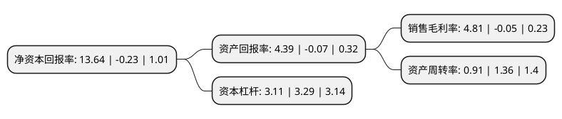

> 本页面由自动化程序生成于 2022年5月20日 01:06
> 内容可能存在错误，如有bug请提交issue至：https://github.com/Eroleice/doc-pi/issues
{.is-warning}

# 上市公司基本情况

## 基本资料

新疆中泰化学股份有限公司（以下简称“中泰化学”）成立于2001年12月18日，乌鲁木齐市。于2006年12月08日在深交所中小板上市。

中泰化学注册资本257,573.952万元，主营业务:聚氯乙烯树脂，离子膜烧碱等化工产品的生产和销售，涉及氯碱，电石，焦炭，石灰石，原盐，煤炭，热电，水泥，塑料加工，化学助剂，信息技术等行业以下是详细信息：

- 公司名称: 新疆中泰化学股份有限公司
- 股票代码: 002092.SZ
- 所在地: 新疆 - 乌鲁木齐市
- 成立日期: 2001年12月18日
- 注册资本: 257,573.952万元
- 法定代表人: 刘洪
- 主营业务: 主营业务:聚氯乙烯树脂，离子膜烧碱等化工产品的生产和销售，涉及氯碱，电石，焦炭，石灰石，原盐，煤炭，热电，水泥，塑料加工，化学助剂，信息技术等行业
- 公司官网: www.zthx.com
- 公司介绍: 公司前身为新疆氯碱厂，是全国大型氯碱化工企业之一。公司主营聚氯乙烯树脂(PVC)，离子膜烧碱、粘胶纤维、棉纱等产品。产品广泛应用于纺织、建材、国防等20余个行业，除供应新疆市场外，还远销内地省区并出口到俄罗斯、中亚、南亚、南美洲和非洲等国家和地区，享有较高的市场知名度和信誉。公司先后被授予乌鲁木齐市经济发展“突出贡献企业”、“纳税突出贡献企业”，“西部大开发新疆最佳优秀企业”、“新疆自治区循环经济试点单位”、“乌鲁木齐市大气污染治理先进单位”、“自治区文明单位”、“中国化工企业500强”、“中国化工最具成长性企业”荣誉称号。

## 股东及高管情况

上市公司第一大股东为新疆中泰(集团)有限责任公司，持股501,302,124股，占比19.46%，**疑似为**上市公司实际控制人。

截至2022年03月31日，上市公司的前十大股东中，共有6名机构股东，3个产品账户，1个海外主体，其中5%以上大股东共有2名。上市公司前十大股东明细如下：

> 未能通过持股比例判定出上市公司实际控制人（持股30%以上）
> 可能存在通过间接持股、联合持股、协议控制等方式拥有实际控制权的主体，具体请参考上市公司定期公告！
{.is-warning}

> 截至2022年03月31日，上市公司前十大股东信息如下：

| 股东名称 | 持股数量（股） | 持股比例 |
| --- | --- | --- |
| 新疆中泰(集团)有限责任公司 | 501,302,124 | 19.46% |
| 鸿达兴业集团有限公司 | 187,305,772 | 7.27% |
| 广东联塑科技实业有限公司 | 78,828,828 | 3.06% |
| 乌鲁木齐环鹏有限公司 | 60,044,000 | 2.33% |
| 香港中央结算有限公司(陆股通) | 37,351,006 | 1.45% |
| 乌鲁木齐国有资产经营(集团)有限公司 | 27,011,952 | 1.05% |
| 广州市玄元投资管理有限公司-玄元六度元宝8号私募投资基金 | 19,048,641 | 0.74% |
| 国泰基金-交通银行-国泰基金博远20号集合资产管理计划 | 18,801,918 | 0.73% |
| 新疆中泰国际供应链管理股份有限公司 | 17,667,845 | 0.69% |
| 中国人寿资管-中国银行-国寿资产-PIPE2020保险资产管理产品 | 16,891,891 | 0.66% |

## 利润表分析

上市公司2021年总收入为624.63亿元，净利润为30.07亿元，实现盈利。

## 杜邦分析

> 数据列示周期：2021年 | 2020年 | 2019年
{.is-info}

上市公司的净资产收益率在近一年有所下降，下降幅度为-6030.43%，其变化情况分解如下：
- 上市公司的销售毛利率在近一年下降了-9720%，可能是生产效率的下降、商品原材料价格上涨或商品价格的下跌所致。
- 上市公司的资产周转率在近一年下降了-33.09%，可能是源自于更慢的销售回款或库存管理效果下降。
- 上市公司的财务杠杆比率在近一年下降了-5.47%，可能是减少负债降低财务费用。

