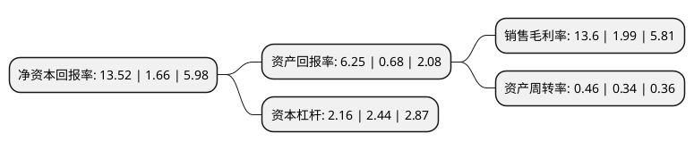

> 本页面由自动化程序生成于 2022年5月20日 01:06
> 内容可能存在错误，如有bug请提交issue至：https://github.com/Eroleice/doc-pi/issues
{.is-warning}

# 上市公司基本情况

## 基本资料

湘潭电化科技股份有限公司（以下简称“湘潭电化”）成立于2000年09月30日，湘潭市。于2007年04月03日在深交所中小板上市。

湘潭电化注册资本62,948.171万元，主营业务:生产，销售电解二氧化锰，电解金属锰。主要产品为标准包装的电解二氧化锰及金属锰。以下是详细信息：

- 公司名称: 湘潭电化科技股份有限公司
- 股票代码: 002125.SZ
- 所在地: 湖南 - 湘潭市
- 成立日期: 2000年09月30日
- 注册资本: 62,948.171万元
- 法定代表人: 刘干江
- 主营业务: 主营业务:生产，销售电解二氧化锰，电解金属锰主要产品为标准包装的电解二氧化锰及金属锰
- 公司官网: www.chinaemd.com
- 公司介绍: 公司是中国电解二氧化锰的摇篮，也是国内最大规模生产绿色高能环保电池所需材料——无汞碱锰电池专用电解二氧化锰的生产企业，公司经营范围是研究、开发、生产和销售电解二氧化锰、电解金属锰、电池材料和其他能源新材料。主导产品电解二氧化锰按产品种类划分，分为碳锌电池级、无汞碱锰电池级、一次锂锰电池级、锰酸锂电池材料级和磁性材料级电解二氧化锰。公司的产品远销美国、日本、欧盟等20多个国家和地区，是南孚、双鹿、美国永备、金霸王等世界名牌电池材料的指定供应商。公司先后荣获“全国精神文明创建先进单位”、“全国五一劳动奖状”、“全国模范职工之家”、“全国轻工系统先进集体”、“全国电池工业协会企业信用评价3A级信用企业”、“省文明标兵单位”等10多项国家、省级荣誉称号。

## 股东及高管情况

上市公司第一大股东为湘潭电化集团有限公司，持股179,971,473股，占比28.59%，**疑似为**上市公司实际控制人。

截至2022年03月31日，上市公司的前十大股东中，共有7名自然人股东，2名机构股东，1个产品账户，其中5%以上大股东共有2名。上市公司前十大股东明细如下：

> 未能通过持股比例判定出上市公司实际控制人（持股30%以上）
> 可能存在通过间接持股、联合持股、协议控制等方式拥有实际控制权的主体，具体请参考上市公司定期公告！
{.is-warning}

> 截至2022年03月31日，上市公司前十大股东信息如下：

| 股东名称 | 持股数量（股） | 持股比例 |
| --- | --- | --- |
| 湘潭电化集团有限公司 | 179,971,473 | 28.59% |
| 湘潭振湘国有资产经营投资有限公司 | 79,885,370 | 12.69% |
| 蒋如宁 | 3,468,789 | 0.55% |
| 王圣俊 | 3,307,000 | 0.53% |
| 苏州格外投资管理有限公司-格外投资新三板1号基金 | 3,260,000 | 0.52% |
| 王海云 | 3,070,816 | 0.49% |
| 巫鹏飞 | 2,875,980 | 0.46% |
| 卢红萍 | 2,800,000 | 0.44% |
| 祝双英 | 2,613,712 | 0.42% |
| 彭自如 | 2,580,400 | 0.41% |

## 利润表分析

上市公司2021年总收入为18.71亿元，净利润为2.54亿元，实现盈利。

## 杜邦分析

> 数据列示周期：2021年 | 2020年 | 2019年
{.is-info}

上市公司的净资产收益率在近一年有所上升，上升幅度为714.46%，其变化情况分解如下：
- 上市公司的销售毛利率在近一年上升了583.42%，可能是生产效率的提升、商品原材料价格下跌或商品价格的上涨所致。
- 上市公司的资产周转率在近一年上升了35.29%，可能是源自于更快的销售回款或库存管理效果提升。
- 上市公司的财务杠杆比率在近一年下降了-11.48%，可能是减少负债降低财务费用。

