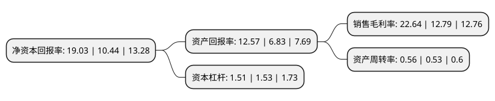

> 本页面由自动化程序生成于 2022年5月20日 01:06
> 内容可能存在错误，如有bug请提交issue至：https://github.com/Eroleice/doc-pi/issues
{.is-warning}

# 上市公司基本情况

## 基本资料

中核华原钛白股份有限公司（以下简称“中核钛白”）成立于2001年02月23日，白银市。于2007年08月03日在深交所中小板上市。

中核钛白注册资本205,367.332万元，主要产品:金红石型钛白粉，锐钛型钛白粉系列产品。主营业务:钛白粉产品的生产，销售及服务。以下是详细信息：

- 公司名称: 中核华原钛白股份有限公司
- 股票代码: 002145.SZ
- 所在地: 甘肃 - 白银市
- 成立日期: 2001年02月23日
- 注册资本: 205,367.332万元
- 法定代表人: 朱树人
- 主营业务: 主要产品:金红石型钛白粉，锐钛型钛白粉系列产品主营业务:钛白粉产品的生产，销售及服务
- 公司官网: www.zhtb.com
- 公司介绍: 公司主要从事钛白粉、氧化铁的研发与生产、销售。公司的主营产品为金红石型钛白粉；公司钛白粉产销规模位列国内钛白粉行业企业前列。钛白粉主要应用于涂料、塑料、造纸等下游应用领域。公司与德国Ti-Cons公司、Buhier AG公司、清华大学化学系、南京大学化工学院、中科院过程科学研究所建立长期技术合作关系。在脱硝催化纳米钛白材料、蜂窝成型产品在环境保护中的应用等重大科学技术问题以及在磁性铁氧化物等化工关键技术产业化领域开展广泛深入合作。公司经过多年的研发投入，公司的技术水平已日趋成熟，能够满足不同客户的不同技术要求。

## 股东及高管情况

上市公司第一大股东为王泽龙，持股892,927,745股，占比43.48%，为上市公司实际控制人。

截至2022年05月17日，上市公司的前十大股东中，共有3名自然人股东，1名机构股东，5个产品账户，1个海外主体，其中5%以上大股东共有1名。上市公司前十大股东明细如下：

> 截至2022年05月17日，上市公司前十大股东信息如下：

| 股东名称 | 持股数量（股） | 持股比例 |
| --- | --- | --- |
| 王泽龙 | 892,927,745 | 43.48% |
| 中核华原钛白股份有限公司-第四期员工持股计划 | 75,962,500 | 3.7% |
| 中核华原钛白股份有限公司-第五期员工持股计划 | 39,155,856 | 1.91% |
| 交通银行股份有限公司-富国均衡优选混合型证券投资基金 | 38,743,302 | 1.89% |
| 中国农业银行股份有限公司-富国成长领航混合型证券投资基金 | 36,836,060 | 1.79% |
| 中国建设银行股份有限公司-富国低碳新经济混合型证券投资基金 | 29,578,173 | 1.44% |
| 何晓红 | 22,755,673 | 1.11% |
| 香港中央结算有限公司(陆股通) | 19,142,535 | 0.93% |
| 袁桂荣 | 9,127,998 | 0.44% |
| 中国人寿保险股份有限公司-分红-个人分红 -005L-FH002深 | 8,390,324 | 0.41% |

## 利润表分析

上市公司2021年总收入为53.74亿元，净利润为12.16亿元，实现盈利。

## 杜邦分析

> 数据列示周期：2021年 | 2020年 | 2019年
{.is-info}

上市公司的净资产收益率在近一年有所上升，上升幅度为82.28%，其变化情况分解如下：
- 上市公司的销售毛利率在近一年上升了77.01%，可能是生产效率的提升、商品原材料价格下跌或商品价格的上涨所致。
- 上市公司的资产周转率在近一年上升了5.66%，可能是源自于更快的销售回款或库存管理效果提升。
- 上市公司的财务杠杆比率在近一年下降了-1.31%，可能是减少负债降低财务费用。

