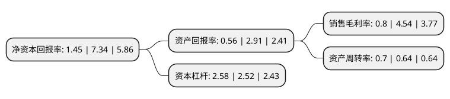

> 本页面由自动化程序生成于 2022年5月20日 01:06
> 内容可能存在错误，如有bug请提交issue至：https://github.com/Eroleice/doc-pi/issues
{.is-warning}

# 上市公司基本情况

## 基本资料

红宝丽集团股份有限公司（以下简称“红宝丽”）成立于1994年06月23日，南京市。于2007年09月13日在深交所中小板上市。

红宝丽注册资本73,526.984万元，主要产品:聚氨酯硬泡组合聚醚和异丙醇胺系列产品。主营业务:聚氨酯硬泡组合聚醚和异丙醇胺系列产品的技术开发，生产与销售。以下是详细信息：

- 公司名称: 红宝丽集团股份有限公司
- 股票代码: 002165.SZ
- 所在地: 江苏 - 南京市
- 成立日期: 1994年06月23日
- 注册资本: 73,526.984万元
- 法定代表人: 芮益民
- 主营业务: 主要产品:聚氨酯硬泡组合聚醚和异丙醇胺系列产品主营业务:聚氨酯硬泡组合聚醚和异丙醇胺系列产品的技术开发，生产与销售
- 公司官网: www.hongbaoli.com
- 公司介绍: 公司是国内聚氨酯产品的主要生产基地，是聚氨酯行业国家重点高新技术企业。公司主要从事聚氨酯硬泡组合聚醚和异丙醇胺系列产品，以及高阻燃聚氨酯保温板等新兴材料的研发、生产和销售。公司坚持创新理念，增加研发投入，针对客户不同要求，开发新技术、新产品，并储备新技术，逐步抢占了国内冷藏行业硬泡组合聚醚的市场份额，成为国内、国际上响当当的行业品牌，美的、海信、美菱、博西华、LG、三星、伊莱克斯、中集等冰箱(柜)、集装箱企业是公司客户。公司经营产品涉及三大产业，拥有较好的生产资源，硬泡组合聚醚年生产能力为15万吨，是国内最大的硬泡组合聚醚供应商，也是世界规模最大的硬泡组合聚醚生产企业之一。

## 股东及高管情况

上市公司第一大股东为江苏宝源投资管理有限公司，持股150,115,500股，占比20.42%，**疑似为**上市公司实际控制人。

截至2022年03月31日，上市公司的前十大股东中，共有4名自然人股东，5名机构股东，1个产品账户，其中5%以上大股东共有4名。上市公司前十大股东明细如下：

> 未能通过持股比例判定出上市公司实际控制人（持股30%以上）
> 可能存在通过间接持股、联合持股、协议控制等方式拥有实际控制权的主体，具体请参考上市公司定期公告！
{.is-warning}

> 截至2022年03月31日，上市公司前十大股东信息如下：

| 股东名称 | 持股数量（股） | 持股比例 |
| --- | --- | --- |
| 江苏宝源投资管理有限公司 | 150,115,500 | 20.42% |
| 江苏宝源投资管理有限公司 | 149,815,500 | 20.3756% |
| 江苏宝源投资管理有限公司 | 147,852,500 | 20.1086% |
| 江苏宝源投资管理有限公司 | 144,584,000 | 19.6641% |
| 南京高淳国有资产经营控股集团有限公司 | 28,795,346 | 3.92% |
| 吕强 | 13,677,005 | 1.86% |
| 榆林市煤炭转化基金投资管理有限公司-榆林市煤炭资源转化引导基金合伙企业(有限合伙) | 13,089,005 | 1.78% |
| 芮敬功 | 6,790,314 | 0.92% |
| 尚中利 | 6,200,202 | 0.84% |
| 成维真 | 4,160,000 | 0.57% |

## 利润表分析

上市公司2021年总收入为34.28亿元，净利润为0.27亿元，实现盈利。

## 杜邦分析

> 数据列示周期：2021年 | 2020年 | 2019年
{.is-info}

上市公司的净资产收益率在近一年有所下降，下降幅度为-80.25%，其变化情况分解如下：
- 上市公司的销售毛利率在近一年下降了-82.38%，可能是生产效率的下降、商品原材料价格上涨或商品价格的下跌所致。
- 上市公司的资产周转率在近一年上升了9.38%，可能是源自于更快的销售回款或库存管理效果提升。
- 上市公司的财务杠杆比率在近一年上升了2.38%，可能是增加负债扩大生产规模。

