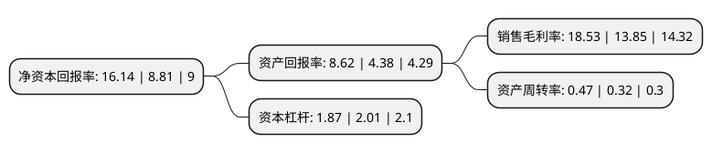

> 本页面由自动化程序生成于 2022年5月20日 01:07
> 内容可能存在错误，如有bug请提交issue至：https://github.com/Eroleice/doc-pi/issues
{.is-warning}

# 上市公司基本情况

## 基本资料

安徽江南化工股份有限公司（以下简称“江南化工”）成立于1998年12月03日，宣城市。于2008年05月06日在深交所中小板上市。

江南化工注册资本264,892.286万元，本公司主要产品为:乳化炸药和粉状乳化炸药，主体生产设备主要有M型乳化炸药大产能微机控制生产线，新型微机控制连续化粉状乳化生产线等。以下是详细信息：

- 公司名称: 安徽江南化工股份有限公司
- 股票代码: 002226.SZ
- 所在地: 安徽 - 宣城市
- 成立日期: 1998年12月03日
- 注册资本: 264,892.286万元
- 法定代表人: 吴振国
- 主营业务: 本公司主要产品为:乳化炸药和粉状乳化炸药，主体生产设备主要有M型乳化炸药大产能微机控制生产线，新型微机控制连续化粉状乳化生产线等
- 公司官网: www.ahjnhg.com
- 公司介绍: 公司是中国500强企业盾安控股集团旗下成员企业，是一家集科研、生产、销售和爆破服务一体化的大型民爆上市公司，主要为矿山开采、基础建设、城市拆除爆破等提供民用爆破器材和工程爆破服务。为进一步提升行业的集中度，做强、做大民爆产业，江南化工与盾安控股集团下属民爆产业于2011年6月完成重大资产重组，资产规模快速壮大、生产能力和盈利能力迅速提升，炸药生产许可能力已达26.95万吨，整体规模位居国内民爆上市公司首位。公司先后荣获“2011安徽省民营企业百名排序50强企业”、“安徽省科学技术奖”、“上市公司五十强”等荣誉。2018年公司通过重大资产重组，收购盾安新能源100%股权从而一举进入新能源领域，依托标的公司丰富的新能源发电运营管理经验以及优质的风、光资源，上市公司将逐步完成在新能源行业的战略布局。

## 股东及高管情况

上市公司第一大股东为北方特种能源集团有限公司，持股521,869,961股，占比19.7%，**疑似为**上市公司实际控制人。

截至2022年03月31日，上市公司的前十大股东中，共有10名机构股东，其中5%以上大股东共有4名。上市公司前十大股东明细如下：

> 未能通过持股比例判定出上市公司实际控制人（持股30%以上）
> 可能存在通过间接持股、联合持股、协议控制等方式拥有实际控制权的主体，具体请参考上市公司定期公告！
{.is-warning}

> 截至2022年03月31日，上市公司前十大股东信息如下：

| 股东名称 | 持股数量（股） | 持股比例 |
| --- | --- | --- |
| 北方特种能源集团有限公司 | 521,869,961 | 19.7% |
| 盾安控股集团有限公司 | 381,468,679 | 14.4% |
| 中国北方工业有限公司 | 170,375,085 | 6.43% |
| 奥信控股(香港)有限公司 | 159,682,102 | 6.03% |
| 广西建华机械有限公司 | 125,448,721 | 4.74% |
| 安徽盾安化工集团有限公司 | 101,754,240 | 3.84% |
| 诸暨永天投资有限公司 | 75,191,340 | 2.84% |
| 浙江青鸟旅游投资集团有限公司 | 69,601,273 | 2.63% |
| 西安庆华民用爆破器材股份有限公司 | 53,883,664 | 2.03% |
| 杭州秋枫投资管理合伙企业(有限合伙) | 52,554,384 | 1.98% |

## 利润表分析

上市公司2021年总收入为64.81亿元，净利润为12.01亿元，实现盈利。

## 杜邦分析

> 数据列示周期：2021年 | 2020年 | 2019年
{.is-info}

上市公司的净资产收益率在近一年有所上升，上升幅度为83.2%，其变化情况分解如下：
- 上市公司的销售毛利率在近一年上升了33.79%，可能是生产效率的提升、商品原材料价格下跌或商品价格的上涨所致。
- 上市公司的资产周转率在近一年上升了46.87%，可能是源自于更快的销售回款或库存管理效果提升。
- 上市公司的财务杠杆比率在近一年下降了-6.97%，可能是减少负债降低财务费用。

