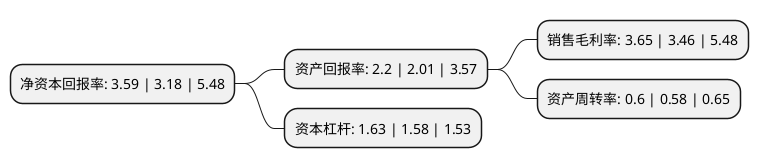

> 本页面由自动化程序生成于 2022年5月20日 01:07
> 内容可能存在错误，如有bug请提交issue至：https://github.com/Eroleice/doc-pi/issues
{.is-warning}

# 上市公司基本情况

## 基本资料

北方化学工业股份有限公司（以下简称“北化股份”）成立于2002年08月23日，泸州市。于2008年06月05日在深交所中小板上市。

北化股份注册资本54,903.479万元，硝化棉的生产和销售，同时还销售硝化棉的生产过程中的副产品硫酸等。主要产品:H型硝化棉，L型硝化棉，含能硝化棉。以下是详细信息：

- 公司名称: 北方化学工业股份有限公司
- 股票代码: 002246.SZ
- 所在地: 四川 - 泸州市
- 成立日期: 2002年08月23日
- 注册资本: 54,903.479万元
- 法定代表人: 尉伟华
- 主营业务: 硝化棉的生产和销售，同时还销售硝化棉的生产过程中的副产品硫酸等主要产品:H型硝化棉，L型硝化棉，含能硝化棉
- 公司官网: bhgf.norincogroup.com.cn
- 公司介绍: 公司是全球生产规模最大的硝化棉生产企业，产销量连续多年排在世界首位，是世界硝化棉行业协会三家执委单位之一，是国内、国际硝化棉行业的领先企业。公司主要从事硝化棉系列产品的生产、销售，硝化棉属庞大纤维素衍生品家族中的酯类，广泛用于涂料、油墨、体育用品、化妆品等各个领域，主要生产的硝化棉系列产品，包括H型硝化棉、L型硝化棉、含能硝化棉在内的70余种不同规格型号的硝化棉产品。2017年，公司收购新华化工100%股权，公司主营业务新增防护器材、活性炭及其深加工、环保产品等业务。

## 股东及高管情况

上市公司第一大股东为山西新华防护器材有限责任公司，持股99,138,233股，占比18.06%，**疑似为**上市公司实际控制人。

截至2022年05月12日，上市公司的前十大股东中，共有1名自然人股东，9名机构股东，其中5%以上大股东共有8名。上市公司前十大股东明细如下：

> 未能通过持股比例判定出上市公司实际控制人（持股30%以上）
> 可能存在通过间接持股、联合持股、协议控制等方式拥有实际控制权的主体，具体请参考上市公司定期公告！
{.is-warning}

> 截至2022年05月12日，上市公司前十大股东信息如下：

| 股东名称 | 持股数量（股） | 持股比例 |
| --- | --- | --- |
| 山西新华防护器材有限责任公司 | 99,138,233 | 18.06% |
| 中兵投资管理有限责任公司 | 66,907,484 | 12.1864% |
| 中国北方化学研究院集团有限公司 | 39,770,520 | 7.24% |
| 中国北方化学研究院集团有限公司 | 39,770,520 | 7.24% |
| 泸州北方化学工业有限公司 | 30,674,288 | 5.59% |
| 泸州北方化学工业有限公司 | 30,674,288 | 5.59% |
| 西安北方惠安化学工业有限公司 | 30,162,838 | 5.49% |
| 西安北方惠安化学工业有限公司 | 30,162,838 | 5.49% |
| 中央汇金资产管理有限责任公司 | 5,104,700 | 0.93% |
| 赵贵宾 | 3,943,700 | 0.72% |

## 利润表分析

上市公司2021年总收入为26.33亿元，净利润为0.96亿元，实现盈利。

## 杜邦分析

> 数据列示周期：2021年 | 2020年 | 2019年
{.is-info}

上市公司的净资产收益率在近一年有所上升，上升幅度为12.89%，其变化情况分解如下：
- 上市公司的销售毛利率在近一年上升了5.49%，可能是生产效率的提升、商品原材料价格下跌或商品价格的上涨所致。
- 上市公司的资产周转率在近一年上升了3.45%，可能是源自于更快的销售回款或库存管理效果提升。
- 上市公司的财务杠杆比率在近一年上升了3.16%，可能是增加负债扩大生产规模。

