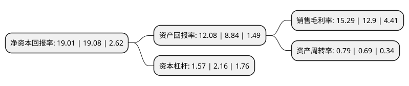

> 本页面由自动化程序生成于 2022年5月20日 01:08
> 内容可能存在错误，如有bug请提交issue至：https://github.com/Eroleice/doc-pi/issues
{.is-warning}

# 上市公司基本情况

## 基本资料

四川发展龙蟒股份有限公司（以下简称“川发龙蟒”）成立于1997年05月20日，成都市。于2009年12月03日在深交所中小板上市。

川发龙蟒注册资本176,319.629万元，公司主要业务从单一的金融服务外包业务，变更为磷化工及金融服务外包业务双主业。以下是详细信息：

- 公司名称: 四川发展龙蟒股份有限公司
- 股票代码: 002312.SZ
- 所在地: 四川 - 成都市
- 成立日期: 1997年05月20日
- 注册资本: 176,319.629万元
- 法定代表人: 毛飞
- 主营业务: 公司主要业务从单一的金融服务外包业务，变更为磷化工及金融服务外包业务双主业
- 公司官网: www.isantai.com
- 公司介绍: 自2009年登陆资本市场至今10余年，公司主营业务不断完善。2019年9月，公司完成对龙蟒大地农业有限公司100%股权收购，正式跨入磷化工领域。公司主要产品为磷酸一铵、磷酸氢钙等磷酸盐产品以及各种复合肥产品，主要原材料为磷矿石、硫磺、硫酸、液氨、尿素、氯化钾等。公司主要产品所使用的品牌“蟒牌”为中国驰名商标。公司是饲料级磷酸氢钙、磷酸二氢钙和磷酸一二钙现行国家标准的起草单位之一，是国内该产品最大的生产企业。公司是国内工业磷酸一铵规模最大的生产企业。公司是粉状磷酸一铵国内的主要生产企业，产销量居国内前列。未来公司将专注发展磷酸盐业务，致力成为精细磷化工龙头企业。

## 股东及高管情况

上市公司第一大股东为四川省先进材料产业投资集团有限公司，持股385,865,200股，占比21.88%，**疑似为**上市公司实际控制人。

截至2022年03月31日，上市公司的前十大股东中，共有6名自然人股东，1名机构股东，2个产品账户，1个海外主体，其中5%以上大股东共有2名。上市公司前十大股东明细如下：

> 未能通过持股比例判定出上市公司实际控制人（持股30%以上）
> 可能存在通过间接持股、联合持股、协议控制等方式拥有实际控制权的主体，具体请参考上市公司定期公告！
{.is-warning}

> 截至2022年03月31日，上市公司前十大股东信息如下：

| 股东名称 | 持股数量（股） | 持股比例 |
| --- | --- | --- |
| 四川省先进材料产业投资集团有限公司 | 385,865,200 | 21.88% |
| 李家权 | 314,893,619 | 17.86% |
| 李鹏 | 14,608,111 | 0.83% |
| 香港中央结算有限公司(陆股通) | 11,367,988 | 0.64% |
| 交通银行股份有限公司-汇丰晋信低碳先锋股票型证券投资基金 | 10,381,600 | 0.59% |
| 彭伟 | 8,597,654 | 0.49% |
| 朱江 | 7,916,675 | 0.45% |
| 骆光明 | 7,911,371 | 0.45% |
| 庞玉学 | 7,390,300 | 0.42% |
| 横琴广金美好基金管理有限公司-广金美好科新三十二号私募证券投资基金 | 6,830,000 | 0.39% |

## 利润表分析

上市公司2021年总收入为66.44亿元，净利润为10.16亿元，实现盈利。

## 杜邦分析

> 数据列示周期：2021年 | 2020年 | 2019年
{.is-info}

上市公司的净资产收益率在近一年有所下降，下降幅度为-0.37%，其变化情况分解如下：
- 上市公司的销售毛利率在近一年上升了18.53%，可能是生产效率的提升、商品原材料价格下跌或商品价格的上涨所致。
- 上市公司的资产周转率在近一年上升了14.49%，可能是源自于更快的销售回款或库存管理效果提升。
- 上市公司的财务杠杆比率在近一年下降了-27.31%，可能是减少负债降低财务费用。

