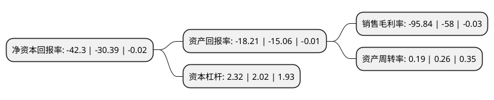

> 本页面由自动化程序生成于 2022年5月20日 01:08
> 内容可能存在错误，如有bug请提交issue至：https://github.com/Eroleice/doc-pi/issues
{.is-warning}

# 上市公司基本情况

## 基本资料

新纶新材料股份有限公司（以下简称“新纶新材”）成立于2002年12月25日，深圳市。于2010年01月22日在深交所中小板上市。

新纶新材注册资本115,221.459万元，主营业务:电子功能材料，新型复合材料，洁净室工程与超净产品以下是详细信息：

- 公司名称: 新纶新材料股份有限公司
- 股票代码: 002341.SZ
- 所在地: 广东 - 深圳市
- 成立日期: 2002年12月25日
- 注册资本: 115,221.459万元
- 法定代表人: 廖垚
- 主营业务: 主营业务:电子功能材料，新型复合材料，洁净室工程与超净产品
- 公司官网: www.szselen.com
- 公司介绍: 公司是集新材料研发、生产、销售及新材料精密制造于一体的综合服务商，以促进新材料国产化为使命，致力为客户提供新材料与新材料精密制造的系统解决方案，以高端精密涂布技术为核心，业务涵盖电子功能材料、光电显示材料、新能源材料、精密制造等领域。公司的电子功能材料业务在国内智能终端、触控行业处于领先地位。新能源材料业务公司是国内最大的动力类铝塑膜供应商。光电显示材料业务引进了日本最高端的团队和涂布设备，是国内第一家的具备CPI、COP和TAC等薄膜产品涂布加工能力的专业光学膜涂布企业。

## 股东及高管情况

上市公司第一大股东为侯毅，持股246,048,495股，占比21.35%，**疑似为**上市公司实际控制人。

截至2022年03月31日，上市公司的前十大股东中，共有10名自然人股东，其中5%以上大股东共有3名。上市公司前十大股东明细如下：

> 未能通过持股比例判定出上市公司实际控制人（持股30%以上）
> 可能存在通过间接持股、联合持股、协议控制等方式拥有实际控制权的主体，具体请参考上市公司定期公告！
{.is-warning}

> 截至2022年03月31日，上市公司前十大股东信息如下：

| 股东名称 | 持股数量（股） | 持股比例 |
| --- | --- | --- |
| 侯毅 | 246,048,495 | 21.35% |
| 侯毅 | 245,934,655 | 21.3445% |
| 侯毅 | 245,303,666 | 21.2898% |
| 王宙 | 56,878,012 | 4.94% |
| 唐千军 | 29,800,476 | 2.59% |
| 杨绍刚 | 20,868,900 | 1.81% |
| 马泉斌 | 13,123,200 | 1.14% |
| 李敏仙 | 11,598,108 | 1.01% |
| 周子天 | 11,307,900 | 0.98% |
| 殷琼林 | 8,853,700 | 0.77% |

## 利润表分析

上市公司2021年总收入为13.32亿元，净利润为-12.77亿元，**未实现盈利**。

## 杜邦分析

> 数据列示周期：2021年 | 2020年 | 2019年
{.is-info}

上市公司的净资产收益率在近一年有所上升，上升幅度为39.19%，其变化情况分解如下：
- 上市公司的销售毛利率在近一年上升了65.24%，可能是生产效率的提升、商品原材料价格下跌或商品价格的上涨所致。
- 上市公司的资产周转率在近一年下降了-26.92%，可能是源自于更慢的销售回款或库存管理效果下降。
- 上市公司的财务杠杆比率在近一年上升了14.85%，可能是增加负债扩大生产规模。

