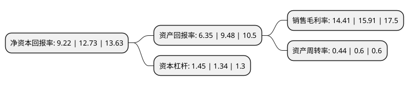

> 本页面由自动化程序生成于 2022年5月20日 01:08
> 内容可能存在错误，如有bug请提交issue至：https://github.com/Eroleice/doc-pi/issues
{.is-warning}

# 上市公司基本情况

## 基本资料

山西同德化工股份有限公司（以下简称“同德化工”）成立于2001年06月10日，忻州市。于2010年03月03日在深交所中小板上市。

同德化工注册资本41,948.156万元，主要产品:工业炸药和白炭黑。主营业务:工业炸药，白炭黑产品的生产与销售。以下是详细信息：

- 公司名称: 山西同德化工股份有限公司
- 股票代码: 002360.SZ
- 所在地: 山西 - 忻州市
- 成立日期: 2001年06月10日
- 注册资本: 41,948.156万元
- 法定代表人: 张云升
- 主营业务: 主要产品:工业炸药和白炭黑主营业务:工业炸药，白炭黑产品的生产与销售
- 公司官网: www.tondchem.com
- 公司介绍: 公司是国家民爆行业优势骨干企业，也是山西省科技厅会同山西财政厅、山西省国税局、山西省地税局首批认定的高新技术企业。公司主要从事民用炸药和白炭黑的生产、销售、科研、进出口贸易、现场混装炸药、工程爆破服务。公司已取得具有自主知识产权的发明专利8项，在民爆行业较早通过了ISO9001：2000质量管理体系认证、ISO14001环境管理体系认证和OHSMS18001职业安全健康管理体系认证。

## 股东及高管情况

上市公司第一大股东为张云升，持股80,057,500股，占比19.08%，**疑似为**上市公司实际控制人。

截至2022年03月31日，上市公司的前十大股东中，共有10名自然人股东，其中5%以上大股东共有1名。上市公司前十大股东明细如下：

> 未能通过持股比例判定出上市公司实际控制人（持股30%以上）
> 可能存在通过间接持股、联合持股、协议控制等方式拥有实际控制权的主体，具体请参考上市公司定期公告！
{.is-warning}

> 截至2022年03月31日，上市公司前十大股东信息如下：

| 股东名称 | 持股数量（股） | 持股比例 |
| --- | --- | --- |
| 张云升 | 80,057,500 | 19.08% |
| 邬庆文 | 9,850,435 | 2.35% |
| 张乃蛇 | 8,763,124 | 2.09% |
| 任安增 | 8,500,000 | 2.03% |
| 叶福有 | 6,100,368 | 1.45% |
| 白利军 | 6,097,670 | 1.45% |
| 邬卓 | 5,970,748 | 1.42% |
| 郑俊卿 | 5,817,270 | 1.39% |
| 郑伟 | 5,709,719 | 1.36% |
| 赵贵存 | 4,515,728 | 1.08% |

## 利润表分析

上市公司2021年总收入为8.52亿元，净利润为1.22亿元，实现盈利。

## 杜邦分析

> 数据列示周期：2021年 | 2020年 | 2019年
{.is-info}

上市公司的净资产收益率在近一年有所下降，下降幅度为-27.57%，其变化情况分解如下：
- 上市公司的销售毛利率在近一年下降了-9.43%，可能是生产效率的下降、商品原材料价格上涨或商品价格的下跌所致。
- 上市公司的资产周转率在近一年下降了-26.67%，可能是源自于更慢的销售回款或库存管理效果下降。
- 上市公司的财务杠杆比率在近一年上升了8.21%，可能是增加负债扩大生产规模。

