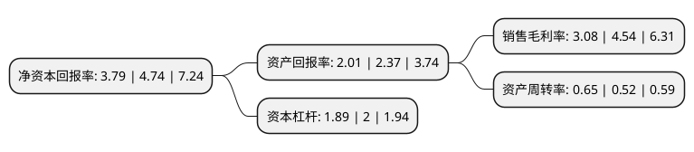

> 本页面由自动化程序生成于 2022年5月20日 01:08
> 内容可能存在错误，如有bug请提交issue至：https://github.com/Eroleice/doc-pi/issues
{.is-warning}

# 上市公司基本情况

## 基本资料

安徽神剑新材料股份有限公司（以下简称“神剑股份”）成立于2002年04月18日，芜湖市。于2010年03月03日在深交所中小板上市。

神剑股份注册资本97,857.195万元，主要产品为粉末涂料专用聚酯树脂。主营业务:化工新材料领域专业从事聚酯树脂系列产品的生产销售。以下是详细信息：

- 公司名称: 安徽神剑新材料股份有限公司
- 股票代码: 002361.SZ
- 所在地: 安徽 - 芜湖市
- 成立日期: 2002年04月18日
- 注册资本: 97,857.195万元
- 法定代表人: 刘志坚
- 主营业务: 主要产品为粉末涂料专用聚酯树脂主营业务:化工新材料领域专业从事聚酯树脂系列产品的生产销售
- 公司官网: www.shen-jian.com
- 公司介绍: 公司专业从事粉末涂料专用聚酯树脂系列产品的生产、销售和研发，为国家级重点高新技术企业。公司拥有独具特色的节能环保型粉末涂料聚酯树脂配方及工艺技术、自动化控制双釜半连续流程技术、在线负压真空取样分析技术等。系列产品长期为全球前两大粉末涂料供应商阿克苏诺贝尔、杜邦，以及海尔、格力、三星、LG等高端客户提供配套服务，是国内粉末涂料原材料专业供应商，市场占有份额名列前茅。公司的项目和产品分别获得了国家级火炬计划项目、安徽省科技进步奖、省级科技研究成果、安徽省名牌产品等，公司商标被认定为安徽省著名商标。

## 股东及高管情况

上市公司第一大股东为刘志坚，持股178,675,980股，占比18.26%，**疑似为**上市公司实际控制人。

截至2022年03月31日，上市公司的前十大股东中，共有7名自然人股东，3个产品账户，其中5%以上大股东共有1名。上市公司前十大股东明细如下：

> 未能通过持股比例判定出上市公司实际控制人（持股30%以上）
> 可能存在通过间接持股、联合持股、协议控制等方式拥有实际控制权的主体，具体请参考上市公司定期公告！
{.is-warning}

> 截至2022年03月31日，上市公司前十大股东信息如下：

| 股东名称 | 持股数量（股） | 持股比例 |
| --- | --- | --- |
| 刘志坚 | 178,675,980 | 18.26% |
| 刘琪 | 32,000,000 | 3.27% |
| 刘绍宏 | 28,800,000 | 2.94% |
| 吕强 | 28,199,566 | 2.88% |
| 李保才 | 19,537,905 | 2% |
| 上海国盛资本管理有限公司-上海盛悦泓私募投资基金合伙企业(有限合伙) | 17,850,000 | 1.82% |
| 王学良 | 15,351,800 | 1.57% |
| 谢仁国 | 14,438,171 | 1.48% |
| 中国工商银行股份有限公司-交银施罗德趋势优先混合型证券投资基金 | 13,121,709 | 1.34% |
| 中国工商银行股份有限公司-华夏磐利一年定期开放混合型证券投资基金 | 13,015,184 | 1.33% |

## 利润表分析

上市公司2021年总收入为25.91亿元，净利润为0.79亿元，实现盈利。

## 杜邦分析

> 数据列示周期：2021年 | 2020年 | 2019年
{.is-info}

上市公司的净资产收益率在近一年有所下降，下降幅度为-20.04%，其变化情况分解如下：
- 上市公司的销售毛利率在近一年下降了-32.16%，可能是生产效率的下降、商品原材料价格上涨或商品价格的下跌所致。
- 上市公司的资产周转率在近一年上升了25%，可能是源自于更快的销售回款或库存管理效果提升。
- 上市公司的财务杠杆比率在近一年下降了-5.5%，可能是减少负债降低财务费用。

