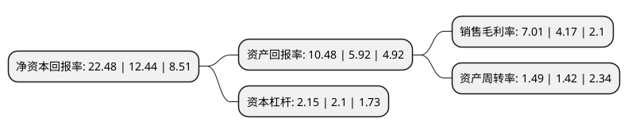

> 本页面由自动化程序生成于 2022年5月20日 01:08
> 内容可能存在错误，如有bug请提交issue至：https://github.com/Eroleice/doc-pi/issues
{.is-warning}

# 上市公司基本情况

## 基本资料

淄博齐翔腾达化工股份有限公司（以下简称“齐翔腾达”）成立于2002年01月04日，淄博市。于2010年05月18日在深交所中小板上市。

齐翔腾达注册资本284,263.715万元，本公司自成立以来，一直专注于对石油加工副产品碳四进行深加工以转化成高附加值精细化工产品业务，主要研发，生产和销售的产品有甲乙酮，MTBE，异丁烯，叔丁醇等，其中甲乙酮为公司主导产品。以下是详细信息：

- 公司名称: 淄博齐翔腾达化工股份有限公司
- 股票代码: 002408.SZ
- 所在地: 山东 - 淄博市
- 成立日期: 2002年01月04日
- 注册资本: 284,263.715万元
- 法定代表人: 车成聚
- 主营业务: 本公司自成立以来，一直专注于对石油加工副产品碳四进行深加工以转化成高附加值精细化工产品业务，主要研发，生产和销售的产品有甲乙酮，MTBE，异丁烯，叔丁醇等，其中甲乙酮为公司主导产品
- 公司官网: www.qxtdgf.com
- 公司介绍: 公司专注于对原料碳四进行深度加工转化成高附加值精细化工产品的研发、生产和销售。目前已形成碳四丁烯组分综合利用产品线、异丁烯组分综合利用产品线和丁烷组分综合利用产品线三条产品线。公司始终坚持以质量为生命，推行全面质量管理，通过了ISO9001质量管理体系认证，产品质量保障相关制度完善;同时以安全环保为保障，严格实行HSE管理，企业生产安全保障相关制度完善。先后获得“中国化工五百强”、“山东省守合同重信用企业”、“山东省劳动就业服务明星企业”“淄博市工业功勋企业”等荣誉称号。

## 股东及高管情况

上市公司第一大股东为淄博齐翔石油化工集团有限公司，持股1,305,214,885股，占比45.92%，为上市公司实际控制人。

截至2022年03月31日，上市公司的前十大股东中，共有6名自然人股东，2名机构股东，1个产品账户，1个海外主体，其中5%以上大股东共有1名。上市公司前十大股东明细如下：

> 截至2022年03月31日，上市公司前十大股东信息如下：

| 股东名称 | 持股数量（股） | 持股比例 |
| --- | --- | --- |
| 淄博齐翔石油化工集团有限公司 | 1,305,214,885 | 45.92% |
| 车成聚 | 101,738,691 | 3.58% |
| 长安国际信托股份有限公司-长安信托-齐翔腾达第一期员工持股集合资金信托计划 | 75,386,218 | 2.65% |
| 香港中央结算有限公司(陆股通) | 36,951,414 | 1.3% |
| 徐建裕 | 24,818,900 | 0.87% |
| 梅景明 | 12,451,005 | 0.44% |
| 蔡向晖 | 11,950,021 | 0.42% |
| 中信建投证券股份有限公司 | 10,812,606 | 0.38% |
| 王海荣 | 10,100,000 | 0.36% |
| 李琳 | 9,400,000 | 0.33% |

## 利润表分析

上市公司2021年总收入为348.92亿元，净利润为24.46亿元，实现盈利。

## 杜邦分析

> 数据列示周期：2021年 | 2020年 | 2019年
{.is-info}

上市公司的净资产收益率在近一年有所上升，上升幅度为80.71%，其变化情况分解如下：
- 上市公司的销售毛利率在近一年上升了68.11%，可能是生产效率的提升、商品原材料价格下跌或商品价格的上涨所致。
- 上市公司的资产周转率在近一年上升了4.93%，可能是源自于更快的销售回款或库存管理效果提升。
- 上市公司的财务杠杆比率在近一年上升了2.38%，可能是增加负债扩大生产规模。

