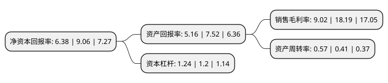

> 本页面由自动化程序生成于 2022年5月20日 01:08
> 内容可能存在错误，如有bug请提交issue至：https://github.com/Eroleice/doc-pi/issues
{.is-warning}

# 上市公司基本情况

## 基本资料

江苏雅克科技股份有限公司（以下简称“雅克科技”）成立于1997年10月29日，无锡市。于2010年05月25日在深交所中小板上市。

雅克科技注册资本47,592.768万元，主营业务:公司是国内最大的有机磷系阻燃剂生产和出口厂商，主要从事磷酸酯阻燃剂和其他橡塑助剂的研发，生产和销售。主要产品为有机磷系阻燃剂TCPP，TDCP，YOKE V6，BDP等和催化剂Yoke T-9等。以下是详细信息：

- 公司名称: 江苏雅克科技股份有限公司
- 股票代码: 002409.SZ
- 所在地: 江苏 - 无锡市
- 成立日期: 1997年10月29日
- 注册资本: 47,592.768万元
- 法定代表人: 沈琦
- 主营业务: 主营业务:公司是国内最大的有机磷系阻燃剂生产和出口厂商，主要从事磷酸酯阻燃剂和其他橡塑助剂的研发，生产和销售主要产品为有机磷系阻燃剂TCPP，TDCP，YOKE V6，BDP等和催化剂Yoke T-9等
- 公司官网: www.yokechem.com
- 公司介绍: 公司是一家中国深圳证券交易所上市企业，主要致力于电子半导体材料，深冷复合材料以及塑料助剂材料研发和生产。公司通过多种方式参与到集成电路(晶圆制造及封装)、平板显示(包含LCD及OLED)等电子制造产业链各个环节，丰富产品链为客户提供多方位的产品和技术服务，并积极探索新业务模式提升高附加值满足市场的需求；公司具有全球领先的深冷复合材料技术，针对以三航(航空、航天和航海)为代表的高端装备制备需求提供专业性的解决方案；最后以磷系阻燃剂为主的塑料助剂材料的世界主要供应商为客户提供更多有竞争力的产品和服务。2018年，公司通过外延并购，成功切入半导体封装材料领域、电子特气领域、IC材料等领域。

## 股东及高管情况

上市公司第一大股东为沈琦，持股104,721,941股，占比22%，**疑似为**上市公司实际控制人。

截至2022年03月31日，上市公司的前十大股东中，共有5名自然人股东，1名机构股东，3个产品账户，1个海外主体，其中5%以上大股东共有2名。上市公司前十大股东明细如下：

> 未能通过持股比例判定出上市公司实际控制人（持股30%以上）
> 可能存在通过间接持股、联合持股、协议控制等方式拥有实际控制权的主体，具体请参考上市公司定期公告！
{.is-warning}

> 截至2022年03月31日，上市公司前十大股东信息如下：

| 股东名称 | 持股数量（股） | 持股比例 |
| --- | --- | --- |
| 沈琦 | 104,721,941 | 22% |
| 沈馥 | 96,031,300 | 20.18% |
| 国家集成电路产业投资基金股份有限公司 | 23,796,476 | 5% |
| 香港中央结算有限公司(陆股通) | 9,964,597 | 2.09% |
| 沈锡强 | 9,120,000 | 1.92% |
| 中国工商银行股份有限公司-富国天惠精选成长混合型证券投资基金(LOF) | 9,008,931 | 1.89% |
| 宁波梅山保税港区毓朗创业投资合伙企业(有限合伙) | 5,971,110 | 1.25% |
| 李文 | 5,550,822 | 1.17% |
| 东志刚 | 4,129,452 | 0.87% |
| 中国建设银行股份有限公司-华夏国证半导体芯片交易型开放式指数证券投资基金 | 4,021,340 | 0.84% |

## 利润表分析

上市公司2021年总收入为37.82亿元，净利润为3.41亿元，实现盈利。

## 杜邦分析

> 数据列示周期：2021年 | 2020年 | 2019年
{.is-info}

上市公司的净资产收益率在近一年有所下降，下降幅度为-29.58%，其变化情况分解如下：
- 上市公司的销售毛利率在近一年下降了-50.41%，可能是生产效率的下降、商品原材料价格上涨或商品价格的下跌所致。
- 上市公司的资产周转率在近一年上升了39.02%，可能是源自于更快的销售回款或库存管理效果提升。
- 上市公司的财务杠杆比率在近一年上升了3.33%，可能是增加负债扩大生产规模。

