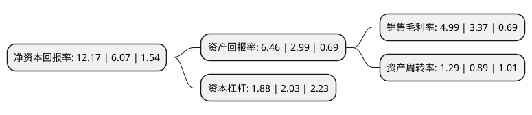

> 本页面由自动化程序生成于 2022年5月20日 01:09
> 内容可能存在错误，如有bug请提交issue至：https://github.com/Eroleice/doc-pi/issues
{.is-warning}

# 上市公司基本情况

## 基本资料

龙星化工股份有限公司（以下简称“龙星化工”）成立于2004年08月04日，邢台市。于2010年07月06日在深交所中小板上市。

龙星化工注册资本49,082万元，公司的主营业务为炭黑的生产和销售，公司的主要产品为炭黑，包括N100，N200，N300，N500，N600，N700六个系列十多个品种。以下是详细信息：

- 公司名称: 龙星化工股份有限公司
- 股票代码: 002442.SZ
- 所在地: 河北 - 邢台市
- 成立日期: 2004年08月04日
- 注册资本: 49,082万元
- 法定代表人: 刘鹏达
- 主营业务: 公司的主营业务为炭黑的生产和销售，公司的主要产品为炭黑，包括N100，N200，N300，N500，N600，N700六个系列十多个品种
- 公司官网: www.hb-lx.com.cn
- 公司介绍: 公司是专业从事高品质橡胶用炭黑生产的上市公司。多年来，公司以其技术研发、节能环保、清洁生产著称于世，是以优质、绿色、安全为主旨的炭黑生产企业。“龙星”牌炭黑，分别在河北本埠工厂和河南焦作工厂生产。目前拥有多条炭黑生产线，均采用最先进的技术，使用高温反应器、湿法造粒等先进工艺；采用850℃高温空气预热器、在线余热锅炉等节能降耗的先进技术和设备。公司引进高级人才，引入技术，建立研发中心，致力于对产品性能的研究、新产品的开发、新工艺技术应用研究，并努力实现科技成果转换。先后被认定为“邢台市炭黑工程技术研究中心”和“河北省企业技术中心”并先后通过ISO9001质量管理体系认证、ISO/TS16949质量管理体系认证、ISO14001环境管理体系和OHSAS18001职业健康安全管理体系认证。

## 股东及高管情况

上市公司第一大股东为刘江山，持股97,897,902股，占比19.95%，**疑似为**上市公司实际控制人。

截至2022年03月31日，上市公司的前十大股东中，共有9名自然人股东，1名机构股东，其中5%以上大股东共有2名。上市公司前十大股东明细如下：

> 未能通过持股比例判定出上市公司实际控制人（持股30%以上）
> 可能存在通过间接持股、联合持股、协议控制等方式拥有实际控制权的主体，具体请参考上市公司定期公告！
{.is-warning}

> 截至2022年03月31日，上市公司前十大股东信息如下：

| 股东名称 | 持股数量（股） | 持股比例 |
| --- | --- | --- |
| 刘江山 | 97,897,902 | 19.95% |
| 渤海国际信托股份有限公司-冀兴三号单一资金信托 | 72,629,372 | 14.8% |
| 俞菊美 | 20,154,350 | 4.11% |
| 刘河山 | 8,965,713 | 1.83% |
| 江漫 | 3,523,300 | 0.72% |
| 江浩 | 3,365,600 | 0.69% |
| 陈敬丰 | 2,066,000 | 0.42% |
| 赵江涛 | 1,537,100 | 0.31% |
| 陈嘉伟 | 1,271,552 | 0.26% |
| 王金涛 | 1,266,800 | 0.26% |

## 利润表分析

上市公司2021年总收入为34.38亿元，净利润为1.71亿元，实现盈利。

## 杜邦分析

> 数据列示周期：2021年 | 2020年 | 2019年
{.is-info}

上市公司的净资产收益率在近一年有所上升，上升幅度为100.49%，其变化情况分解如下：
- 上市公司的销售毛利率在近一年上升了48.07%，可能是生产效率的提升、商品原材料价格下跌或商品价格的上涨所致。
- 上市公司的资产周转率在近一年上升了44.94%，可能是源自于更快的销售回款或库存管理效果提升。
- 上市公司的财务杠杆比率在近一年下降了-7.39%，可能是减少负债降低财务费用。

