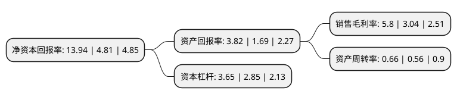

> 本页面由自动化程序生成于 2022年5月20日 01:09
> 内容可能存在错误，如有bug请提交issue至：https://github.com/Eroleice/doc-pi/issues
{.is-warning}

# 上市公司基本情况

## 基本资料

江苏百川高科新材料股份有限公司（以下简称“百川股份”）成立于2002年07月01日，无锡市。于2010年08月03日在深交所中小板上市。

百川股份注册资本59,316.517万元，主要业务是醋酸丁酯，偏苯三酸酐的生产与销售。主要产品是醋酸丁酯，偏苯三酸酐。以下是详细信息：

- 公司名称: 江苏百川高科新材料股份有限公司
- 股票代码: 002455.SZ
- 所在地: 江苏 - 无锡市
- 成立日期: 2002年07月01日
- 注册资本: 59,316.517万元
- 法定代表人: 郑铁江
- 主营业务: 主要业务是醋酸丁酯，偏苯三酸酐的生产与销售主要产品是醋酸丁酯，偏苯三酸酐
- 公司官网: www.bcchem.com
- 公司介绍: 公司是一家在深圳证券交易所上市、专业从事高新技术精细化工产品生产的企业，旗下拥有南通百川新材料有限公司和如皋百川化工材料有限公司。　百川股份长期致力于乙酸酯类、丙二醇醚及其酯类、酸酐类、增塑剂、多元醇类以及绝缘树脂和漆包线漆等多种环保节能型化工产品的研发生产。产品被广泛应用于涂料油漆、胶粘剂、医药医疗、家用电器、木器家具、装饰装潢、儿童玩具、文体用品、包装印刷、工业设备、道路标线等各种行业。百川股份是阿克苏诺贝尔、PPG工业集团、巴斯夫、立邦、科思创、花王、湛新等多家世界500强涂料企业稳定的原材料供应商和合作伙伴。公司已通过了ISO9001质量管理体系和ISO14001环境管理体系的认证，是安全生产标准化二级企业，并通过了清洁生产的审核评估。

## 股东及高管情况

上市公司第一大股东为郑铁江，持股111,690,000股，占比18.83%，**疑似为**上市公司实际控制人。

截至2022年03月31日，上市公司的前十大股东中，共有7名自然人股东，3个产品账户，其中5%以上大股东共有1名。上市公司前十大股东明细如下：

> 未能通过持股比例判定出上市公司实际控制人（持股30%以上）
> 可能存在通过间接持股、联合持股、协议控制等方式拥有实际控制权的主体，具体请参考上市公司定期公告！
{.is-warning}

> 截至2022年03月31日，上市公司前十大股东信息如下：

| 股东名称 | 持股数量（股） | 持股比例 |
| --- | --- | --- |
| 郑铁江 | 111,690,000 | 18.83% |
| 惠宁 | 22,119,924 | 3.73% |
| 郑江 | 15,498,303 | 2.61% |
| 王亚娟 | 8,000,000 | 1.35% |
| 上海通怡投资管理有限公司-通怡麒麟7号私募证券投资基金 | 5,650,000 | 0.95% |
| 上海通怡投资管理有限公司-通怡麒麟10号私募证券投资基金 | 5,650,000 | 0.95% |
| 李建新 | 4,895,000 | 0.83% |
| 宋立 | 1,686,000 | 0.28% |
| 李蓉 | 1,378,200 | 0.23% |
| 中国对外经济贸易信托有限公司-外贸信托-汇沣19号(好猫2号)结构化证券投资集合资金信托计划 | 1,033,300 | 0.17% |

## 利润表分析

上市公司2021年总收入为40.2亿元，净利润为2.33亿元，实现盈利。

## 杜邦分析

> 数据列示周期：2021年 | 2020年 | 2019年
{.is-info}

上市公司的净资产收益率在近一年有所上升，上升幅度为189.81%，其变化情况分解如下：
- 上市公司的销售毛利率在近一年上升了90.79%，可能是生产效率的提升、商品原材料价格下跌或商品价格的上涨所致。
- 上市公司的资产周转率在近一年上升了17.86%，可能是源自于更快的销售回款或库存管理效果提升。
- 上市公司的财务杠杆比率在近一年上升了28.07%，可能是增加负债扩大生产规模。

