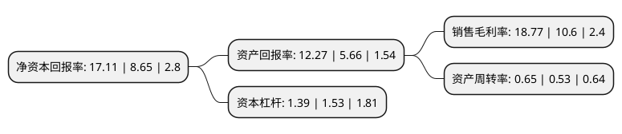

> 本页面由自动化程序生成于 2022年5月20日 01:09
> 内容可能存在错误，如有bug请提交issue至：https://github.com/Eroleice/doc-pi/issues
{.is-warning}

# 上市公司基本情况

## 基本资料

四川雅化实业集团股份有限公司（以下简称“雅化集团”）成立于2001年12月25日，雅安市。于2010年11月09日在深交所中小板上市。

雅化集团注册资本115,256.252万元，主营业务为各类工业炸药和起爆器材的生产与销售。主要产品为工业炸药，工业雷管和工业索类等民用爆炸物品。以下是详细信息：

- 公司名称: 四川雅化实业集团股份有限公司
- 股票代码: 002497.SZ
- 所在地: 四川 - 雅安市
- 成立日期: 2001年12月25日
- 注册资本: 115,256.252万元
- 法定代表人: 高欣
- 主营业务: 主营业务为各类工业炸药和起爆器材的生产与销售主要产品为工业炸药，工业雷管和工业索类等民用爆炸物品
- 公司官网: www.scyahua.com
- 公司介绍: 公司专注于锂矿和锂盐产品生产，是国内最早生产锂盐产品的企业之一，是全球锂盐产品的主要供应商。公司以锂产业和民爆产业为主业。集民爆生产、爆破服务、锂盐生产、锂矿开采、危险品运输、军工业务为一体，资源协同、联动发展。公司拥有中国民爆行业唯一的国家级企业技术中心以及国家认可监测和校准实验室，建有两个“博士后创新实践基地”、四川省民用爆炸物品与装备工程技术研究中心等多个创新平台，具有国内领先的技术研发能力。在智能装备、电子雷管、工程爆破、炸药技术等领域处于国内领先水平；雅化锂业在锂行业中技术领先，拥有磷酸二氢锂的制备装置、磷酸二氢锂的生产方法、钛酸锂晶须的制备、一步清洁法电池极碳酸锂的生产方法等发明专利，国内领先的氢氧化锂矿石一步冷冻法生产中核心环节冷冻、浓缩分离生产技术均为雅化锂业所首创。

## 股东及高管情况

上市公司第一大股东为郑戎，持股117,519,340股，占比10.2%，**疑似为**上市公司实际控制人。

截至2022年03月31日，上市公司的前十大股东中，共有4名自然人股东，5个产品账户，1个海外主体，其中5%以上大股东共有1名。上市公司前十大股东明细如下：

> 未能通过持股比例判定出上市公司实际控制人（持股30%以上）
> 可能存在通过间接持股、联合持股、协议控制等方式拥有实际控制权的主体，具体请参考上市公司定期公告！
{.is-warning}

> 截至2022年03月31日，上市公司前十大股东信息如下：

| 股东名称 | 持股数量（股） | 持股比例 |
| --- | --- | --- |
| 郑戎 | 117,519,340 | 10.2% |
| 张婷 | 41,900,000 | 3.64% |
| 交通银行股份有限公司-汇丰晋信低碳先锋股票型证券投资基金 | 29,836,889 | 2.59% |
| 香港中央结算有限公司(陆股通) | 26,525,780 | 2.3% |
| 中国建设银行股份有限公司-华夏能源革新股票型证券投资基金 | 26,113,604 | 2.27% |
| 樊建民 | 14,543,868 | 1.26% |
| 交通银行-汇丰晋信动态策略混合型证券投资基金 | 10,862,559 | 0.94% |
| 交通银行股份有限公司-汇丰晋信智造先锋股票型证券投资基金 | 8,901,881 | 0.77% |
| 王崇盛 | 8,192,245 | 0.71% |
| 上海宽投资产管理有限公司-宽投幸运星7号私募证券投资基金 | 7,100,081 | 0.62% |

## 利润表分析

上市公司2021年总收入为52.41亿元，净利润为9.83亿元，实现盈利。

## 杜邦分析

> 数据列示周期：2021年 | 2020年 | 2019年
{.is-info}

上市公司的净资产收益率在近一年有所上升，上升幅度为97.8%，其变化情况分解如下：
- 上市公司的销售毛利率在近一年上升了77.08%，可能是生产效率的提升、商品原材料价格下跌或商品价格的上涨所致。
- 上市公司的资产周转率在近一年上升了22.64%，可能是源自于更快的销售回款或库存管理效果提升。
- 上市公司的财务杠杆比率在近一年下降了-9.15%，可能是减少负债降低财务费用。

