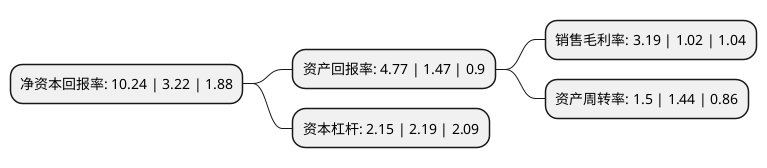

> 本页面由自动化程序生成于 2022年5月20日 01:10
> 内容可能存在错误，如有bug请提交issue至：https://github.com/Eroleice/doc-pi/issues
{.is-warning}

# 上市公司基本情况

## 基本资料

西陇科学股份有限公司（以下简称“西陇科学”）成立于1994年07月19日，汕头市。于2011年06月02日在深交所中小板上市。

西陇科学注册资本58,521.642万元，主要产品或提供的劳务:本公司主要从事化学试剂，原料药及食品添加剂的研发，生产和销售以及化工原料的销售。以下是详细信息：

- 公司名称: 西陇科学股份有限公司
- 股票代码: 002584.SZ
- 所在地: 广东 - 汕头市
- 成立日期: 1994年07月19日
- 注册资本: 58,521.642万元
- 法定代表人: 黄少群
- 主营业务: 主要产品或提供的劳务:本公司主要从事化学试剂，原料药及食品添加剂的研发，生产和销售以及化工原料的销售
- 公司官网: www.xilongs.com
- 公司介绍: 公司是国家火炬计划重点高新技术企业，参与起草修订多项国家及行业标准，重点发展精馏、电化学等核心高新技术，拥有多台专业先进的精密检测设备和众多设施完善的生产线车间，承担多项国家及省级科研项目。公司经过多年的发展，目前的业务范围涵盖化学试剂、化工原料、诊断试剂、基因测序服务以及第三方独立医学实验室，形成了通用试剂、PCB电子化学品、超净高纯溶剂、生物试剂等大业务板块，并辅以原料药、食品添加剂、实验室产品和化工原料为一体的高新技术产品链和产业群,覆盖近万种产品种类和多个产品规格。

## 股东及高管情况

上市公司第一大股东为黄少群，持股74,500,000股，占比12.73%，**疑似为**上市公司实际控制人。

截至2022年03月31日，上市公司的前十大股东中，共有8名自然人股东，2名机构股东，其中5%以上大股东共有3名。上市公司前十大股东明细如下：

> 未能通过持股比例判定出上市公司实际控制人（持股30%以上）
> 可能存在通过间接持股、联合持股、协议控制等方式拥有实际控制权的主体，具体请参考上市公司定期公告！
{.is-warning}

> 截至2022年03月31日，上市公司前十大股东信息如下：

| 股东名称 | 持股数量（股） | 持股比例 |
| --- | --- | --- |
| 黄少群 | 74,500,000 | 12.73% |
| 黄伟鹏 | 67,741,616 | 11.58% |
| 黄伟波 | 66,579,456 | 11.38% |
| 黄侦杰 | 15,247,500 | 2.61% |
| 黄侦凯 | 8,576,725 | 1.47% |
| 徐进 | 8,343,250 | 1.43% |
| 新疆名鼎股权投资管理合伙企业(有限合伙) | 4,406,353 | 0.75% |
| 华泰证券股份有限公司 | 4,200,900 | 0.72% |
| 童美芳 | 3,200,000 | 0.55% |
| 张鹤 | 3,027,500 | 0.52% |

## 利润表分析

上市公司2021年总收入为68.37亿元，净利润为2.17亿元，实现盈利。

## 杜邦分析

> 数据列示周期：2021年 | 2020年 | 2019年
{.is-info}

上市公司的净资产收益率在近一年有所上升，上升幅度为218.01%，其变化情况分解如下：
- 上市公司的销售毛利率在近一年上升了212.75%，可能是生产效率的提升、商品原材料价格下跌或商品价格的上涨所致。
- 上市公司的资产周转率在近一年上升了4.17%，可能是源自于更快的销售回款或库存管理效果提升。
- 上市公司的财务杠杆比率在近一年下降了-1.83%，可能是减少负债降低财务费用。

