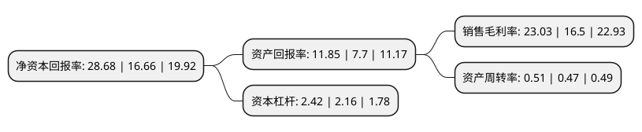

> 本页面由自动化程序生成于 2022年5月20日 01:10
> 内容可能存在错误，如有bug请提交issue至：https://github.com/Eroleice/doc-pi/issues
{.is-warning}

# 上市公司基本情况

## 基本资料

龙佰集团股份有限公司（以下简称“龙佰集团”）成立于1998年08月20日，焦作市。于2011年07月15日在深交所中小板上市。

龙佰集团注册资本238,147.026万元，主营业务为钛白粉，锆制品和硫酸铝等产品的生产与销售。主要产品为钛白粉系列产品，锆制品和硫酸铝等。以下是详细信息：

- 公司名称: 龙佰集团股份有限公司
- 股票代码: 002601.SZ
- 所在地: 河南 - 焦作市
- 成立日期: 1998年08月20日
- 注册资本: 238,147.026万元
- 法定代表人: 许刚
- 主营业务: 主营业务为钛白粉，锆制品和硫酸铝等产品的生产与销售主要产品为钛白粉系列产品，锆制品和硫酸铝等
- 公司官网: www.lomonbillions.com
- 公司介绍: 公司是一家致力于钛、锆精细粉体材料研发和制造的大型无机精细化工集团。集团目前已形成河南焦作、四川德阳、攀枝花、湖北襄阳等多个生产基地，主营钛白粉产能大，规模居亚洲榜首，其产品畅销亚太、拉美、北美、欧洲、中东和非洲等百余个国家和地区。公司是“全国守合同重信用企业”、“国家级高新技术企业”、“国家技术创新示范企业”、“国家矿产资源综合利用示范基地”、“国家绿色矿山”等，“雪莲”商标和“蟒”商标荣获中国驰名商标。

## 股东及高管情况

上市公司第一大股东为许刚，持股624,231,769股，占比26.21%，**疑似为**上市公司实际控制人。

截至2022年03月31日，上市公司的前十大股东中，共有5名自然人股东，1名机构股东，3个产品账户，1个海外主体，其中5%以上大股东共有3名。上市公司前十大股东明细如下：

> 未能通过持股比例判定出上市公司实际控制人（持股30%以上）
> 可能存在通过间接持股、联合持股、协议控制等方式拥有实际控制权的主体，具体请参考上市公司定期公告！
{.is-warning}

> 截至2022年03月31日，上市公司前十大股东信息如下：

| 股东名称 | 持股数量（股） | 持股比例 |
| --- | --- | --- |
| 许刚 | 624,231,769 | 26.21% |
| 谭瑞清 | 197,384,705 | 8.29% |
| 香港中央结算有限公司(陆股通) | 181,042,193 | 7.6% |
| 李玲 | 118,928,380 | 4.99% |
| 范先国 | 67,418,965 | 2.83% |
| 河南银泰投资有限公司 | 61,000,072 | 2.56% |
| 中国建设银行股份有限公司-广发科技先锋混合型证券投资基金 | 52,225,216 | 2.19% |
| 上海浦东发展银行股份有限公司-广发小盘成长混合型证券投资基金(LOF) | 35,414,099 | 1.49% |
| 中国工商银行股份有限公司-广发双擎升级混合型证券投资基金 | 34,953,617 | 1.47% |
| 陈开琼 | 31,568,300 | 1.33% |

## 利润表分析

上市公司2021年总收入为206.17亿元，净利润为47.35亿元，实现盈利。

## 杜邦分析

> 数据列示周期：2021年 | 2020年 | 2019年
{.is-info}

上市公司的净资产收益率在近一年有所上升，上升幅度为72.15%，其变化情况分解如下：
- 上市公司的销售毛利率在近一年上升了39.58%，可能是生产效率的提升、商品原材料价格下跌或商品价格的上涨所致。
- 上市公司的资产周转率在近一年上升了8.51%，可能是源自于更快的销售回款或库存管理效果提升。
- 上市公司的财务杠杆比率在近一年上升了12.04%，可能是增加负债扩大生产规模。

