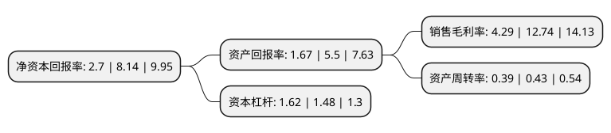

> 本页面由自动化程序生成于 2022年5月20日 01:10
> 内容可能存在错误，如有bug请提交issue至：https://github.com/Eroleice/doc-pi/issues
{.is-warning}

# 上市公司基本情况

## 基本资料

道明光学股份有限公司（以下简称“道明光学”）成立于2007年11月22日，金华市。于2011年11月22日在深交所中小板上市。

道明光学注册资本62,459.909万元，主营业务为反光材料及反光制品的研发，设计及生产，主要产品包括各规格，各等级的反光膜，反光布及以反光膜和反光布为原材料制造的反光制品。以下是详细信息：

- 公司名称: 道明光学股份有限公司
- 股票代码: 002632.SZ
- 所在地: 浙江 - 金华市
- 成立日期: 2007年11月22日
- 注册资本: 62,459.909万元
- 法定代表人: 胡智彪
- 主营业务: 主营业务为反光材料及反光制品的研发，设计及生产，主要产品包括各规格，各等级的反光膜，反光布及以反光膜和反光布为原材料制造的反光制品
- 公司官网: www.chinadaoming.com
- 公司介绍: 公司是专业从事研发、生产和销售各种反光材料及反光制品的高新技术企业，亚洲最大的反光材料生产基地。主要产品包括各规格、各等级的反光膜、反光布及以反光膜和反光布为原材料制造的反光制品。公司拥有的“DM”商标已被国家工商管理总局商标局认定为中国驰名商标。公司拥有十多项自主知识产权，并有多项高新技术及产品填补了国内空白，“海事反光膜”产品被列为国家火炬计划项目。公司产品获得欧洲EN471、EN533、EN12899、美国ANSI/107、瑞士环保、澳标等多种证书；通过国家交通部、交通工程监理检测中心、公安部交通安全产品质量监督检测中心等检测。公司享有自营进出口权，系列反光产品远销世界各地多个国家及地区。

## 股东及高管情况

上市公司第一大股东为浙江道明投资有限公司，持股249,600,000股，占比39.96%，为上市公司实际控制人。

截至2022年03月31日，上市公司的前十大股东中，共有8名自然人股东，1名机构股东，1个产品账户，其中5%以上大股东共有1名。上市公司前十大股东明细如下：

> 截至2022年03月31日，上市公司前十大股东信息如下：

| 股东名称 | 持股数量（股） | 持股比例 |
| --- | --- | --- |
| 浙江道明投资有限公司 | 249,600,000 | 39.96% |
| 胡慧玲 | 28,008,000 | 4.48% |
| 胡智雄 | 24,191,702 | 3.87% |
| 胡智彪 | 23,671,702 | 3.79% |
| 刘文华 | 12,810,556 | 2.05% |
| 池巧丽 | 11,278,768 | 1.81% |
| 胡敏超 | 9,830,000 | 1.57% |
| 吴之华 | 7,900,000 | 1.26% |
| 金鹰基金-工商银行-金鹰穗通定增35号资产管理计划 | 6,189,422 | 0.99% |
| 吴东萍 | 6,188,130 | 0.99% |

## 利润表分析

上市公司2021年总收入为12.83亿元，净利润为0.55亿元，实现盈利。

## 杜邦分析

> 数据列示周期：2021年 | 2020年 | 2019年
{.is-info}

上市公司的净资产收益率在近一年有所下降，下降幅度为-66.83%，其变化情况分解如下：
- 上市公司的销售毛利率在近一年下降了-66.33%，可能是生产效率的下降、商品原材料价格上涨或商品价格的下跌所致。
- 上市公司的资产周转率在近一年下降了-9.3%，可能是源自于更慢的销售回款或库存管理效果下降。
- 上市公司的财务杠杆比率在近一年上升了9.46%，可能是增加负债扩大生产规模。

