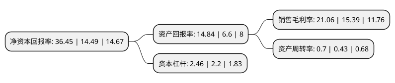

> 本页面由自动化程序生成于 2022年5月20日 01:11
> 内容可能存在错误，如有bug请提交issue至：https://github.com/Eroleice/doc-pi/issues
{.is-warning}

# 上市公司基本情况

## 基本资料

卫星化学股份有限公司（以下简称“卫星化学”）成立于2005年08月03日，嘉兴市。于2011年12月28日在深交所中小板上市。

卫星化学注册资本172,007.153万元，主要业务为专业从事丙烯酸，丙烯酸酯，甲基丙烯酸，颜料中间体，丙烯酸酯高分子乳液，高吸水性树脂(SAP)及其他丙烯酸酯下游产品的研发，生产和销售。主要产品包括丙烯酸及酯，高分子乳液，颜料中间体，甲基丙烯酸，上述产品构成公司设立以来的主营业务，均已实现大批量生产。以下是详细信息：

- 公司名称: 卫星化学股份有限公司
- 股票代码: 002648.SZ
- 所在地: 浙江 - 嘉兴市
- 成立日期: 2005年08月03日
- 注册资本: 172,007.153万元
- 法定代表人: 杨卫东
- 主营业务: 主要业务为专业从事丙烯酸，丙烯酸酯，甲基丙烯酸，颜料中间体，丙烯酸酯高分子乳液，高吸水性树脂(SAP)及其他丙烯酸酯下游产品的研发，生产和销售主要产品包括丙烯酸及酯，高分子乳液，颜料中间体，甲基丙烯酸，上述产品构成公司设立以来的主营业务，均已实现大批量生产
- 公司官网: www.satlpec.com
- 公司介绍: 公司是国内最大、全球前五大丙烯酸制造商，是国内第一家以丙烷为原料形成C3产业一体化格局的民营上市企业。公司集研发、生产、销售、物流于一体，涵盖从丙烯、聚丙烯、丙烯酸、高纯度丙烯酸，到丙烯酸酯、高分子乳液、高吸水性树脂等多个大类产品。公司发挥上市公司资本平台的优势，坚持“产业+资本”的优势，寻求国内外企业的合作，以及具有高成长性和高附加值的产品发展。在未来实现卫星成为中国最好地专注于技术与服务的多元化化工企业。凭借领先的生产技术和全产业链优势，得益于精细化管理优势和区位优势，卫星石化被评为国家高新技术企业、中国化工行业最具竞争力的企业，也是中国专用化学品制造行业最具竞争力的企业。

## 股东及高管情况

上市公司第一大股东为浙江卫星控股股份有限公司，持股595,026,712股，占比34.59%，为上市公司实际控制人。

截至2022年03月31日，上市公司的前十大股东中，共有1名自然人股东，3名机构股东，1个产品账户，3个海外主体，2名其他股东，其中5%以上大股东共有3名。上市公司前十大股东明细如下：

> 截至2022年03月31日，上市公司前十大股东信息如下：

| 股东名称 | 持股数量（股） | 持股比例 |
| --- | --- | --- |
| 浙江卫星控股股份有限公司 | 595,026,712 | 34.59% |
| YANG YA ZHEN | 200,200,000 | 11.64% |
| 香港中央结算有限公司(陆股通) | 158,257,865 | 9.2% |
| 嘉兴茂源投资有限公司 | 71,400,000 | 4.15% |
| 共青城胜帮投资管理有限公司-共青城胜帮凯米投资合伙企业(有限合伙) | 47,595,059 | 2.77% |
| 中国人寿资管-中国银行-国寿资产-PIPE2020保险资产管理产品 | 29,552,043 | 1.72% |
| 澳门金融管理局-自有资金 | 19,344,018 | 1.12% |
| 洪涛 | 16,890,000 | 0.98% |
| BILL & MELINDA GATES FOUNDATION TRUST | 16,169,442 | 0.94% |
| 科威特政府投资局 | 13,227,499 | 0.77% |

## 利润表分析

上市公司2021年总收入为285.57亿元，净利润为60.12亿元，实现盈利。

## 杜邦分析

> 数据列示周期：2021年 | 2020年 | 2019年
{.is-info}

上市公司的净资产收益率在近一年有所上升，上升幅度为151.55%，其变化情况分解如下：
- 上市公司的销售毛利率在近一年上升了36.84%，可能是生产效率的提升、商品原材料价格下跌或商品价格的上涨所致。
- 上市公司的资产周转率在近一年上升了62.79%，可能是源自于更快的销售回款或库存管理效果提升。
- 上市公司的财务杠杆比率在近一年上升了11.82%，可能是增加负债扩大生产规模。

