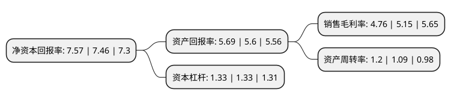

> 本页面由自动化程序生成于 2022年5月20日 01:11
> 内容可能存在错误，如有bug请提交issue至：https://github.com/Eroleice/doc-pi/issues
{.is-warning}

# 上市公司基本情况

## 基本资料

广东德联集团股份有限公司（以下简称“德联集团”）成立于1992年01月24日，佛山市。于2012年03月27日在深交所中小板上市。

德联集团注册资本75,432.927万元，主要产品:各类汽车精细化学品，主要分消耗类和非消耗类产品，消耗类产品为防冻液，制动液，动力转向油，自动变速箱油，发动机油，燃油添加剂等汽车运行中必需使用，且按一定时间或里程更换的精细化学品，非消耗类产品主要为胶粘剂，纤维增强胶片等胶类产品。主营业务:汽车精细化学品的制造和销售，产品主要应用于国内乘用车市场。以下是详细信息：

- 公司名称: 广东德联集团股份有限公司
- 股票代码: 002666.SZ
- 所在地: 广东 - 佛山市
- 成立日期: 1992年01月24日
- 注册资本: 75,432.927万元
- 法定代表人: 徐咸大
- 主营业务: 主要产品:各类汽车精细化学品，主要分消耗类和非消耗类产品，消耗类产品为防冻液，制动液，动力转向油，自动变速箱油，发动机油，燃油添加剂等汽车运行中必需使用，且按一定时间或里程更换的精细化学品，非消耗类产品主要为胶粘剂，纤维增强胶片等胶类产品主营业务:汽车精细化学品的制造和销售，产品主要应用于国内乘用车市场
- 公司官网: www.delian.cn
- 公司介绍: 公司是一家专营汽车系列化工用品的大型集团公司。主营各类汽车精细化学品，包括消耗类防冻液、制动液、动力转向油、自动变速箱油、发动机油、燃油添加剂及非消耗类胶粘剂、纤维增强胶片等胶类产品。公司独立开发的高效汽柴油清净剂和长效发动机冷却液通过了广东省科技厅科技成果鉴定，其中高效汽柴油清净剂被列为广东省重点新产品和交通部节能推荐产品。公司在国内主要汽车产业集群区域建立了大规模、集中化的汽车精细化学品研发、采购、生产、供应综合性服务平台，并与巴斯夫、陶氏化学、潘东兴、雅富顿建立长期的战略合作关系。

## 股东及高管情况

上市公司第一大股东为徐团华，持股279,970,936股，占比37.12%，为上市公司实际控制人。

截至2022年04月29日，上市公司的前十大股东中，共有9名自然人股东，1名机构股东，其中5%以上大股东共有2名。上市公司前十大股东明细如下：

> 截至2022年04月29日，上市公司前十大股东信息如下：

| 股东名称 | 持股数量（股） | 持股比例 |
| --- | --- | --- |
| 徐团华 | 279,970,936 | 37.12% |
| 徐庆芳 | 101,450,336 | 13.45% |
| 徐咸大 | 20,996,192 | 2.78% |
| 上海衡平投资有限公司 | 4,887,400 | 0.65% |
| 徐光昶 | 3,430,200 | 0.45% |
| 于方 | 2,043,900 | 0.27% |
| 赵振和 | 2,034,600 | 0.27% |
| 徐玉莲 | 1,775,900 | 0.24% |
| 李吉远 | 1,710,050 | 0.23% |
| 郑荣 | 1,604,200 | 0.21% |

## 利润表分析

上市公司2021年总收入为51.92亿元，净利润为2.47亿元，实现盈利。

## 杜邦分析

> 数据列示周期：2021年 | 2020年 | 2019年
{.is-info}

上市公司的净资产收益率在近一年有所上升，上升幅度为1.47%，其变化情况分解如下：
- 上市公司的销售毛利率在近一年下降了-7.57%，可能是生产效率的下降、商品原材料价格上涨或商品价格的下跌所致。
- 上市公司的资产周转率在近一年上升了10.09%，可能是源自于更快的销售回款或库存管理效果提升。
- 上市公司的财务杠杆比率在近一年下降了0%，可能是减少负债降低财务费用。

