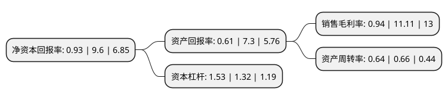

> 本页面由自动化程序生成于 2022年5月20日 01:11
> 内容可能存在错误，如有bug请提交issue至：https://github.com/Eroleice/doc-pi/issues
{.is-warning}

# 上市公司基本情况

## 基本资料

康达新材料(集团)股份有限公司（以下简称“康达新材”）成立于1988年07月14日，上海市。于2012年04月16日在深交所中小板上市。

康达新材注册资本25,249.292万元，主要产品:环氧树脂胶，改性丙烯酸酯胶，聚氨酯胶，SBS胶等多种类型，200多种规格型号的产品。主营业务:胶粘剂的研发，生产，销售和服务。以下是详细信息：

- 公司名称: 康达新材料(集团)股份有限公司
- 股票代码: 002669.SZ
- 所在地: 上海 - 上海市
- 成立日期: 1988年07月14日
- 注册资本: 25,249.292万元
- 法定代表人: 王建祥
- 主营业务: 主要产品:环氧树脂胶，改性丙烯酸酯胶，聚氨酯胶，SBS胶等多种类型，200多种规格型号的产品主营业务:胶粘剂的研发，生产，销售和服务
- 公司官网: www.shkdchem.com
- 公司介绍: 公司主要从事结构胶粘剂的研发和生产、销售的科研产业实体，拥有改性丙烯酸酯胶、有机硅胶、环氧树脂胶、聚氨酯胶、PUR热熔胶、SBS胶等多种类型，百余种规格型号的产品，主要应用于风力发电、光伏太阳能、轨道交通、航空航天、海洋船舶工程、软包装复合、橡塑制品、建筑工程、家用电子电器、汽摩配件、电机、电梯、矿业设备、工业维修等多个领域。公司被评为首批“上海市创新型企业”，其下属机构上海康达化工技术研究所为上海市认定的企业技术开发机构。

## 股东及高管情况

上市公司第一大股东为唐山金控产业孵化器集团有限公司，持股63,095,200股，占比24.99%，**疑似为**上市公司实际控制人。

截至2022年03月31日，上市公司的前十大股东中，共有4名自然人股东，2名机构股东，4个产品账户，其中5%以上大股东共有1名。上市公司前十大股东明细如下：

> 未能通过持股比例判定出上市公司实际控制人（持股30%以上）
> 可能存在通过间接持股、联合持股、协议控制等方式拥有实际控制权的主体，具体请参考上市公司定期公告！
{.is-warning}

> 截至2022年03月31日，上市公司前十大股东信息如下：

| 股东名称 | 持股数量（股） | 持股比例 |
| --- | --- | --- |
| 唐山金控产业孵化器集团有限公司 | 63,095,200 | 24.99% |
| 中国工商银行股份有限公司-广发多因子灵活配置混合型证券投资基金 | 9,735,500 | 3.86% |
| 兴业银行股份有限公司-天弘多元收益债券型证券投资基金 | 4,837,000 | 1.92% |
| 张立岗 | 4,603,450 | 1.82% |
| 耿殿根 | 4,578,168 | 1.81% |
| 张东东 | 4,219,134 | 1.67% |
| 康达新材料(集团)股份有限公司-第三期员工持股计划 | 3,899,100 | 1.54% |
| 陆企亭 | 3,587,716 | 1.42% |
| 北京柘量投资中心(有限合伙) | 1,910,000 | 0.76% |
| 中国银行股份有限公司-华安文体健康主题灵活配置混合型证券投资基金 | 1,838,500 | 0.73% |

## 利润表分析

上市公司2021年总收入为22.71亿元，净利润为0.21亿元，实现盈利。

## 杜邦分析

> 数据列示周期：2021年 | 2020年 | 2019年
{.is-info}

上市公司的净资产收益率在近一年有所下降，下降幅度为-90.31%，其变化情况分解如下：
- 上市公司的销售毛利率在近一年下降了-91.54%，可能是生产效率的下降、商品原材料价格上涨或商品价格的下跌所致。
- 上市公司的资产周转率在近一年下降了-3.03%，可能是源自于更慢的销售回款或库存管理效果下降。
- 上市公司的财务杠杆比率在近一年上升了15.91%，可能是增加负债扩大生产规模。

